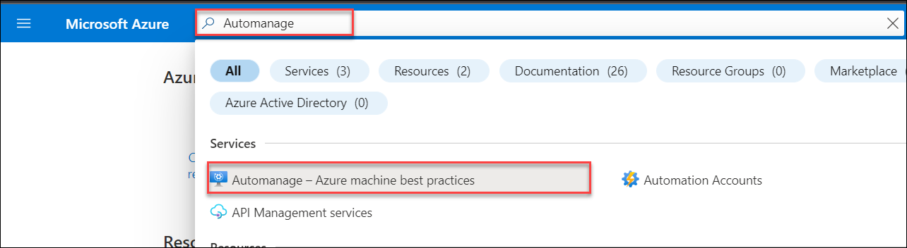
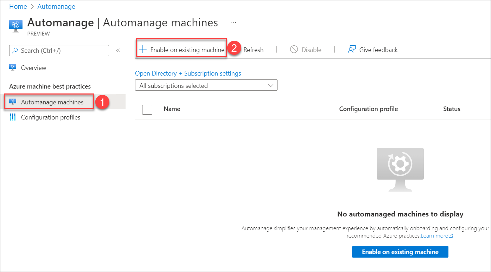
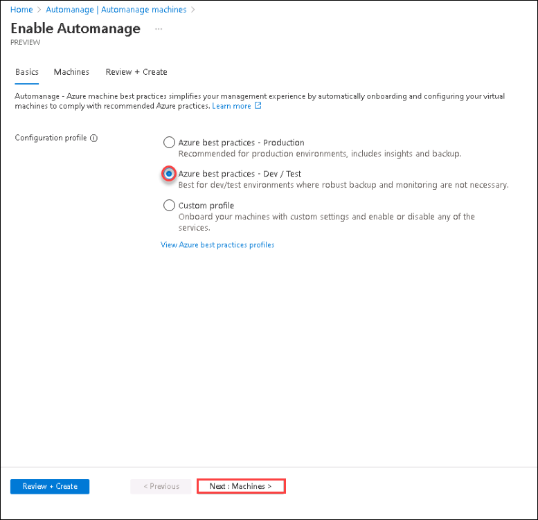
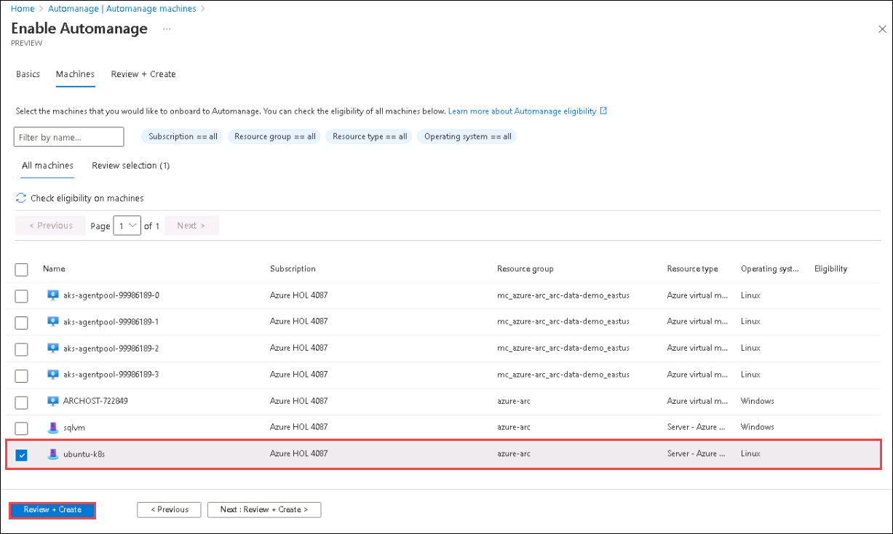
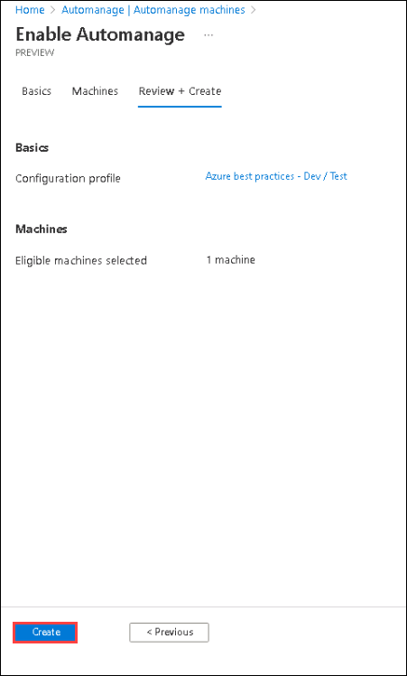

# HOL-1: Exercise 4: Enabling Azure Automanage for Server - Azure Arc

In the last exercise, we worked on onboarding SQL Server to Azure Arc, so now let's enable Azure Automanage for Server - Azure Arc which we created earlier in the lab.

## Overview: 
Azure Automanage enrols, configures, and monitors the entire lifecycle of dev/test and production VMs for products, services and features such as Azure Security Centre, update management, change tracking, VM inventory, desired state configuration, guest configuration, automation accounts and log analytics.

## Task 1: Configuring Azure Automanage

1. Navigate to the home page of the [Azure Portal](https://portal.azure.com/#home), then search for **Automanage** in the search box and select **Automanage - Azure machine best practices**.

   
   
2. From the Automanage pane, select **Automanage machines**(1) under Azure machine best practices and click on **+ Enable on existing machine**(2).

   

3. On Enable Automanage - Azure machine best practices page, select **Azure best practices - Dev / Test** and click on **Next: Machines**.

   

4. In Select machines pane, select the **ubuntu-k8s** Server - Azure Arc and click on **Review + Create**.

   

5. Click on **Create**.

   

6. Once the Configuration profile assignment is completed successfully it will take around 20-30 minutes to get the Status as Conformant.

   

7. You can proceed with the next task and review the status later.
