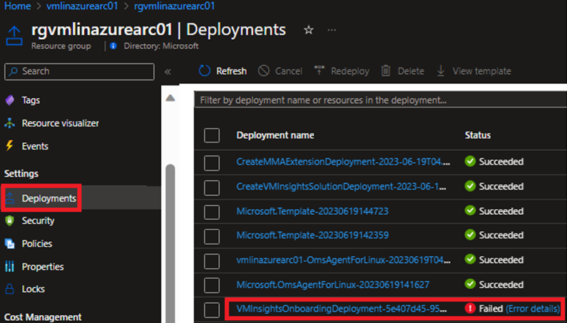
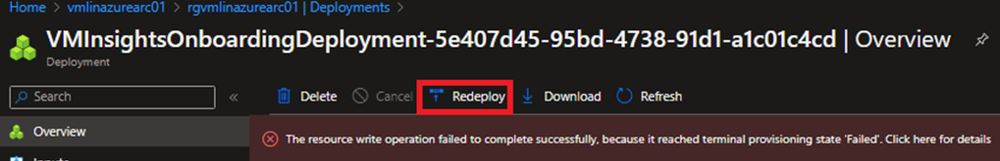
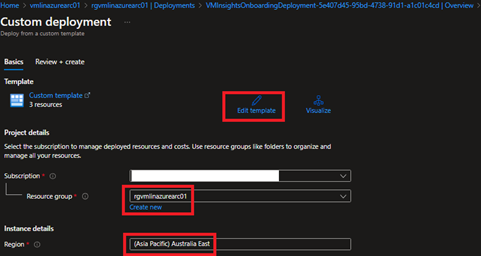
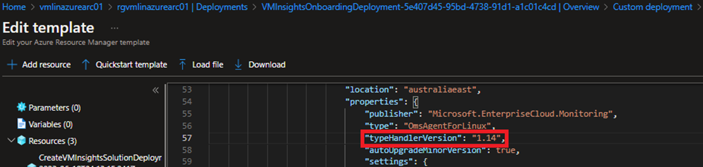

# Work around for MMA installation failure:

## Follow the below instructions to fix the MMA installation failure by updating the handler version:

1. Navigate to **azure-arc** resource group in Azure Portal and navigate to Deployments on left pane of Settings section.

   
   
2. Click Re-deploy to edit the Custom deployment.

   

3. Select **azure-arc** Resource group and **Region** for VM Insights deployment and select **Edit template**.

   

4. Press **Ctrl + F** in codespace and search for **tyepHandlerversion**. Change **typeHandlerVersion** from **1.7 to 1.14**.

   

5. Click **Save** and **Review + create**.
