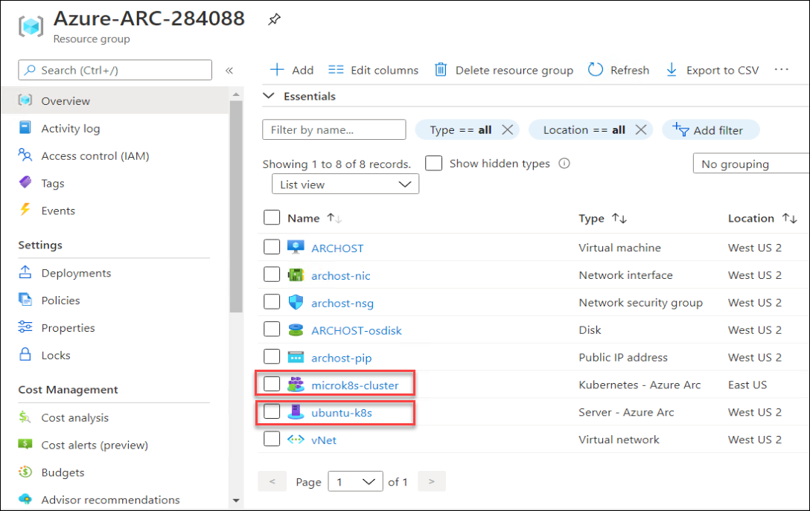
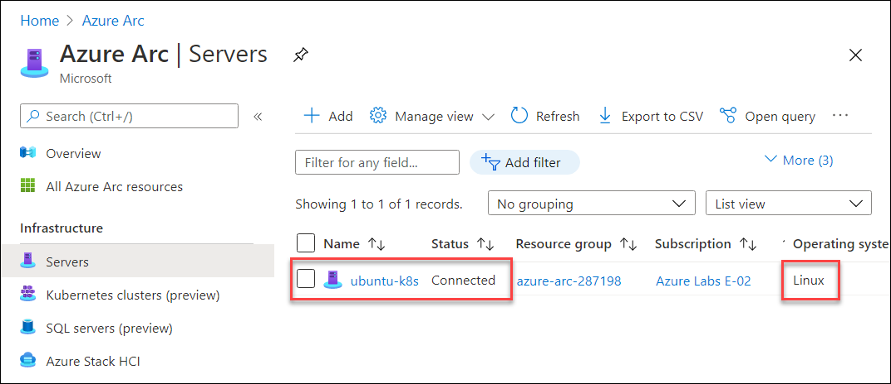

# Exercise 1: Connect On-Prem Servers to Azure with Arc

Azure Arc extends Azure Resource Manager capabilities to Linux and Windows servers, as well as Kubernetes clusters on any infrastructure across on-premises, multi-cloud, and edge. With Azure Arc, customers can also run Azure data services anywhere, realizing the benefits of cloud innovation, including always up-to-date data capabilities, deployment in seconds (rather than hours), and dynamic scalability on any infrastructure. Azure Arc for servers is currently in public preview.

## Task 1: Login and become familiar with Hyper-V Infrastructure

Hyper-V is Microsoft's hardware virtualization product. It lets you create and run a software version of a computer, called a virtual machine. Each virtual machine acts like a complete computer, running an operating system and programs. When you need computing resources, virtual machines give you more flexibility, help save time and money, and are a more efficient way to use hardware than just running one operating system on physical hardware. In this task, you will walk through on-prem environment which is hosted on Hyper-V. You will find three virtual machines hosted on Hyper-V server, which you will onboard to Azure Arc and play around.

1. You can see a virtual machine desktop 💻 (LabVM/ARCHOST) is loaded in the left side in your browser. Use this virtual machine throughout the workshop to perform the the lab. You can also connect to the virtual machine using RDP using the ARCHOST VM credentials provided on **Environment Details** tab. Double click on the **Hyper-V Manager** for VM desktop to start the Hyper-V Manager

    

1. Select **ARCHOST** to connect with Local Hyper-V server. In your Machine there could be a unique suffix added at end of **ARCHOST**, something like **ARCHOST-XXXXXX**.

    

1. You will find two guest virtual machines running on the Hyper-V manager. Find list of guest virtual machines with private ip address.
     * **ubuntu-k8s** - ```192.168.0.8```
     * **sqlvm** - ```192.168.0.4```
     
    
    
## Task 2: Onboard Linux Machine to Azure Arc

In this task, we will learn to onboard the Linux VMs and local kubernetes cluster to Azure Arc. So, here we will onboard **ubuntu-k8s** VM to Azure ARC.

1. From the start menu of the ARCHOST VM, search for **putty** and open it with double click or other way.

    
     
1. In Putty Configuration tool, enter the **ubuntu-k8s** VM private IP - ```192.168.0.8```, make sure the Port value is ```22```. Once you entered the private IP of the ubuntuk8s vm, click on the Open to lunch the terminal.

    
    
1. Enter the **ubuntu-k8s** vm username - ```demouser``` in **login as** and then hit **Enter**. Now, enter the password - ```demo@pass123``` and press **Enter**. Remember password will be hidden and not be visible in terminal, don't worry about that.

    
    
    > Note: To paste any value in Putty terminal, just copy the values from anywhere and then right click on the terminal to paste the copied value.
    
1. Login to the **Root user account** using sudo command; enter following command and then provide **password** - ```demo@pass123``` when prompted for password.
     * Command: ```sudo su ```
     * Password: ```demo@Pass123```
    
    
    
1. There is file ```installArcAgentLinux.txt``` on ARCHOST VM desktop 💻. Open that and copy first 6 lines and paste in putty to declare the values of AppID, AppSecret, TenantID, SubscriptionID, ResourceGroup and location. You can also find the values of these variables in **Environment Details** tab and then use in next steps.

    
    
1. Login to Azure using following command: ```az login -u $AppID --service-principal --tenant $TenantID -p $AppSecret```

    
    
1. Now, downlaod the Azure Arc installation package for linux, run the below command:

    ```wget https://aka.ms/azcmagent -O ~/install_linux_azcmagent.sh```
    
    
    
1. Install Azure Arc agent by running : ```bash ~/install_linux_azcmagent.sh```

    
    
1. Once the installation is successful, you will see following message in terminal **Latest version of azcmagent is installed**.

        
    
1. Finally, connect the ubuntu-k8s machine to Azure Arc. Run following connect command.  Once you run the below command, it will take few minutes to onboard the machine to Azure Arc. 
    
    ```azcmagent connect --resource-group $ResourseGroup --tenant-id $TenantID --location $location --subscription-id $SubscriptionId -i $AppID -p $AppSecret```
      > Remember, we are using variables declared earlier in step 5. If you have connect with new putty session, you may have to run steps 4,5,6 again.
     
    

## Task 3: Onboard Kubernetes Cluster to Azure Arc
In this task, we will learn to onboard local kubernetes cluster to Azure Arc. So, here we onboard **MicroK8s** kubernetes cluster to Azure ARC which is hosted on **ubuntu-k8s** VM . For this task, Microk8s kubernetes cluster is already configured, also Arc enabled CLI extensions are installed.

 > Note: If you have closed the putty after completing **task 2**, then perform first 6 steps of task 2 again and then jump to this task. 

1. Now, we need to run the commands as demouser instead of root user, if you are logged in as root user, enter ```exit``` command to get back on **demouser**.

    

1. Update the Arc enabled Kubernetes CLI extensions, if there will be any update these commands will update the k8s extensions.
    ```az extension update --name connectedk8s
       az extension update --name k8sconfiguration
    ```
    
    
1. Now, check the status of Kubernetes cluster by running ```microk8s.status``` as demouser in **ubuntu-k8s** vm. You can proceed further if it is running, if it is in stopped state, you may have to run ```microk8s start``` command to run the kubernetes cluster.

    
    
1. There is file ```installArcAgentLinux.txt``` on ARCHOST VM desktop 💻. Open that and copy first 7 lines and paste in putty to declare the values of AppID, AppSecret, TenantID, SubscriptionID, ResourceGroup and location and then **login to azure** using 7th line. You can also find the values of these variables in **Environment Details** tab and then use in next steps.

    
    
1. Connect the Kubernetes cluster to Azure Arc by executing the following command, once you run teh command, it will take few minutes to onboard Kubernetes Cluster to onboard to Azure Arc.

      ```az connectedk8s connect --name microk8s-cluster --resource-group $ResourseGroup -l $location```
    
    
    
1. Once the previous command executed successfully, check the **provisioningstate** in output, it should be in succeeded status.

    
    

## Task 4: Verify if the Kubernetes cluster is connected to Azure Arc

In this task, you will verify if the Kubernetes cluster is connected to Azure Arc and in healthy state.

1. Verify whether the cluster is connected by running the following command:
   
   ```
   az connectedk8s list -g $ResourseGroup -o table
   ```
     
   
   
2. You can also View this resource on the Azure portal. Navigate to https://portal.azure.com, login with the credentials provided in the Lab Environment Tab on the right. Once you have the portal open in your browser, navigate to the resource group and there will be a resource with type **Azure Arc enabled Kubernetes resource**

   

2. Azure Arc enabled Kubernetes deploys a few operators into the azure-arc namespace. You can view these deployments and pods by running the command:


   ```
   kubectl -n azure-arc get deployments,pods
   ```
   
   The output should be similar as shown:
   
   
   
## Task 5: Create a policy assignment to identify compliant/non-compliant resources
Policies can be applied to ARC servers the same way they are applied to Microsoft Azure virtual machines. Policies can be applied to ensure the Azure resources are compliant with established practices such as ensuring that all resources are tagged with an owner. Initiatives can be applied to ensure the server operating systems are compliant such as ensuring the time zone is set correctly on a Microsoft Windows server or a software package is installed on a Linux server. The initiatives use a publish policy to deploy a configuration requirement and an audit policy to check if the requirement has been met. In this task, we will br deploying the **Log Analytics Workspace** using policy on ubuntu-k8s machine, which you onboarded earlier to Azure Arc.

1. From the Azure Poral ```http://portal.azure.com/```, search for ```Azure Arc``` from search box and then click **Azure Arc**. 

    
    
1. Select **Servers** from the options on Azure Arc blade.

    
    
1. Explore **ubuntu-k8s** server from connected machines. 

    
    
1. From **ubuntu-k8s** server blade, select **Policies** under **Operations**.

    
    
1. Click on **Assign policy** to assign a policy to connected **ubuntu-k8s** machine.

    
    
1. From **Assign policy Basics** blade, select **ellipse(...)**  from **Policy Definitions**.

    
    
1. Search for ```Deploy Log Analytics``` in **Available Definitions** and then select **Deploy Log Analytics agent for Linux VMs**.

    
    
1. After selecting the policy defination, move to the **Parameters** blade by clicking on **Next** button from the bottom.

    
    
1. In **Log Analytics Workspace**, select the existing workspace with prefix **LogAnalyticsWS-** from available list and then click on **Next**.

    

1. On **Remediation** blade, enable the checkbox for **Create a remediation task** and then click on **Review + create** button.

    
    
1. On **Review + create** blade, select **Create**.

    
    
1. Now, once the policy assignment is created, you will see Deploy Log Analytics Workspace for lInux on assigned policies list in Compliant state, it can also take some time to convert in **Compliant** state.

        


