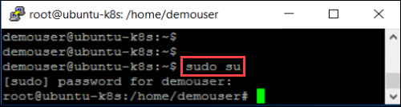
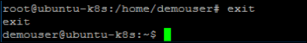
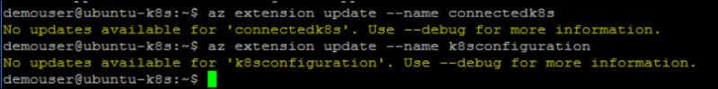
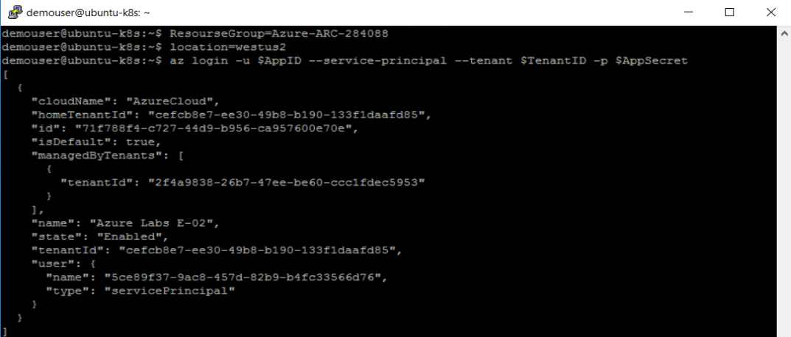
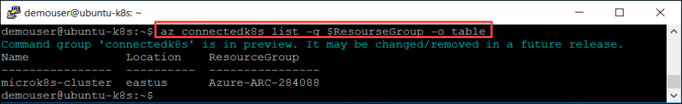
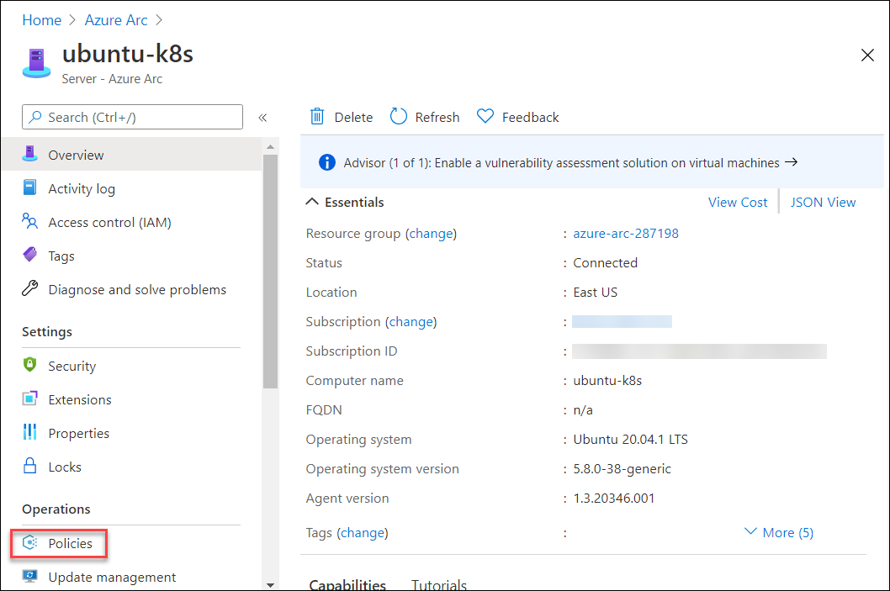
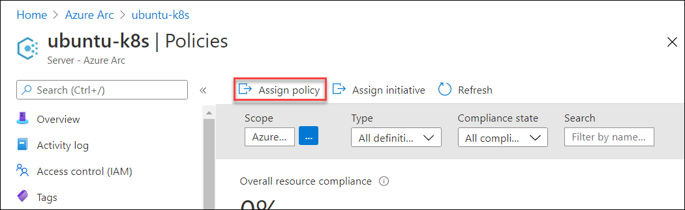
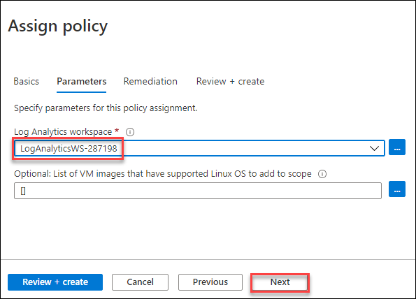
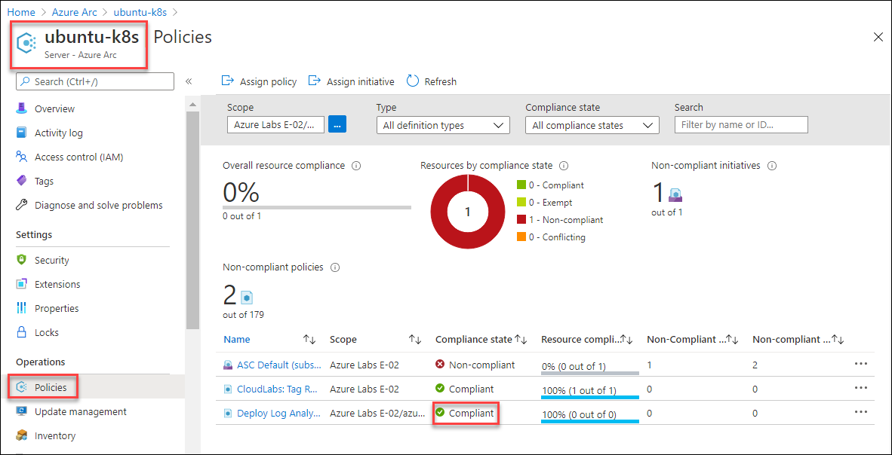
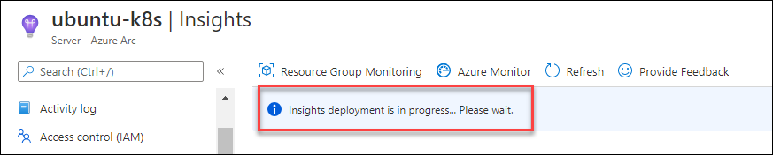

# Exercise 1: Getting started with Azure Arc

Azure Arc extends Azure Resource Manager capabilities to Linux and Windows servers, as well as Kubernetes clusters on any infrastructure across on-premises, multi-cloud, and edge. With Azure Arc, customers can also run Azure data services anywhere, realizing the benefits of cloud innovation, including always up-to-date data capabilities, deployment in seconds (rather than hours), and dynamic scalability on any infrastructure. Azure Arc for servers is currently in public preview.

## Task 1: Login and become familiar with Hyper-V Infrastructure

Hyper-V is Microsoft's hardware virtualization product. It lets you create and run a software version of a computer, called a virtual machine. Each virtual machine acts like a complete computer, running an operating system and programs. When you need computing resources, virtual machines give you more flexibility, help save time and money, and are a more efficient way to use hardware than just running one operating system on physical hardware. In this task, you will walk through an on-prem environment that is hosted on Hyper-V. You will find three virtual machines hosted on the Hyper-V server, which you will onboard to Azure Arc and play around with.

1. You can see a virtual machine desktop 💻 (LabVM/ARCHOST) is loaded on the left side in your browser. Use this virtual machine throughout the workshop to perform the lab. You can also connect to the virtual machine using RDP using the ARCHOST VM credentials provided on the **Environment Details** tab. Double click on the **Hyper-V Manager** from VM desktop to start the Hyper-V Manager

    

1. Select **ARCHOST** to connect with the Local Hyper-V server. In your Machine, there could be a unique suffix added at end of **ARCHOST**, something like **ARCHOST-XXXXXX**.

    

1. You will find two guest virtual machines running on the Hyper-V manager. Find a list of guest virtual machines with private IP address.
     * **ubuntu-k8s** - ```192.168.0.8```
     * **sqlvm** - ```192.168.0.4```
     
    
    
## Task 2: Onboard Linux Machine to Azure Arc

In this task, we will learn to onboard the Linux VMs and local Kubernetes cluster to Azure Arc. So, here we will onboard **ubuntu-k8s** VM to Azure ARC.

1. From the start menu of the ARCHOST VM, search for **putty** and open it with a double click or another way.

    
     
1. In the Putty Configuration tool, enter the **ubuntu-k8s** VM private IP - ```192.168.0.8```, make sure the Port value is ```22```. Once you entered the private IP of the ubuntuk8s VM, click on the Open to lunch the terminal.

    
    
1. Enter the **ubuntu-k8s** VM username - ```demouser``` in **login as** and then hit **Enter**. Now, enter the password - ```demo@pass123``` and press **Enter**. Remember the password will be hidden and not be visible in the terminal, don't worry about that.

    
    
    > Note: To paste any value in the Putty terminal, just copy the values from anywhere and then right-click on the terminal to paste the copied value.
    
1. Login to the **Root user account** using sudo command; enter the following command and then provide **password** - ```demo@pass123``` when prompted for the password.
     * Command: ```sudo su ```
     * Password: ```demo@Pass123```
    
    
    
1. There is file installArcAgentLinux.txt on ARCHOST VM desktop 💻. Open that and copy the first 7 lines and paste in putty to declare the values of AppID, AppSecret, TenantID, SubscriptionID, ResourceGroup, and location, and then log in to azure using the 7th line. You can also find the values of these variables in the Environment Details tab and then use them in the next steps.

    
    
1. Now, download the Azure Arc installation package for Linux, run the below command:

    ```wget https://aka.ms/azcmagent -O ~/install_linux_azcmagent.sh```
    
    
    
1. Install Azure Arc agent by running : ```bash ~/install_linux_azcmagent.sh```

    
    
1. Once the installation is successful, you will see the following message in terminal **Latest version of azcmagent is installed**.

        
    
1. Finally, connect the ubuntu-k8s machine to Azure Arc. Run following connect command.  Once you run the below command, it will take few minutes to onboard the machine to Azure Arc. 
    
    ```azcmagent connect --resource-group $ResourceGroup --tenant-id $TenantID --location $location --subscription-id $SubscriptionId -i $AppID -p $AppSecret```
      > Remember, we are using variables declared earlier in step 5. If you have connected with a new putty session, you may have to run steps 4,5,6 again.
     
    

## Task 3: Onboard Kubernetes Cluster to Azure Arc

In this task, we will learn to onboard the local Kubernetes cluster to Azure Arc. So, here we onboard **MicroK8s** Kubernetes cluster to Azure ARC which is hosted on **ubuntu-k8s** VM. For this task, the Microk8s Kubernetes cluster is already configured, also Arc enabled CLI extensions are installed.

 > Note: If you have closed the putty after completing **task 2**, then perform the first 6 steps of task 2 again and then jump to this task. 

1. Now, we need to run the commands as demouser instead of root user, if you are logged in as root user, enter ```exit``` command to get back on **demouser**.

    

1. Update the Arc enabled Kubernetes CLI extensions, if there will be any update these commands will update the k8s extensions.
    ```
    az extension update --name connectedk8s
    az extension update --name k8sconfiguration
    ```
    
    
1. Now, check the status of the Kubernetes cluster by running ```microk8s.status``` as demouser in **ubuntu-k8s** VM. You can proceed further if it is running. If it is in a stopped state, you may have to run ```microk8s start``` command to run the Kubernetes cluster.

    
    
1. There is a file ```installArcAgentLinux.txt``` on ARCHOST VM desktop 💻. Open that and copy the first 7 lines and paste in putty to declare the values of AppID, AppSecret, TenantID, SubscriptionID, ResourceGroup, and location and then **login to azure** using the 7th line. You can also find the values of these variables in the **Environment Details** tab and then use them in the next steps.

    
    
1. Connect the Kubernetes cluster to Azure Arc by executing the following command, once you run the command, it will take few minutes to onboard Kubernetes Cluster to onboard to Azure Arc.

      ```az connectedk8s connect --name microk8s-cluster --resource-group $ResourceGroup -l $location```
    
    
    
1. Once the previous command executed successfully, check the **provisioning state** in output, it should be in succeeded status.

    
    

## Task 4: Verify if the Kubernetes cluster is connected to Azure Arc

In this task, you will verify if the Kubernetes cluster is connected to Azure Arc and in a healthy state.

1. Verify whether the cluster is connected by running the following command:
   
   ```
   az connectedk8s list -g $ResourceGroup -o table
   ```
     
   
   
1. In the **LabVM/ARCHost VM**, click on the Azure portal shortcut of Microsoft Edge browser which is created on the desktop.
  
    
    
1. On the **Sign into Microsoft Azure** tab you will see the login screen, in that enter following **Email/Username** and then click on **Next**. 
   * Email/Username: <inject key="AzureAdUserEmail"></inject>
   
1. Now enter the following **Password** and click on **Sign in**.
   * Password: <inject key="AzureAdUserPassword"></inject>
   
1. If you see the pop-up **Stay Signed in?**, click No

1. If you see the pop-up **You have free Azure Advisor recommendations!**, close the window to continue the lab.

1. If **Welcome to Microsoft Azure** popup window appears, click **Maybe Later** to skip the tour.

1. Navigate to the Resource Group from the Azure portal navigate section and Click on the Resource Group named **azure-arc** and there will be a resource with type **Azure Arc enabled Kubernetes resource**

   

1. Azure Arc enabled Kubernetes deploys a few operators into the azure-arc namespace. You can view these deployments and pods by running the command:

   ```
   kubectl -n azure-arc get deployments,pods
   ```
   
   The output should be similar as shown:
   
   
   
## Task 5: Create a policy assignment to identify compliant/non-compliant resources
Policies can be applied to ARC servers the same way they are applied to Microsoft Azure virtual machines. Policies can be applied to ensure the Azure resources are compliant with established practices such as ensuring that all resources are tagged with an owner. Initiatives can be applied to ensure the server operating systems are compliant such as ensuring the time zone is set correctly on a Microsoft Windows server or a software package is installed on a Linux server. The initiatives use a publish policy to deploy a configuration requirement and an audit policy to check if the requirement has been met. In this task, we will be deploying the **Log Analytics Workspace** using policy on ubuntu-k8s machine, which you onboarded earlier to Azure Arc.

1. From the Azure Portal ```http://portal.azure.com/```, search for ```Azure Arc``` from the search box and then click **Azure Arc**. 

    
    
1. Select **Servers** from the options on the Azure Arc blade.

    
    
1. Explore the **ubuntu-k8s** server from connected machines. 

    
    
1. From **ubuntu-k8s** server blade, select **Policies** under **Operations**.

    
    
1. Click on **Assign policy** to assign a policy to the connected **ubuntu-k8s** machine.

    
    
1. From **Assign policy Basics** blade, select **ellipse(...)**  from **Policy Definitions**.

    
    
1. Search for ```Deploy Log Analytics``` in **Available Definitions** and then select **Deploy Log Analytics agent for Linux VMs**.

    
    
1. After selecting the policy definition, move to the **Parameters** blade by clicking on the **Next** button from the bottom.

    
    
1. In **Log Analytics Workspace**, select the existing workspace with prefix **LogAnalyticsWS-** from the available list and then click on **Next**.

    

1. On the **Remediation** blade, enable the checkbox for **Create a remediation task** and then click on the **Review + create** button.

    
    
1. On **Review + create** blade, select **Create**.

    
    
1. Now, once the policy assignment is created, you will see Deploy Log Analytics Workspace for Linux on the assigned policies list in Compliant state, it can also take some time to convert in **Compliant** state.

        

## Task 6: Monitor Arc Enabled machines with Azure Monitor

Azure Monitor can collect data directly from your hybrid machines into a Log Analytics workspace for detailed analysis and correlation. Typically, this would entail installing the Log Analytics agent on the machine using a script, manually, or automated method following your configuration management standards. Arc enabled servers recently introduced support to install the Log Analytics and Dependency agent VM extensions for Windows and Linux, enabling Azure Monitor to collect data from your non-Azure VMs.

In this task, you will configure and collect data from your Linux machine by enabling Azure Monitor for VMs following a simplified set of steps, which streamlines the experience and takes a shorter amount of time.

1. From the Azure Portal ```http://portal.azure.com/```, search for ```Azure Arc``` from the search box and then click **Azure Arc**. 

    
    
1. Select **Servers** from the options on the Azure Arc blade.

    
    
1. Explore the **ubuntu-k8s** server from connected machines. 

    

1. Select **Insights** from **Monitoring** options.

    
    
1. Click on the **Enable** on Insights blade.

    

1. On the Azure Monitor **Insights Onboarding** page, choose the existing **Log Analytics Workspace** named like ```LogAnalyticsWS-{Suffix}``` and then click on **Enable**.

    

1. Once you click on the **Enable** button, you can see a notification on the bell icon(🔔) in the top right corner: **validating deployment** and then **Submitting deployment** and finally **Deployment in progress**. Deployment will take approx 15-20 minutes to deploy the insights for Ubuntu-k8s VM as extensions are being installed on your connected machine (ubuntu-k8s).

    
    
1. On Azure Arc ubuntu-k8s Insights blade, you will see **Insights deployment in progress... Please wait.** Once the deployment is completed, you will see a notification on the upper right corner that **Deployment succeeded**.

    

    

1. Once the **Deployment is succeeded**, go back to the **Insights** blade for ubuntu-k8s VM and then refresh the page once, you may have to re-click on the **Enable** button and refresh the page again to see the Insights. Data will take approx 10 minutes to be routed to the Insights from your Linux machine: ubuntu-k8s.

    

1. Once the Insights are ready, click on the **Performance** to review Logical Disk Operations, CPU Utilization, Available Memory, Logical Disk IOPS, Logical Disk MB/s, and much more. It is exciting to see the **graphical representation** on VM performance, whether the VM is deployed on-prem, on other cloud provider platforms, or any edge technologies.

    
    
1. Click on **Map** and review the **ubuntu-k8s** with few running **Progresses**. Also, you can explore machine properties from the right. If there will be any **Alerts** you can check it by clicking on **Alerts** in right 👉.

    
    
