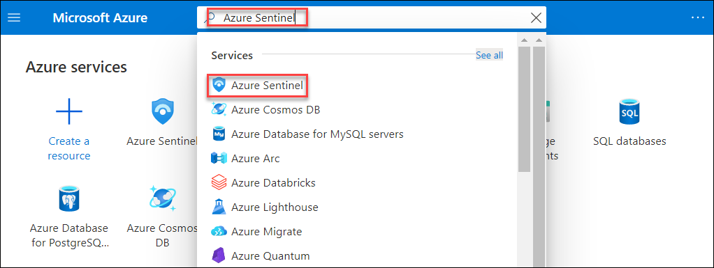

# Exercise 2: Onboard Azure Arc enabled servers to Azure Sentinel and Security Center

This exercise is intended to help you onboard your Azure Arc enabled server to Azure Sentinel and start collecting security-related events. Azure Sentinel provides a single solution for alert detection, threat visibility, proactive hunting, and threat response across the enterprise.

## Task 1: Onboard Azure Arc enabled servers to Azure Sentinel
Azure Sentinel comes with a number of connectors for Microsoft solutions, available out of the box and providing real-time integration. For physical and virtual machines, you can install the Log Analytics agent that collects the logs and forwards them to Azure Sentinel. Arc enabled servers supports deploying the Log Analytics agent using the following methods:
#### Using the VM extensions framework:
This feature in Azure Arc enabled servers allows you to deploy the Log Analytics agent VM extension to a non-Azure Windows and/or Linux server. VM extensions can be managed using the following methods on your hybrid machines or servers managed by Arc enabled servers:
 * The Azure portal
 * The Azure CLI
 * Azure PowerShell
 * Azure Resource Manager templates
#### Using Azure Policy:
Using this approach, you use the Azure Policy Deploy Log Analytics agent to Linux or Windows Azure Arc machines built-in policy to audit if the Arc enabled server has the Log Analytics agent installed. If the agent is not installed, it automatically deploys it using a remediation task. Alternatively, if you plan to monitor the machines with Azure Monitor for VMs, instead use the Enable Azure Monitor for VMs initiative to install and configure the Log Analytics agent.

  > Note: We have already installed LogAnalitics Agent to Linux VM - ubuntu-k8s in previous exercise, you can [go back](./01-Getting-Started-with-Azure-Arc.md#task-5-create-a-policy-assignment-to-identify-compliantnon-compliant-resources) review it for a revision

1. Search for ```Azure Sentinel``` on Azure portal and then select the **Azure Sentinel** from the search result.

    
    
1. On **Azure Sentinel** blade, click on **+ Add** to add a workspace. 

    
    
1. Select the existing log analytics workspace shown named ```LogAnaliticsWS-xxxxxx``` and then click on **Add** button.

    
    
 1. You will see a notification on upper right cornor **Adding Azure Sentinel**. It will take few second to add.
 
    
    
 1. Once the Azure Sentinel is added you will see another notification: **Successfully added Azure Sentinel**.
     
    
    
 1. Click on the **Overview** on Azure Sentinel blade and you will start seeing few insight after few minutes, if you don't see teh insights wait for few minutes and then refresh the browser tab.
    
    
    
    
    
    
    
    
    
    
