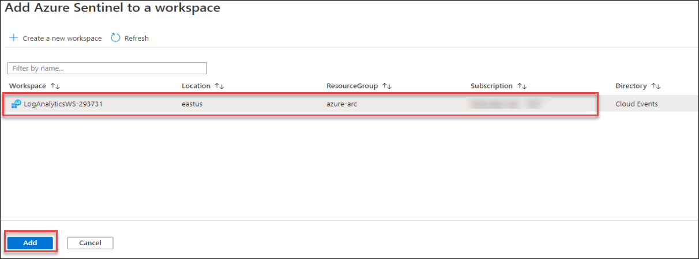
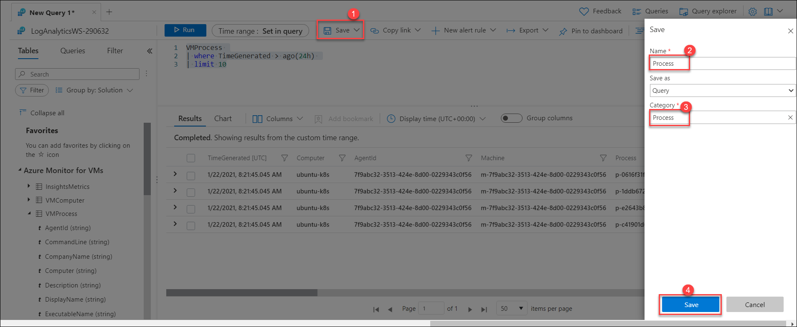
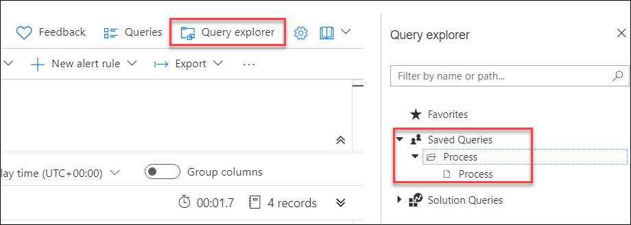
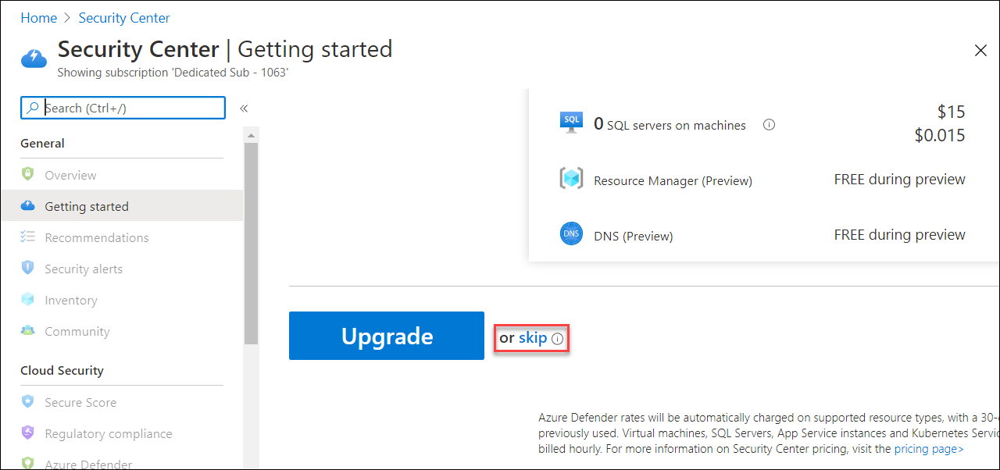
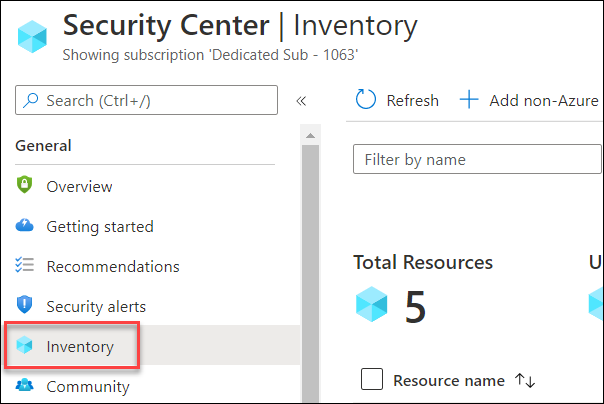
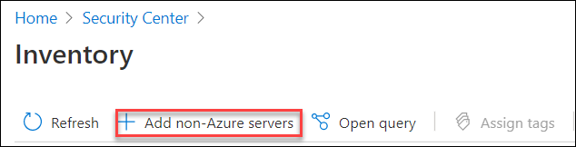
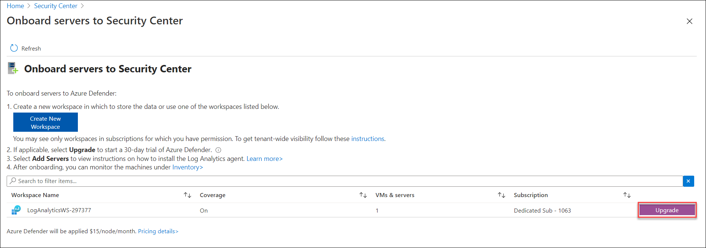
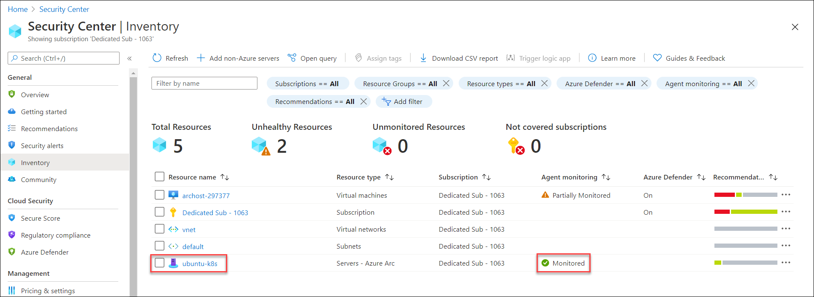

# Exercise 2: Onboard Azure Arc enabled servers to Azure Sentinel and Security Center

In the last excercise we had completed the onboarding of Linux VM and Kubernetes cluster on Azure Arc and verified it. Now let's see how to onboard your Azure Arc enabled server to Azure Sentinel and start collecting security-related events. Azure Sentinel provides a single solution for alert detection, threat visibility, proactive hunting, and threat response across the enterprise.

## Task 1: Onboard Azure Arc enabled servers to Azure Sentinel
Azure Sentinel comes with several connectors for Microsoft solutions, available out of the box and providing real-time integration. For physical and virtual machines, you can install the Log Analytics agent that collects the logs and forwards them to Azure Sentinel. Arc enabled servers supports deploying the Log Analytics agent using the following methods:

#### Using the VM extensions framework:
This feature in Azure Arc enabled servers allows you to deploy the Log Analytics agent VM extension to a non-Azure Windows and/or Linux server. VM extensions can be managed using the following methods on your hybrid machines or servers managed by Arc enabled servers:
 * The Azure portal
 * The Azure CLI
 * Azure PowerShell
 * Azure Resource Manager templates

#### Using Azure Policy:
You can use the Azure Policy Deploy Log Analytics agent to Linux or Windows Azure Arc machines built-in policy to audit if the Arc enabled server has the Log Analytics agent installed. If the agent is not installed, it automatically deploys it using a remediation task. Alternatively, if you plan to monitor the machines with Azure Monitor for VMs, instead use the Enable Azure Monitor for VMs initiative to install and configure the Log Analytics agent.

  > **Note** : We have already installed Log Analytics Agent into the Linux VM - ubuntu-k8s in the previous exercise, you can refer **task 5** in the previous exercise to review it.

1. Search for ```Azure Sentinel``` on the Azure portal and then select the **Azure Sentinel** from the search result.

   
    
1. On **Azure Sentinel** blade, click on **+ Add** to add a workspace. 

   
    
1. Select the existing log analytics workspace shown named ```LogAnalyticsWS-xxxxxx``` and then click on the **Add** button.

   
    
1. You will see a notification on the upper right corner **Adding Azure Sentinel**. It will take a few seconds to add.
 
   
    
1. Once the Azure Sentinel is added you will see another notification which says **Successfully added Azure Sentinel** as shown below.
     
   
 
1. Click on the **Overview** on Azure Sentinel page from where you can view the insights after few minutes. If you are not able to view the insights after a few minutes, then refresh the browser tab.
    
   
    
1. Now, click on the **Workbooks** from the left pane under the **Threat Management** section and search for ```Linux machines``` and select **Linux machines** from the search result.
    
   
    
1. Then from the bottom-left corner of the Azure portal click on **Save** and then on **OK** to save the workbook. 
 
   
    
1. Now, go back to **Azure Sentinel Overview** blade and click on **INSIGHTSMETER** to query the **ubuntu-k8s** VM insights. Count of **Events** could be different on your Azure Sentinel Dashboard.

   
    
1. You will see **Results** for ```union InsightsMetrics``` in query explorer. You can see operations around Network, Logical Disk, Memory, and Processor for **ubuntu-k8s** VM.

   
    
1. Let us check for **ubuntu-k8s** processes by running the following query, you can change the time range limit as well to see the result of a specific time interval. You can scroll right on the **Results** section and see more details and descriptions about every process. 

   ```
   VMProcess 
   | where TimeGenerated > ago(24h) 
   | limit 10
   ```

      
    
1. You can save the query for later use by clicking on the **Save** button and then provide any name for the query **Name** and **Category**, then click on **Save**.

    

1. You can see and run the saved **queries** by browsing to **Query Explorer** and then **Saved Queries** as shown below.

    
    
## Task 2: Enable Azure Security Center
Security Center can monitor the security posture of your non-Azure computers, but first you need to connect them to Azure.
You can connect your non-Azure computers in any of the following ways:
  * Using Azure Arc enabled servers **(recommended)**
  * From Security Center's pages in the Azure portal **(Getting started and Inventory)**
 
1. Search for **Security Center** in Azure portal search bar and then click on **Security Center**.
    
   

1. From the Getting Started tab, scroll down and select **skip**.

   
 
1. Click on **Inventory** from the **Security Center**.

   
    
1. From the **Inventory** tab, click on the **Add non-Azure servers**.

   
    
1. On **Onboard servers to Security Center** page, click on **Upgrade** to upgrade the existing log analytics workspace named **LogAnalyticWS-xxxxx**. This will allow azure defender protect for your resources.

   
    
1. Now, go back to **Inventory** tab and then you will see few connected resources. You can also find the **ubuntu-k8s** Arc enabled server is available in the resources list because **LogAnalytics** agent is already enabled for it and the same Log Analytics workspace is connected to Security Center. Agent monitoring will take few minutes to update and show status as **Monitored** for Arc enabled server **ubuntu-k8s** as shown in below screen.  

   

## In this exercise, you have covered the following:
 
   - Onboard Azure Arc enabled servers to Azure Sentinel.
   - Enable Azure Security Center.