# HOL-1: Exercise 3: Onboard SQL Server to Arc
In the last excercise, you have seen how to enable security measures and monitoring for Arc enabled servers. In this exercise, you will onboard SQL Server to Azure Arc using Azure Portal and PowerShell commands.

## Task 1: Login To Azure Portal

1. Navigate back to Azure Portal which you have already opened in the previous exercises.
      
1. Click on the search blade at the top and search for ```SQL Server```, select **SQL Server - Azure Arc**.
 
   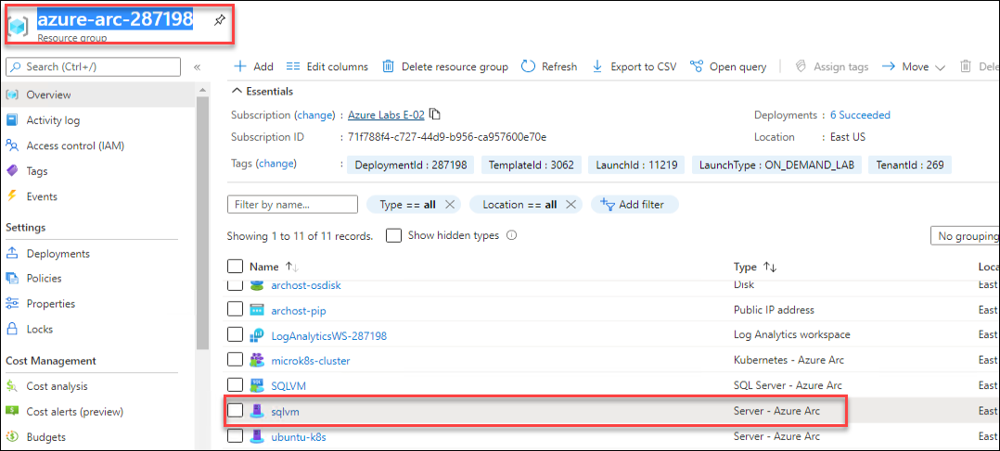
   
1. Click on the **Create SQL Server - Azure Arc** button to create the **SQL Server- Azure Arc**. 
 
   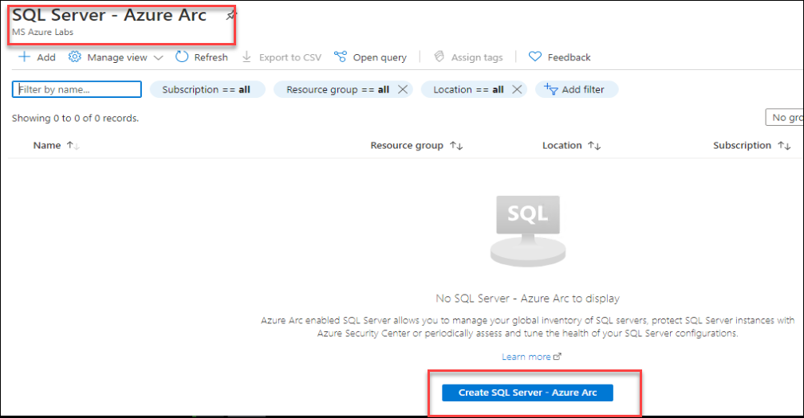
   
1. You will now see the prerequisite page. You can explore the page and then click on the **Next: Server details** option.
    
   > **Note**: We have already completed the prerequisite part for you. 
    
   
   
1. On the **Server Details** blade, enter the below details.
 
   - Subscription: Leave default
   - Resource group: Select **azure-arc** from dropdown list.
   - Region: Select same region as the Resource group.
   - Operating Systems: Select **Windows**.

     Now click on the **Next:Tags** button.
   
   
   
1. Leave the default for tags blade and click on **Next: Run Script** button.
 
1. On the **Script** blade, explore the given script. We will be using this PowerShell script to **Register Azure Arc enabled SQL Server** later.
 
   > **Note** : You can skip the script download from here by clicking on ```X``` at the top right as we have already downloaded this script inside the Lab VM for you.
    
   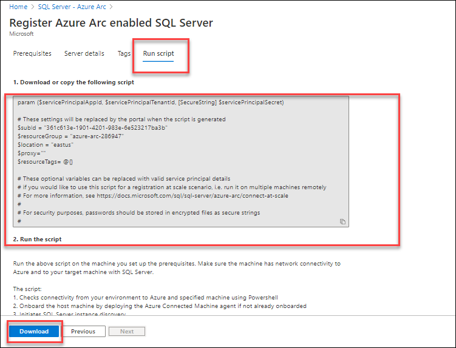
     
## Task 2: Register Azure Arc enabled SQL Server.

1. Minimize the Azure Portal Browser window. 

1. From the desktop of your **LabVM/ARCHost VM**, double click on **Windows PowerShell** icon to open it.
 
   
  
1. Then, run the below command to change the directory to where the script gets downloaded.
 
   ``` 
   cd C:\LabFiles
   ```

1. After changing the directory to **Lab files**, run the command given below:

   ```
   .\Execute-RegisterSqlServerArc.ps1
   ```
     
   > **Note** : This will initiate the execution of **RegisterSqlServerArc.ps1** script inside **sqlvm** that is deployed on Hyper-V.

1. After running the command, you will see some outputs which shows that the script started running.

   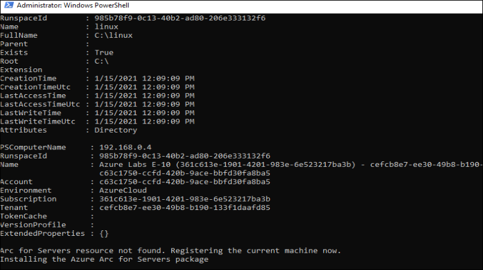
  
1. After 1-2 minutes, you will see that the script execution is completed. Make sure that you see the following output: ```SQL Server - Azure Arc resource: SQLVM created```

   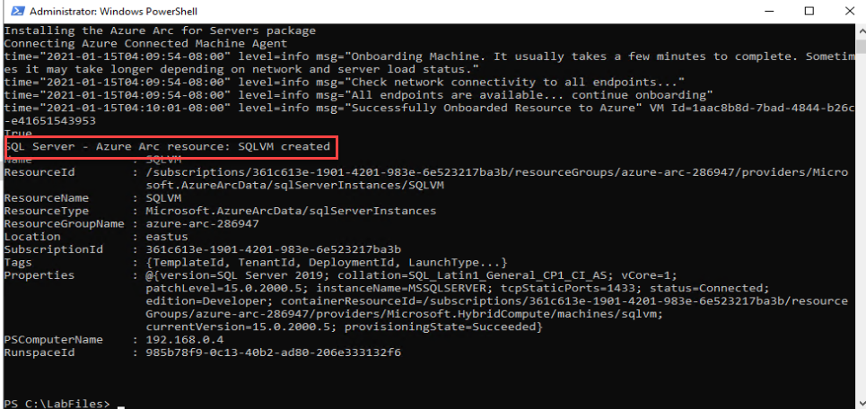
  
1. Bring back the browser window where you had opened Azure Potal and search for **SQL Server -Azure Arc**. If you are already in that page, you will need to click on Refresh button. In that page, you will see one resource **SQLVM** that we just created using the PowerShell script in the previous step.

   
  
1. Select the **SQLVM** resource and now you can see the dashboard of **SQLVM** SQL Server -Azure Arc from Azure Portal.

   

## Task 3: Run on-demand SQL Assessment.

1. Click on the search blade at the top and search for ```Log Analytics workspace```, then select **LogAnalyticsWS-<inject key="DeploymentID/Suffix" />**.

1. Then select **Agents management** from the left side menu and copy the value of **Workspace ID** and **Primary Key** and save it into a notepad or Notepad++ for later use.
 
   

1. Now, search for **Servers - Azure Arc** from search box and click on **Servers - Azure Arc**.
 
   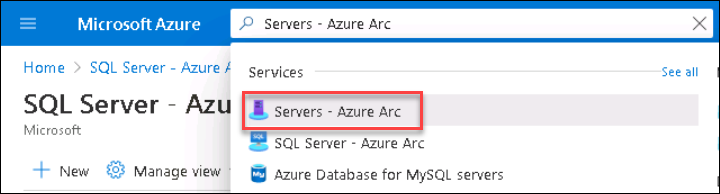 
   
1. Select **sqlvm** from the list of Azure Arc servers.

   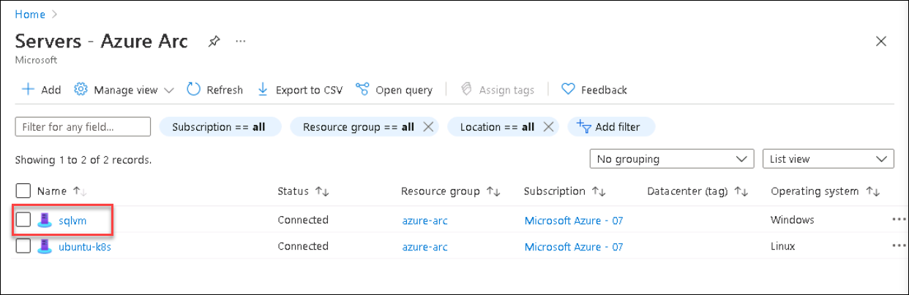
    
1. Click on the **Extension** button from the left side menu and click on **+ Add** button to add a new extension.
 
   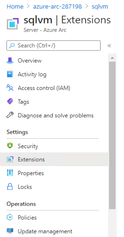
    
1. Select the **Log Analytics Agent - Azure Arc** extension.
 
   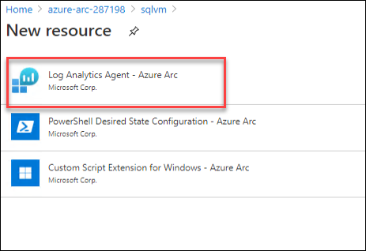
    
1. Now click on the **Create** button to continue. 
   
1. At this step, you must enter Log analytics workspace ID and a key to install the MMA ( Microsoft Monitoring Agent ) in the **sqlvm**.
  
1. Now, enter the Workspace ID and Key that you copied from the previous step, and click on **Review + Create** button and then click on **Create** on next window.
 
   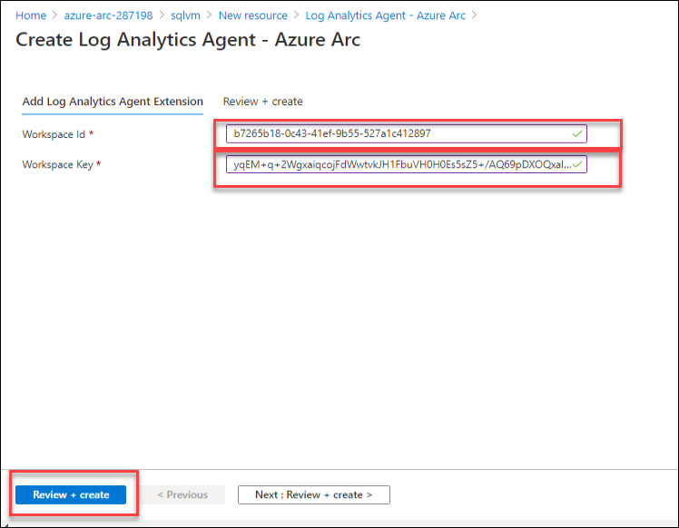
  
   The deployment will take around 5 to 10 minutes to complete. You have to wait for this deployment to get successful to proceed to the next step.
 
1. Then, Go to **SQLVM** Azure Arc - SQL Server resource and select the **Environment Health** under settings from the left side menu.
    
   Now select the below details ( scroll down if you don't see the options ):

   * **Account Type:** Select **Domain User Account** from the drop-down menu.

   Then click on the **Download configuration Script** button to download the PowerShell script.
    
   
    
1. Here you will see one PowerShell script is downloaded.
   
   
    
1. Open PowerShell by clicking on the **Windows Powershell** from your LABVM Desktop and run this command to copy this script in the **sqlvm** machine.
    
   ```
   Copy-VMFile "sqlvm" -SourcePath "C:\Users\arcadmin\Downloads\AddSqlAssessment.ps1" -DestinationPath "C:\LabFiles\AddSqlAssessment.ps1" -CreateFullPath -FileSource Host
   ```

1. After the command is successfully completed, open **sqlvm** from the Hyper-V Manager by double clicking on **sqlvm**.

   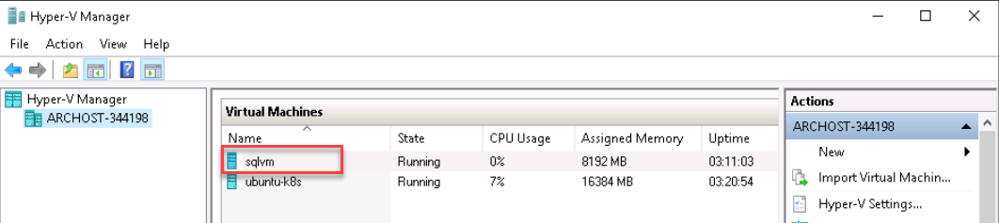
   
1. On Connect to sqlvm box, scroll the bar towards Small to open the vm in smallest window and then click on **Connect** button.

    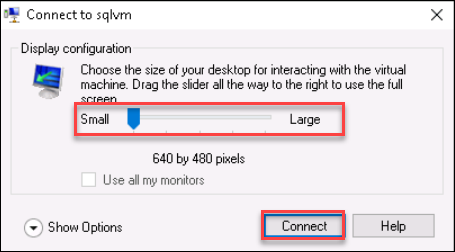

1. Type password **demo@pass123** and press **Enter** button to login. Then, you can resize the sqlvm window size as per your convenience.
   
   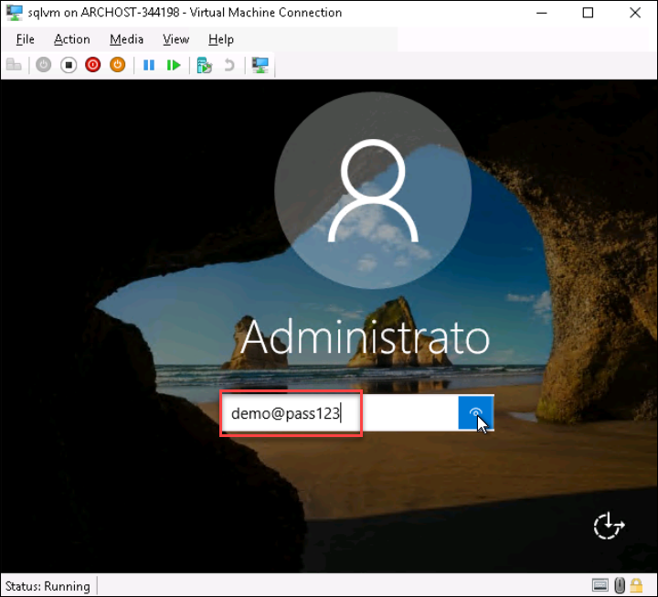
 
1. Click on Start Menu and search for **SQL Server 2019 Configuration Manger** and open SQL Server 2019 Configuration Manger.

   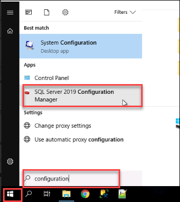

1. Now Select **SQL Server Network configuration** and Double click on **Protocol for MSSQLSERVER**.

   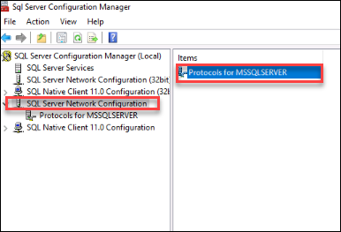
 
1. Now Right click on the **TCP/IP** and select **Enable**. You will get one Warning Pop-up select okay on the pop-up.
 
   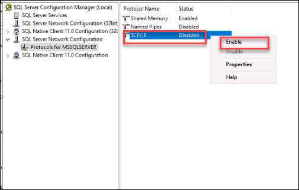
 
1. After enabling the TCP/iP port select **SQL Server Services** from left side menu and right click on **SQL Server** and select Restart. This will restart the SQL Service and apply the TCP/IP port.

   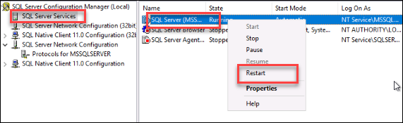
 
1. Open File explorer in the **sqlvm** and navigate to **C:\LabFiles\** this directory and right-click on **AddSqlAssessment.ps1** PowerShell script and select **Run with PowerShell** to run the PowerShell script to schedule the task which will generate the assessment and logs.
    > Note: If the script execution doesn't start, re-run the powershell script again.
 
   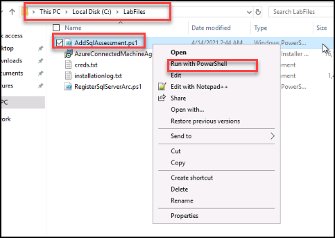
   
1. Type the below Schduled Task username and Password on powershell window and press enter to run the scipt.

   * SchduledTaskUserName: Administrator
   * SchduledTaskPassword: demo@pass123 
   
   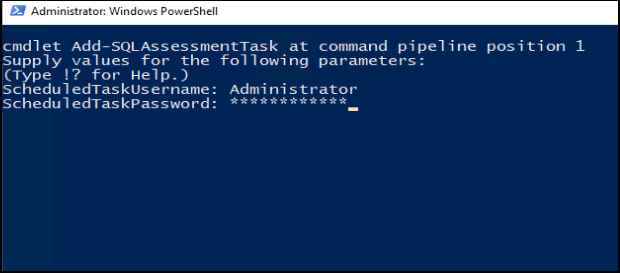
    
1. After running the PowerShell script, navigate to **C:\sql_assessment** directory in File Explorer, and you will be able to see some files and folders. These are the assessments and logs that are generated using the PowerShell script.

    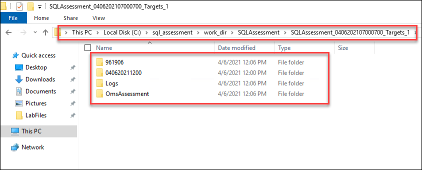
    
1. To view the SQL Assessment in Azure Portal, Navigate back to Azure Portal .

   

1. Now navigate to **azure-arc** Resource group and then select resource **SQLVM** with type  **SQL Server- Azure Arc**. 

1. Now open Environment Health option from left side under Settings section and Click on **View SQL Assessment results**.
    > Note: The View SQL Assessment results button remains disabled until the results are ready in Log Analytics. This process might take up to two hours after the data files are processed on the target machine.
   
   
   
1. Once the Assessment results are available it will look like below.
    > Note: Now you can move to the next Exercise, you don't have to wait here to the Assessment complete.
   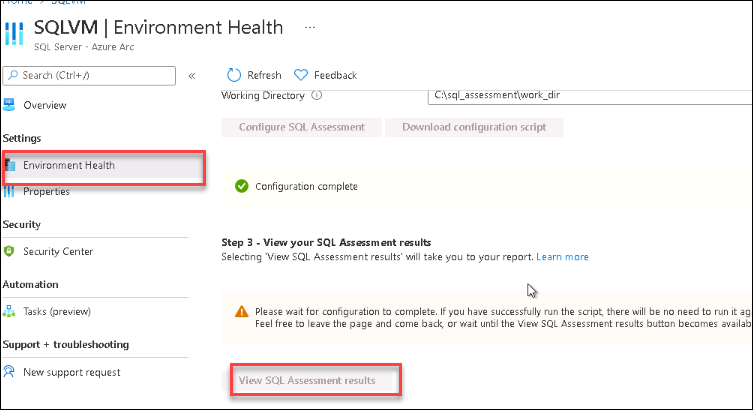
   

## In this exercise, you have covered the following:
 
   - Register Azure Arc enabled SQL Server.
   - Run on-demand SQL Assessment.

