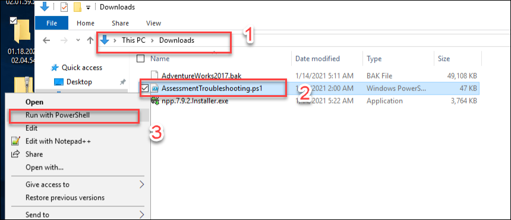

# HOL-1: Exercise 3: Onboard SQL Server to Arc
In the last excercise we had worked around security measures andmonitoring, so now let's onboard SQL Server to Azure Arc using Azure Portal and PowerShell commands.

## Task 1: Login To Azure Portal

1. In the **LabVM/ARCHost VM**, click on the Azure portal shortcut of Microsoft Edge browser which is present on the desktop.
  
    
   
1. On the **Sign in to Microsoft Azure** tab, you will see the login screen. Provide the following **Email/Username** and then click on **Next**.

   * Email/Username: <inject key="AzureAdUserEmail"></inject>
   
1. Now enter the following **Password** and click on **Sign in**.
   
   * Password: <inject key="AzureAdUserPassword"></inject>
   
1. If you see the pop-up **Stay Signed in?**, click No.

1. If you see the pop-up **You have free Azure Advisor recommendations!**, close the window to continue the lab.

1. If **Welcome to Microsoft Azure** pop-up window appears, click on **Maybe Later** to skip the tour.
      
1. Click on the search blade at the top and search for ```SQL Server```, select **SQL Server - Azure Arc**.
 
   
   
1. Click on the **Create SQL Server - Azure Arc** button to create the **SQL Server- Azure Arc**. 
 
   
   
1. You will now see the prerequisite page. You can explore the page and then click on the **Next: Server details** option.
    
   > **Note**: We have already completed the prerequisite part for you. 
    
   
   
1. On the **Server Details** blade, enter the below details.
 
   - Subscription: Leave default
   - Resource group: Select **azure-arc-SUFFIX** from dropdown list.
   - Region: Select same region as the Resource group.
   - Operating Systems: Select **Windows**.

     Now click on the Next button.
   
   
   
1. Leave the default for tags blade and click on **Next: Run Script** button.
 
1. On the **Script** blade, explore the given script. We will be using this PowerShell script to **Register Azure Arc enabled SQL Server** later.
 
   > **Note** : You can skip the script download from here. We have already downloaded this script inside the Lab VM for you.
    
   
     
## Task 2: Register Azure Arc enabled SQL Server.

1. From your **LabVM/ARCHost VM**, open **Windows PowerShell** icon from the desktop.
 
   
  
1. Then, run the below command to change the directory to where the script gets downloaded.
 
   ``` 
   cd C:\LabFiles
   ```

1. After changing the directory to **Lab files**, run the command given below:

   ```
   .\Execute-RegisterSqlServerArc.ps1
   ```
     
   > **Note** : This will automatically run the **RegisterSqlServerArc.ps1** script inside **sqlvm** deployed on Hyper-V.

1. After running the command, you will see that the script started running.

   
  
1. After some time, you will see that the script execution is completed. Make sure that you see the output as shown the image below.

   
  
1. Go back to the Azure portal and search for **SQL Server -Azure Arc**. You will see one resource that we just created using the PowerShell script in the previous step.

   
  
1. Select the **SQLVM** resource and now you can see the dashboard of **SQLVM** SQL Server -Azure Arc from Azure Portal.

   

## Task 3: Run on-demand SQL Assessment.

1. Search for Log analytics workspace, then select **Agents management** from the left side menu and copy the value of **Workspace ID** and **Primary Key** and save it into a notepad for later use.
 
   

1. Now, search for **Servers - Azure Arc** from search box and click on **Servers - Azure Arc**.
 
    
   
1. Select **sqlvm** from the list of Azure Arc servers.

   
    
1. Click on the **Extension** button from the left side menu and click on the **Add** button to add a new extension.
 
   
    
1. Select the **Log Analytics Agent - Azure Arc** extension.
 
   
    
1. Now click on the **Create** button to continue. 
   
1. At this step, you must enter Log analytics workspace ID and a key to install the MMA in the **SQLVM**.
  
1. Now enter the Workspace ID and Key that you copied from the previous step, and click on **Review + Create** button and then click on **Create** on nextr window.
 
   
  
   After a few minutes, the deployment will complete and you can continue with the next task.
 
1. Go to **SQLVM** Azure Arc - SQL Server resource and select the **Environment Health** under settings from the left side menu.
    
   Now select the below details:

   * **Account Type:** Select **Domain User Account** from the drop-down menu.

   Then click on the **Download configuration Script** button to download the PowerShell script.
    
   
    
1. Here you will see one PowerShell script is downloaded.
   
   
    
1. Open the PowerShell by clicking on the **Windows Powershell** from your LABVM Desktop and run this command to copy this script in the **SQLVM** machine.
    
   ```
   Copy-VMFile "sqlvm" -SourcePath "C:\Users\arcadmin\Downloads\AddSqlAssessment.ps1" -DestinationPath "C:\LabFiles\AddSqlAssessment.ps1" -CreateFullPath -FileSource Host
   ```

1. After the command is successfully completed, open your **SQLVM** from the Hyper-VManager and enter password **demo@pass123** to login.
 
1. Open File explorer in the **SQLVM** and navigate to **C:\LabFiles\** this directory and right-click on **AddSqlAssessment.ps1** PowerShell script and select **Run with PowerShell** to run the PowerShell script to schedule the task which will generate the assessment and logs.
 
   
   
1. Enter the below Schduled Task username and Password on powershell window and press enter to run the scipt.

   * SchduledTaskUserName: Administrator
   * SchduledTaskPassword: demo@pass123 
   
   
    
1. After running the PowerShell script, navigate to **C:\sqlserver\SQLAssessment** directory in File Explorer, and you will be able to see some files and folders. These are the assessments and logs that are generated using the PowerShell script.

    

## In this exercise, you have covered the following:
 
   - Register Azure Arc enabled SQL Server.
   - Run on-demand SQL Assessment.

