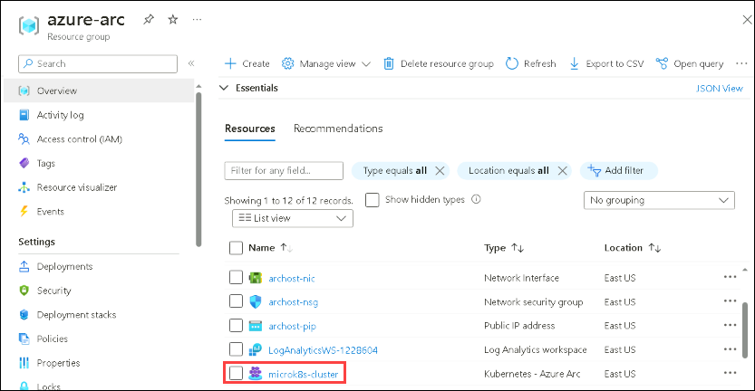
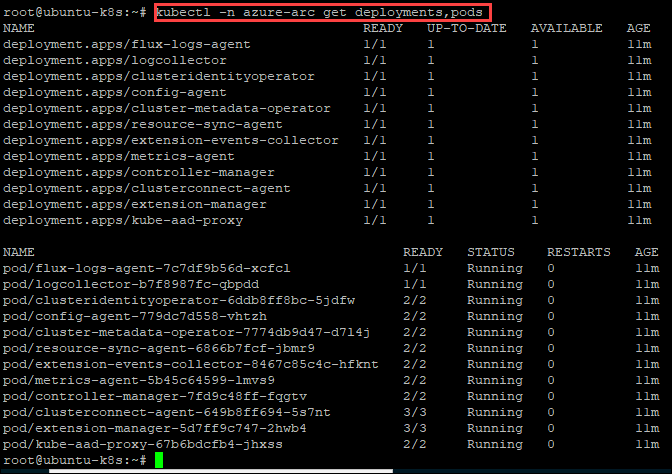
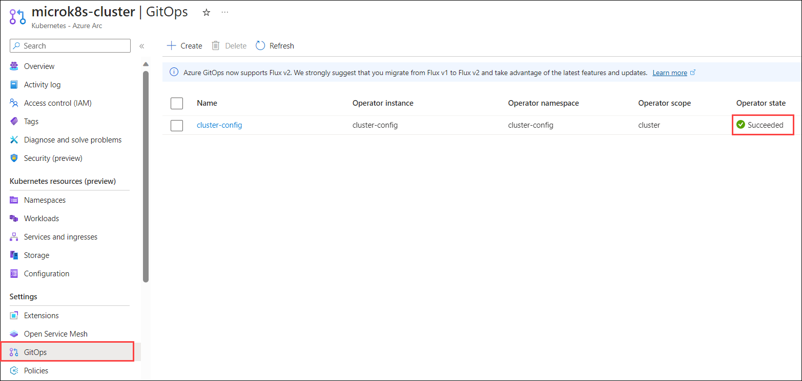
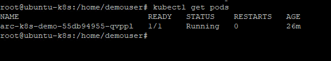
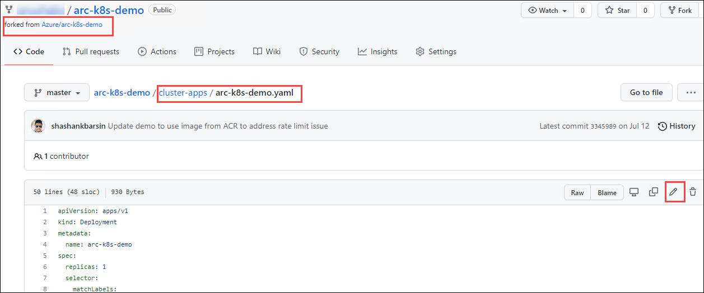
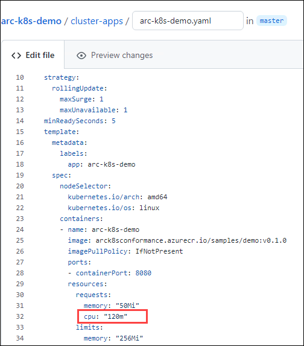
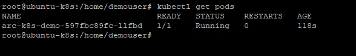
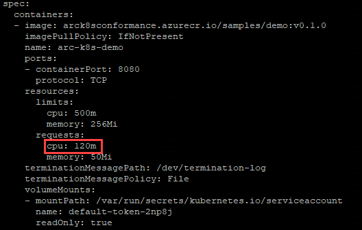

# Exercise 1: Enable GitOps Configuration on connected K8s Cluster

#### Develop cloud-native apps, operate anywhere

In addition to managing and monitoring their Kubernetes clusters, Contoso’s central development teams are building applications for internal inventory management at their distribution sites. They need these applications to be containerized and run on Kubernetes clusters. The locations are spread across the country and Contoso is faced with the challenge of how to uniformly deploy, configure and manage their containerized applications across all these locations. By leveraging GitOps on Azure Arc-enabled Kubernetes, Contoso can centrally declare their Kubernetes configurations and applications in a Git repository and deploy them to all clusters simultaneously. Developers are more empowered because they can commit changes directly in the Git repo and these updates are also automatically rolled out to all the clusters.

GitOps, as it relates to Kubernetes, is the practice of declaring the desired state of Kubernetes configuration (deployments, namespaces, etc.) in a Git repository followed by a polling and pull-based deployment of these configurations to the cluster using an operator. In this exercise, you will deploy a sample Kubernetes app using az k8sconfiguration command and gitops and also update the configuration in the repository which you have linked to the connected cluster and verify if the cluster is getting updated based on the changes made. You will be using the Kubernetes cluster with which you connected in the earlier exercise.

## Task 1: Fork the GitHub Arc K8s demo repository

In this task, you'll navigate to the GitHub repository containing the Azure Arc-enabled Kubernetes demo configurations. By forking this repository to your own GitHub account, you'll have the necessary access to modify and deploy Kubernetes configurations using GitOps methodology. This step is essential for subsequent tasks involving configuration deployment and updates.

1. Launch the following GitHub repository URL ```https://github.com/Azure/arc-k8s-demo```. In the upper right corner you will see **Sign in** and **Sign up** options, if you already have a github account then click on **Sign in**, otherwise **Sign up**.

    

2. Now, from the upper right corner, click on the **Fork** to fork the repository to your GitHub account.

   

## Task 2: Configuring Azure CLI and PuTTY for Ubuntu-K8s VM

In this task, you will configure access to an Ubuntu-K8s VM using PuTTY, upgrade Azure CLI packages, install dependencies, and set up the Azure Arc agent. Additionally, you'll copy essential variables from a file in the ARCHOST VM and utilize them to log into Azure. This setup is essential for subsequent operations and deployments within the Kubernetes cluster.

1. From the start menu of the **ARCHOST** VM, search for **putty** and open it with a double click or another way.

    
     
1. In Putty Configuration tool, enter the **ubuntu-k8s** VM private IP - ```192.168.0.8```, make sure the Port value is ```22```. Once you entered the private IP of the **ubuntuk8s** VM, click on the Open to launch the terminal.

    
    
1. Enter the **ubuntu-k8s** vm username - ```demouser``` in **login as** and then hit **Enter**. 

   ```
   demouser
   ```

1. Now, enter the password - ```demo@pass123``` and press **Enter**. Remember password will be hidden and will not be visible in the terminal.

   ```
   demo@pass123
   ```

    
    
    > Note: To paste any value in the Putty terminal, just copy the values from anywhere and then right-click on the terminal to paste the copied value.

1. Login with Sudo. Run the following command and provide the Password `demo@pass123`.

   ```
   sudo su
   ```
   
   ```
   demo@pass123
   ```
    
1. Run the below commands to upgrade the az packages and az module. 
   
     ```
      curl https://bootstrap.pypa.io/get-pip.py > get-pip.py
      python3 get-pip.py
      apt install pip
      python3 get-pip.py
      python3 -m pip install -U pip
      python3 -m pip install --upgrade pip --target /opt/az/lib/python3.6/site-packages/
      az upgrade -y
      init 6
    ```
    > **Note**: If in case, the above commands fail then please run the below-mentioned command:
    
    ```
     sudo apt-get install python3-pip
    ```
1. Open a new Putty session, re-perform the steps from step 2 to step 6 of the same task to get the upgraded packages and then continue from step 9.

1. Next, you have to navigate back to the Desktop of the provided virtual Machine ARCHOST VM 💻, and then click on the `installArcAgentLinux.txt` file to open it.

   

1. Then, select the first 7 lines and, then right click and copy. 

1. Then, go back to the putty session and paste it into the ubuntu-k8s VM by doing a right click and it will start executing. 

1. Once it is executed, you have declared the values of AppID, AppSecret, TenantID, SubscriptionID, ResourceGroup, and location, and then logged into Azure using the 7th line. You can also find the values of these variables in the **Environment Details** tab. These variables are required for the next steps.

    


## Task 3: Onboard Kubernetes Cluster to Azure Arc

In this task, you will onboard the local Kubernetes cluster to Azure Arc. So, here we onboard **MicroK8s** Kubernetes cluster to Azure Arc which is hosted on **ubuntu-k8s** VM. We already have the Microk8s Kubernetes cluster ready and configured with the Arc-enabled CLI extensions.

   > **Note**: Make sure that you perform all steps with the root user in the ubuntu-k8s VM.

1. To install helm, you need to run the following commands within the terminal of the ubuntu-k8s VM that is opened in Putty:
            
     > **Info**: Helm is a Kubernetes deployment tool for automating the creation, packaging, configuration, and deployment of applications and services to Kubernetes clusters. The Kubernetes app's manifests are stored in helm charts.
   ```
   curl -fsSL -o get_helm.sh https://raw.githubusercontent.com/helm/helm/master/scripts/get-helm-3
   chmod 700 get_helm.sh
   ./get_helm.sh
   ```
   **Note**: In case you see `Could not find git. It is required  for plugin installation.` warning, please ignore it and continue with the lab.
    
   

1. Next, you have to run the below command to ensure the Azure CLI version and customlocation extension for Az CLI are the latest.

    ```
    az upgrade -y
    az extension add --name customlocation
    ```
    
    >**Note**: If you face any exceptions while updating the CLI version, please rerun the command again.

1. Then, you will update the Arc-enabled Kubernetes CLI extension to ensure that we are always using the latest k8s extension for Azure CLI.

   ```
   az extension update --name connectedk8s
   ```
    
   
    
1. Now, you can check the status of the Kubernetes cluster by running ```microk8s.status``` in **ubuntu-k8s** VM. To check the status once the command is executed, you have to scroll up to the top of the output to view the status. If the status is **microk8s is running**, you can proceed to the next step. But, if it is in a stopped state, you have to run the ```microk8s start``` command to restart the Kubernetes cluster.

   - Command to check the status of the Kubernetes cluster
     ```
     microk8s.status
     ```
     
   - Command to start the Kubernetes cluster
     ```
     microk8s start
     ```
     
   >**Note**: In case you see any error,  Open a new Putty session, re-perform the steps from step 2 to step 4 of the same task 2, run the below command to refresh the certificates and retry the step.

   ```
   microk8s refresh-certs
   ```

   

1. Next, you will write the config file to the $HOME/.kube directory by executing the below command.

     > **Info**: A kubeconfig file is a file used to configure access to Kubernetes when used in conjunction with the kubectl commandline tool (or other clients).

   ```
   cd $HOME
   mkdir .kube
   cd .kube
   microk8s config > config
   cd ..
   ```

    

1. Now, you will Connect the Kubernetes cluster to Azure Arc by executing the below command. This command will take a few minutes to onboard the Kubernetes cluster to Azure Arc.

   ```
   az connectedk8s connect --name microk8s-cluster --resource-group $ResourceGroup -l $location
   ```
    
   
   
   > **Note**: While running the above command, if you face an error stating **Could not retrieve credential from local cache**, run the following command to log in to the azure portal again.
   ```
   az login -u $AppID --service-principal --tenant $TenantID -p $AppSecret
   ```
   
1. Once the previous command is executed successfully, the **provisioning state** in output will show as succeeded.

       

## Task 4: Verify if the Kubernetes cluster is connected to Azure Arc

In this task, you'll verify the successful connection of the Kubernetes cluster to Azure Arc. By executing Azure CLI commands and navigating to the Azure portal, you'll confirm the existence of the Kubernetes cluster resource under the specified resource group. Additionally, you'll ensure the proper deployment of operators within the cluster's namespace, validating the establishment of the Azure Arc connection and its associated components.

Now let us verify if the Kubernetes cluster is connected to Azure Arc and is in a healthy state.

1. Verify whether the cluster is connected by running the following command:
   
   ```
   az connectedk8s list -g $ResourceGroup -o table
   ```
     
   
   
1. Navigate to the Resource Group from the Azure portal navigation pane and click on the Resource Group named **azure-arc**. 

1. Click on Refresh on the azure-arc overview page and then look for the resource named **microk8s-cluster** of resource type **Azure Arc enabled Kubernetes resource**.

   

1. Azure Arc enabled Kubernetes to deploy a few operators into the azure-arc namespace. You can view these deployments and pods by running the command in the terminal of the ubuntu-k8s VM:

   ```
   kubectl -n azure-arc get deployments,pods
   ```
   
   The output should be similar as shown below:
   
   


## Task 5: Configure Kubernetes Cluster with GitOps using Azure CLI

In this task, you will configure a Kubernetes cluster using GitOps methodology through Azure CLI. This GitOps setup will create namespaces, deploy workloads, and provide team-specific configurations based on the manifests in the forked repository.

1. Copy the below command to any text editor

   ```
   az k8s-configuration create --name cluster-config --cluster-name microk8s-cluster --resource-group $ResourceGroup --operator-instance-name cluster-config --operator-namespace cluster-config --repository-url https://github.com/<githubusername>/arc-k8s-demo --scope cluster --cluster-type connectedClusters
   ```

1. Then, replace as mentioned below and run the command in ubuntu-k8s VM SSH session that is opened in putty:

   - You have to replace **<githubusername>** in the previous command with the username of the GitHub account to which you had forked the repository. 
   
   If you get a prompt asking **Do you want to install the extension k8sconfiguration**, type **Y** and press **Enter**.

    
   
     > **Note**: Wait for 5 mins before performing the next step

     > ``Info`` - Once you execute the above command, the manifests in your forked repository provision a few namespaces, deploy workloads and provide some team-specific configuration. Using this repository with GitOps creates the following resources on your Kubernetes cluster:

     > *Namespaces*: cluster-config, team-a, team-b
     
     > *Deployment*: cluster-config/arc-k8s

     > *ConfigMap*: team-a/endpoints
     
     > The config agent polls Azure for new or updated configurations.

## Task 6: Validate the SourceControlConfiguration

In this task, you will validate the SourceControlConfiguration to ensure successful creation and compliance status. You'll run an Azure CLI command to check if the compliance state is "Installed", and if not, retry periodically until it reflects the desired state. Additionally, you'll navigate to the Azure Portal to confirm the GitOps operator's state status under the specified Resource Group and Resource, ensuring the successful setup of the GitOps configuration.

1. Now, to validate whether the **sourceControlConfiguration** was successfully created and the **compliance** state is Installed, you have to run the command given below. 
   
   > **Note**: If the state is pending, retry the same command again after every 1 minute.

   ```
   az k8sconfiguration show --resource-group $ResourceGroup --name cluster-config --cluster-name microk8s-cluster --cluster-type connectedClusters
   ```
     > **Note**: that the sourceControlConfiguration resource is updated with compliance status, messages, and debugging information in the output.

   The output should include the following value as given here: ``"complianceState": "Installed"``

    
  
2. In the Azure Portal which you have opened in the browser window, navigate to Resource group **azure-arc** RG-> Resource **microk8s-cluster** -> **GitOps**. Ensure that the operator state status is **Succeeded**.

    
  
## Task 7: Validate the Kubernetes configuration

In this task, you will verify the successful creation of namespaces, deployments, and resources in the Kubernetes cluster. By executing provided kubectl commands, you'll confirm the creation of specified namespaces and the deployment of the Flux operator in the cluster-config namespace. Additionally, you'll explore other resources deployed as part of the configuration repository to ensure the proper functioning of GitOps.

After config-agent has installed the flux instance, resources held in the git repository should begin to flow to the cluster. 

   > ```Info```: Flux is the operator that makes GitOps happen in your cluster. It ensures that the cluster config matches the one in git and automates your deployments.

1. To verify that the namespaces, deployments, and resources are created, **run the following command** in the SSH Session opened to the ubuntu-k8s VM from putty:

   ```
   kubectl get ns --show-labels
   ```
 
   The output shows that team-a, team-b, itops, and cluster-config namespaces have been created as shown:
  
    
   
2. The **flux operator** will be deployed to **cluster-config** namespace, as directed by our **sourceControlConfig**:
      
    ```
    kubectl -n cluster-config get deploy  -o wide
    ```
   
    The output should be as shown:
   
     
  
3. You can explore the other resources deployed as part of the configuration repository by running the following commands:

   ```
   kubectl -n team-a get cm -o yaml
   ```

## Task 8: Make changes to cluster declarations in the Git repo.

In this task, you'll access an Ubuntu-K8s VM through PuTTY and verify the presence of a specific pod using kubectl get pods command. Then, you'll navigate to your forked repository on GitHub (https://github.com/<yourGitHubaccountusername>/arc-k8s-demo) and locate the arc-k8s-demo.yaml file under cluster-apps. You'll edit this YAML file to modify the CPU request to 120, committing the changes to confirm the updated configuration in the repository.

1.  Run the following command in the SSH session that is already opened to the ubuntu-k8s from putty and confirm that you are able to see the **arc-k8s-demo-** pod.

    ```
    kubectl get pods 
    ```
    

2. Browse to the **forked** repo of ```https://github.com/Azure/arc-k8s-demo```, which will be in the following format: ```https://github.com/<yourGitHubaccountusername>/arc-k8s-demo```

3. Navigate to **cluster-apps->arc-k8s-demo.yaml** and edit the yaml file.

      

4. Change the CPU request to **120** in line 32 and then scroll down to the bottom and click on **Commit changes** to confirm the changes to the CPU request.

   
   

## Task 9: Verify changes are deployed to the cluster.

In this task, you'll confirm the deployment of changes made to the cluster declarations in the Git repository. By accessing the Ubuntu-K8s VM via PuTTY, you'll check for the creation of a new pod based on the updated configuration using the **kubectl get pods** command. Upon identifying the new pod, you'll copy its name and execute **kubectl get pod <podname> -o yaml** to inspect its details, specifically observing the updated CPU request value. This process ensures that changes made to the Git repository are successfully deployed and reflected in the Kubernetes cluster.

1.  Run the following command in the SSH Session that you have opened to the ubuntu-k8s VM from Putty and copy the pod name starting with **arc-k8s-demo-**

    ```
    kubectl get pods 
    ```
     
    
    Observe in the above image that the previous pod is terminated and a new pod is created based on the updated configuration.

      > **Note**: If you don't see any change, retry running the command after a couple of minutes

2.  Replace the pod name that you copied in the previous step and run the command
 
    ```
    kubectl get pod <podname> -o yaml
    ```
    Example: ```kubectl get pod arc-k8s-demo-5779f4d696-fm22j -o yaml```
   
       
    
    Observe the CPU request value that you updated in the previous steps in the output as shown:
    
       

In this exercise, you have seen how to enable GitOps Configuration on connected K8s Cluster and how it works.

Now, you can move on to the next exercise.

