# Exercise 2: Enforce GitOps using Azure Policy for Azure Arc-enabled Kubernetes

Contoso’s Central IT team also want to ensure that any new distribution site is quickly ready to set up and start operations with the applications they need. Leveraging Azure Policy, they are able to ensure that any new Kubernetes cluster is automatically connected to the same Git repository where the applications are configured so these can be deployed to the new cluster without any manual intervention from DevOps teams.

In this exercise, you will see how to use Azure Policy to enforce that each Azure Arc-enabled Kubernetes cluster has specific GitOps configurations applied to it.

## Task 1: Create a Policy Assignment

In this task, you will select an existing policy definition and create a policy assignment. When creating the policy assignment you set the scope for the assignment: this will be the Azure Arc-enabled Kubernetes Cluster. You will also set the parameters for the sourceControlConfiguration that will be created. Once the assignment is created the Policy engine will identify all connectedCluster or managedCluster resources that are located within the scope and will apply the sourceControlConfiguration to each one.

1. From the Azure Portal ```https://portal.azure.com```, navigate to the resource group ```azure-arc``` and click on **microk8s-cluster** resource. 

    

1. From the **Kuberenetes Azure Arc** blade, click on **Policies**, under settings tab from the left pane.

    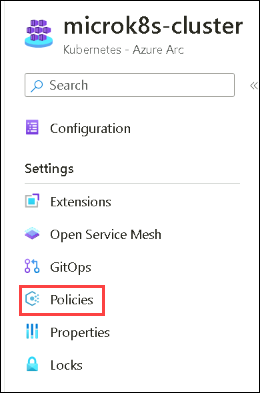
    
1. On the **Policies** blade, click on **Enable extension** to onboard to Azure Policy for Azure Arc-enabled Kubernetes clusters.

     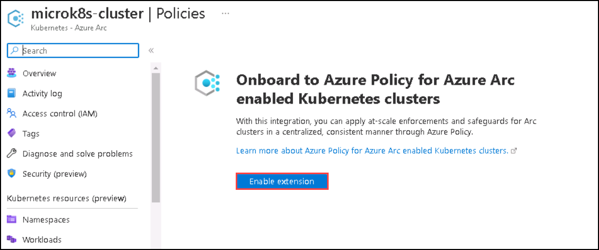
     
1. Now, click on **go to Azure Policy**  to navigate to **Compliance** blade.

     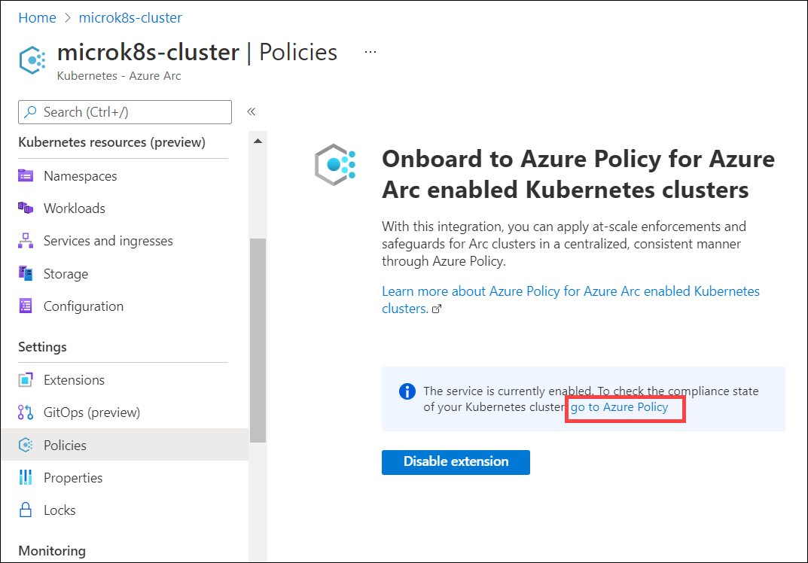

1. On the **Compliance** blade, click on **Assign policy**.

    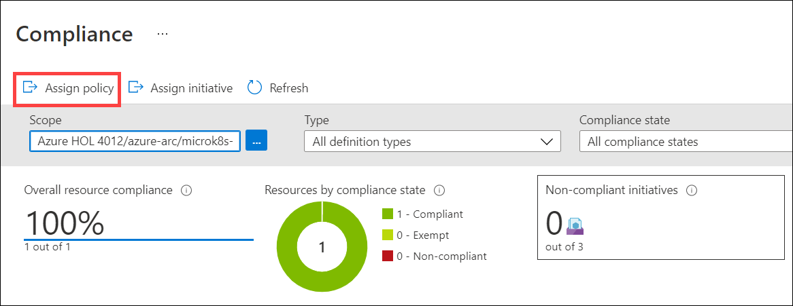

1. On the Basics section, click on the ellipses (…) to the right of **Policy definition**.

    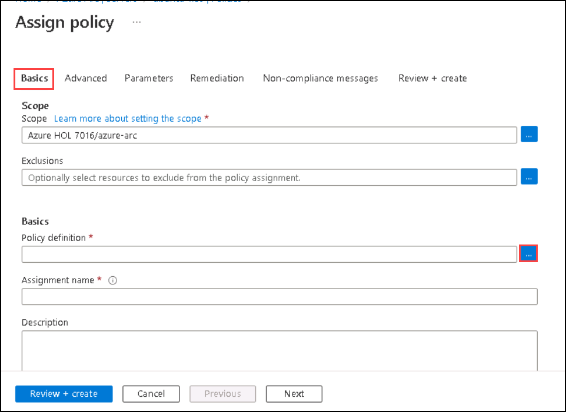

1. In the **Search (1)** window for available definitions, type ```GitOps``` and select the one named **Configure Kubernetes clusters with specified GitOps configuration using no secrets (2)**. Then, click on the **Add (3)** button below.

    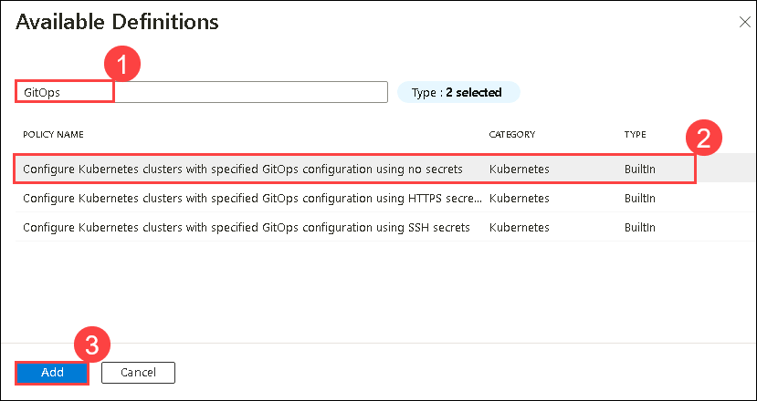

1. Click on **Parameters** blade.

1. Provide the following details under **Parameters** tab

    - uncheck the **Only show parameters that need input or review** box to see all the parameters
    
      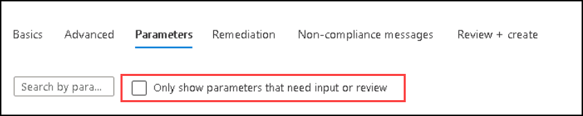
      
    - Configuration resource name: **cluster-config**

      ```bash
      cluster-config
      ```
    - Operator instance name: **cluster-config**

      ```bash
      cluster-config
      ```
    - Operator namespace: **cluster-config**

      ```
      cluster-config
      ```
    - Operator scope: **cluster**

    - Operator type: **Flux**

    - Operator Parameters: **--git-readonly**

      ```
      --git-readonly
      ```
    - Repository URL: The forked repo name of **https://github.com/Azure/arc-k8s-demo** that you are using for performing the lab.

    - Set the **Enable helm** option to **false**.

    - **Leave the other options set to default**
     
      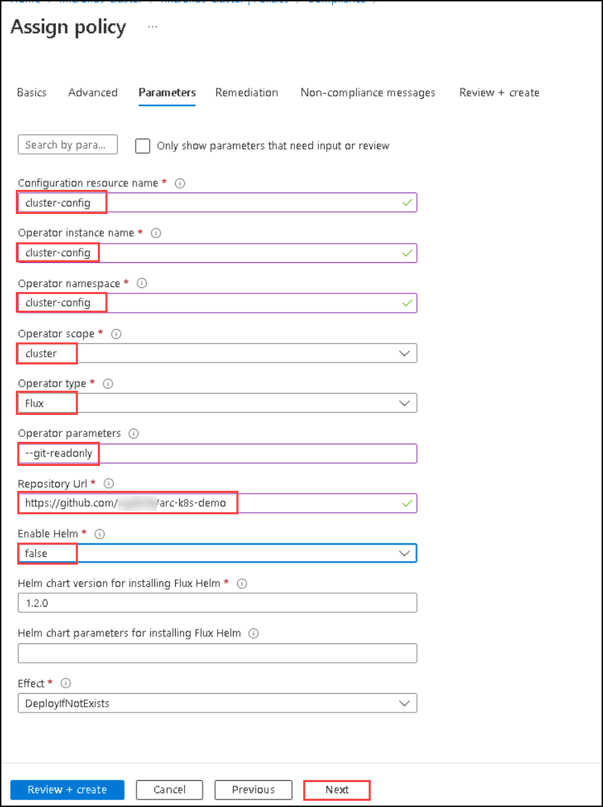

1. Then, Click on **Next** from the bottom of the page.
   
1. Select the **Create a remediation task** check box and then click **Review+create**, skip the Non-compliance messages.

    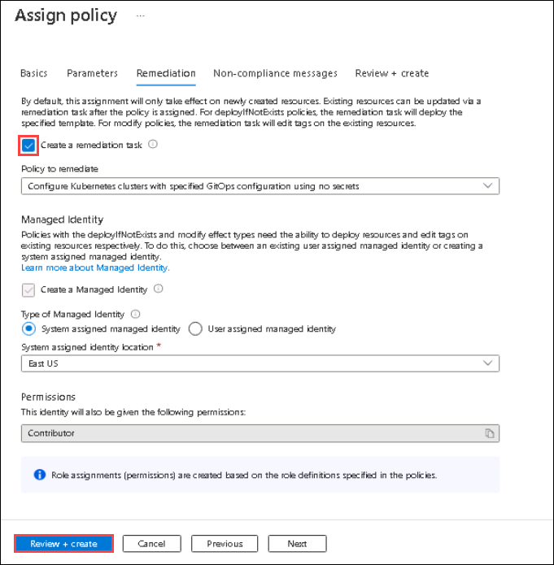
     
1. Click **Create** to start the creation of policy and remediation tasks.

    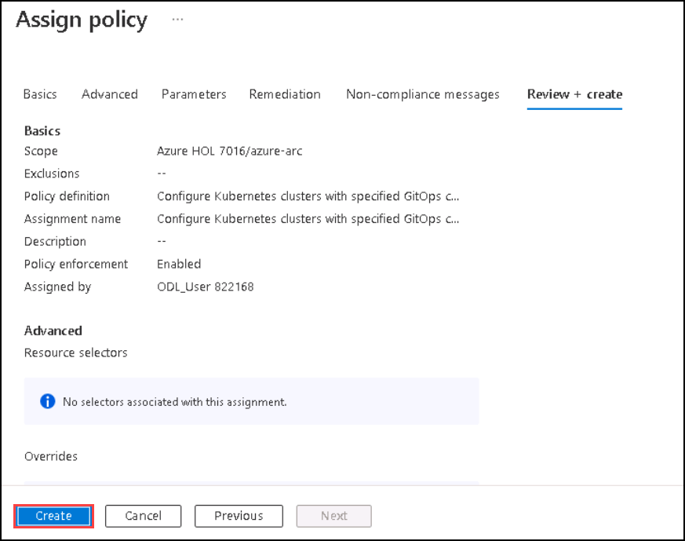

1. You will be redirected to the Policies page of the microk8s-cluster. Navigate to **Azure-Arc RG** -> **microk8s-cluster** -> **Policies** -> **go to Azure Policy**, if you are not already on that page.

1. You can check if your cluster is **compliant** or **not** against **“Configure Kubernetes clusters with specified GitOps configuration using no secrets”** policy you assigned in the previous step by looking at the Compliance State Column. It will be **Compliant** within 20 Minutes, sometimes it can take more than that as well. 

     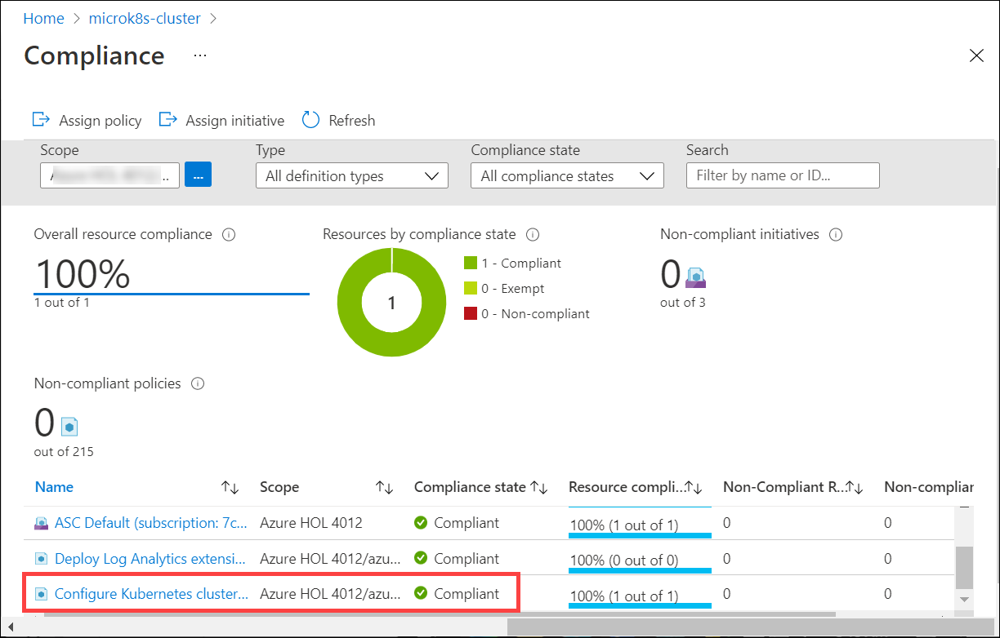
     
   > **Note**: If the compliance state shows as **Non-compliant** even after 10-15 minutes, you will need to create a remediation task in the next task and after some time you will see the complaint state changed to **Compliant**. If you didn't find the policy in the list, then search for ``GitOps`` in the **Search box** of the same pane.
   
You don't have to wait for the compliance state to change. You can move ahead to the next exercise and later come back to this page to review the state.
