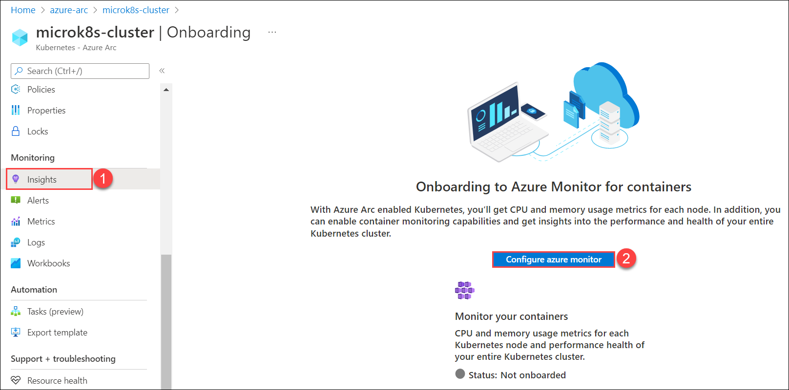
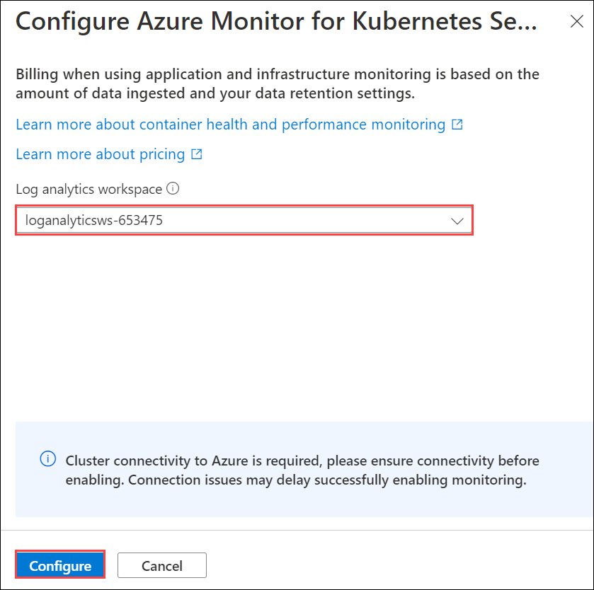

# HOL-2: Exercise 3: Onboard Azure Monitor for containers with Azure Arc enabled Kubernetes cluster

In this exercise, you will see how to configure azure monitor for containers and viewing insights for Kubernetes - Azure Arc resource.

## Task 1: Configuring Azure Monitor

1. Navigate to **azure-arc** resource group and select **microk8s-cluster** Kubernetes - Azure Arc resource from the resources listed.

   

2. On the **microk8s-cluster** Kubernetes - Azure Arc pane, select **Insights**(1) under Monitoring from left-handside menu and click on **Configure azure monitor**(2).

   

3. In Configure Azure Monitor for Kubernetes, for Log Analytics Workspace select the **loganalyticsws- <inject key="DeploymentID/Suffix" />** from the dropdown.

   

4. You will be able to see the insights data after 30-60 minutes. For now you can continue with the next HOL and comeback later to review the insights.

5. In the Insights pane, refresh the page and filter the **Time range = Last 6 Hours**(1). Click on **Cluster**(2) and review the insights.

   

6. In the same pane, filter the **Time range = Last 6 Hours**(1) and Click on **Nodes**(2) and select **ubuntu-k8s**.

   

   

7. In the same pane, filter the **Time range = Last 6 Hours**(1) and Click on **Containers**(2).

   
