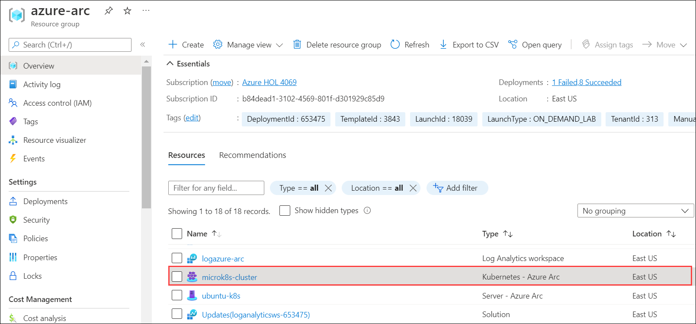
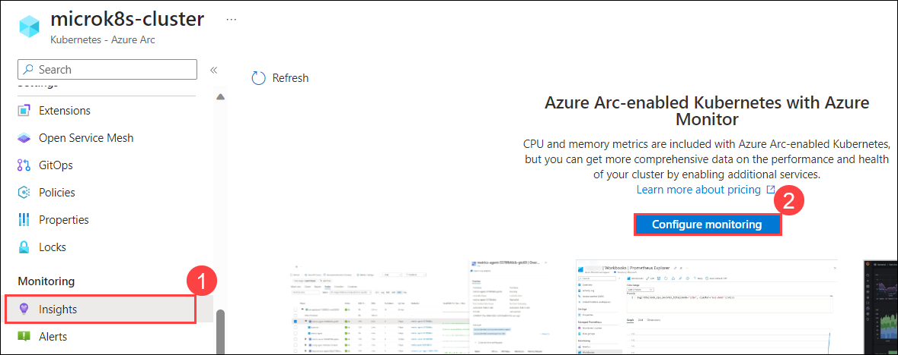
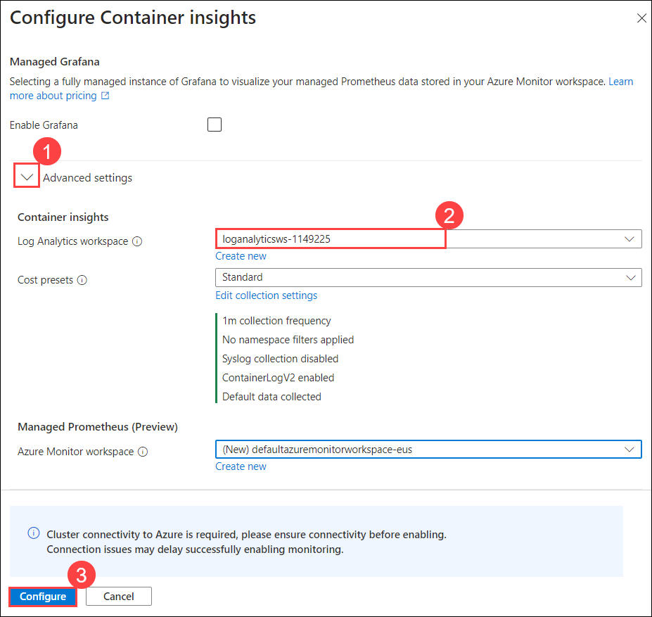
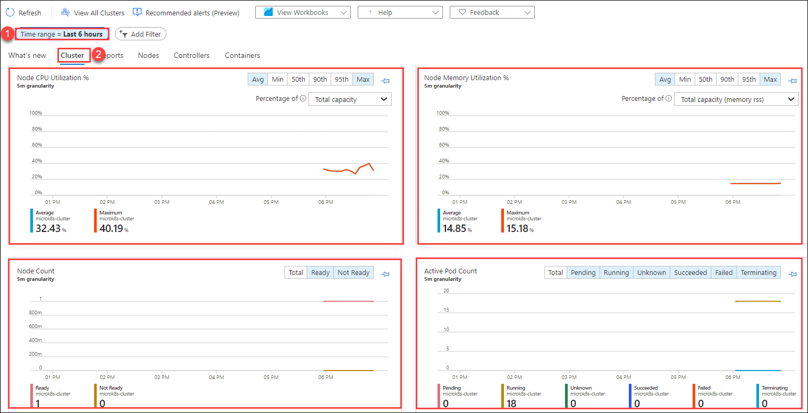
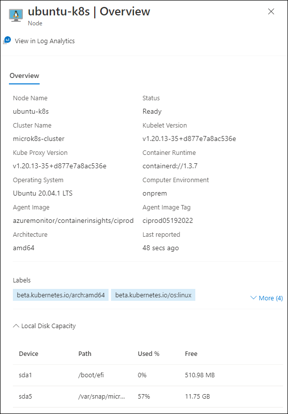
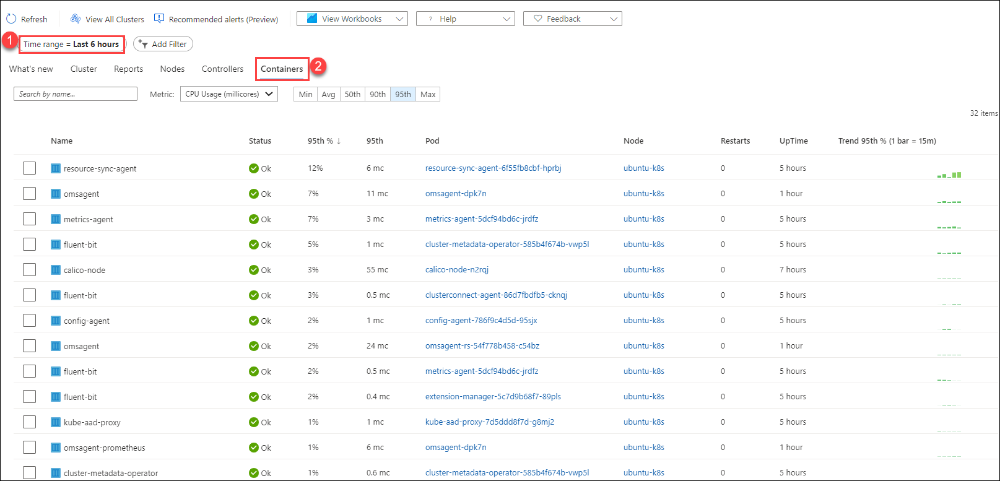

# HOL-2: Exercise 3: Onboard Azure Monitor for containers with Azure Arc-enabled Kubernetes cluster

In this exercise, you will see how to configure Azure Monitor for containers and view insights for Kubernetes - Azure Arc resource.

## Task 1: Configuring Azure Monitor

1. Navigate to **azure-arc** resource group and select **microk8s-cluster** Kubernetes - Azure Arc resource from the resources listed.

   

2. On the **microk8s-cluster** Kubernetes - Azure Arc pane, select **Insights (1)** under Monitoring from left-hand side menu and click on **Configure monitoring (2)**.

   

3. On the Configure Container insights blade, for the Log Analytics workspace select the **loganalyticsws- <inject key="DeploymentID/Suffix" />** from the dropdown and click on **Configure**.

   

4. You will be able to see the insights data after 30-60 minutes. For now, you can continue with the next HOL and come back later to review the insights.

5. In the Insights pane, refresh the page and filter the **Time range = Last 6 Hours (1)**. Click on **Cluster (2)** and review the insights. Now that your cluster is being monitored, you can watch the monitoring telemetry for the cluster, nodes and pods.

   

6. In the same pane, filter the **Time range = Last 6 Hours (1)** and click on **Nodes (2)** and select **ubuntu-k8s**. Here you can observe that the ubuntu-k8s server azure-arc node is listed below, which defines the integration of Azure Arc connected cluster with Azure Monitor for Containers.

   

   

7. In the same pane, filter the **Time range = Last 6 Hours (1)** and click on **Containers (2)**. You will be able to see the list of Containers that are linked to the pod and node which you have monitored in the previous steps.

   
