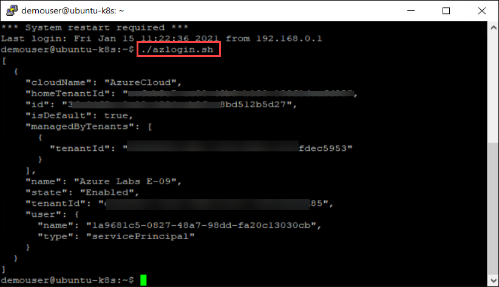
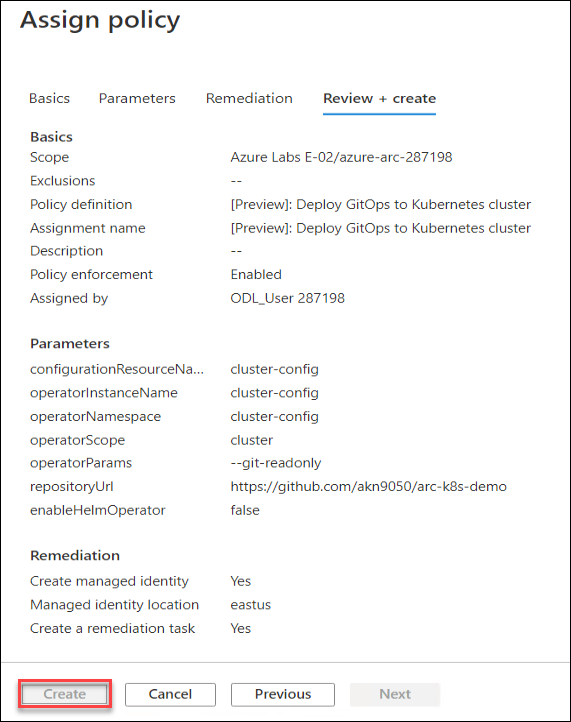

# Exercise 1: Setup GitOps workflow on connected Cluster

GitOps, as it relates to Kubernetes, is the practice of declaring the desired state of Kubernetes configuration (deployments, namespaces, etc.) in a Git repository followed by a polling and pull-based deployment of these configurations to the cluster using an operator. In this exercise, you will deploy a sample kubernetes app using az k8sconfiguration command and gitops and also update the configuration in the repository which you have linked to connected cluster and verify if cluster is getting updated based on the changes made.

## Task 1: Create a Configuration

1. Launch the following GitHub repository url ```https://github.com/Azure/arc-k8s-demo```. On upper right cornor you will see **Sign in** and **Sign up** options, if you already have a github account then click on **Sign in**, otherwise **Sign up**.

    

2. Now, from the upper right cornor, click on the **Fork** to fork the repository to your GitHub account.

   

## Task 2: Deploy App using az k8sconfiguration

1. Using the Azure CLI extension for **k8sconfiguration**, link connected cluster to personal git repository. Provide this configuration a name **cluster-config**, instruct the agent to deploy the operator in the **cluster-config** namespace, and give the operator **cluster-admin** permissions. 

1. From the start menu of the **ARCHOST** VM, search for **putty** and open it with double click or other way.

    
     
1. In Putty Configuration tool, enter the **ubuntu-k8s** VM private IP - ```192.168.0.8```, make sure the Port value is ```22```. Once you entered the private IP of the **ubuntuk8s** vm, click on the Open to lunch the terminal.

    
    
1. Enter the **ubuntu-k8s** vm username - ```demouser``` in **login as** and then hit **Enter**. Now, enter the password - ```demo@pass123``` and press **Enter**. Remember password will be hidden and not be visible in terminal, don't worry about that.

    
    
    > Note: To paste any value in Putty terminal, just copy the values from anywhere and then right click on the terminal to paste the copied value.
    
1. Login to **Azure** using follwing command:
   
     ```./azlogin.sh```
   
   

1. Run the following command:

   - Replace **your personal github account name** with your personal github account that you are using to perform the lab and Signed in above.

   ```
   az k8sconfiguration create --name cluster-config --cluster-name microk8s-cluster --resource-group $ResourseGroup --operator-instance-name cluster-config --operator-namespace cluster-config --repository-url https://github.com/<your personal github account name>/arc-k8s-demo --scope cluster --cluster-type connectedClusters
   ```
   
   The output should be as shown:

    
   
     > Note: Wait for 5 mins before performing the next step

## Task 3: Validate the sourceControlConfiguration

1. Validate whether the **sourceControlConfiguration** was successfully created and the **compliance** state is Installed. If it is pending, retry the same command again after sometime.

   ```
   az k8sconfiguration show --resource-group $ResourseGroup --name cluster-config --cluster-name microk8s-cluster --cluster-type connectedClusters
   ```
     > Note: that the sourceControlConfiguration resource is updated with compliance status, messages, and debugging information in the output.

   The output should be as shown:

    
  
2. Navigate to **azure-arc RG->microk8s-cluster->GitOps**. Ensure that the operator state status should show as **Installed**.

    
  
## Task 4:  Validate the Kubernetes configuration

1. After config-agent has installed the flux instance, resources held in the git repository should begin to flow to the cluster. Check to see that the namespaces, deployments, and resources are created by **Running the following command:**

   ```
   kubectl get ns --show-labels
   ```
 
   The output shows that team-a, team-b, itops, and cluster-config namespaces have been created as shown:
  
    
   
2. The **flux operator** will be deployed to **cluster-config** namespace, as directed by our **sourceControlConfig**:
      
    ```
    kubectl -n cluster-config get deploy  -o wide
    ```
   
    The output should be as shown:
   
     
  
3. You can explore the other resources deployed as part of the configuration repository by running the following commands:

   ```
   kubectl -n team-a get cm -o yaml
   ```

## Task 5: Make changes to cluster declarations in the Git repo.

1.  Run the following command in Powershell window and confirm that the Age is the same for both **azure-vote-back** and **azure-vote-front** apps. It will be same since the deployment was done through **az k8sconfiguration** command.

    ```
    kubectl get pods 
    ```
    

2. Browse to the **forked** repo of ```https://github.com/Azure/arc-k8s-demo```

3. Navigate to **cluster-apps->azure-vote.yaml** and edit the yaml file

      

4. Change the cpu request from 250 to **280** in line 72 and then from the buttom click on **Commit changes** to save the chnages in cpu request.

      

## Task 6: Verify changes are deployed to the cluster.

1.  Run the following command and copy the pod name starting with **azure-vote-front-**

    ```
    kubectl get pods 
    ```
     
    
    Observe in the above image that the previous pod is terminated and a new pod is created based on the updated configuration

2.  Replace the pod name that you copied in the previous step and run the command
 
    ```
    kubectl get pod <podname> -o yaml
    ```
    Example: ```kubectl get pod azure-vote-front-5779f4d696-fm22j -o yaml```
   
       
    
    Observe the CPU request value that you updated in the previous steps in the output as shown:
    
       

# Exercise 2: Enforce GitOps using Azure Policy for Azure Arc Enabled Kubernetes
In this exercise, you will see how to use Azure Policy to enforce that each Microsoft.Kubernetes/connectedclusters resource or Git-Ops enabled Microsoft.ContainerService/managedClusters resource has specific Microsoft.KubernetesConfiguration/sourceControlConfigurations applied on it.

## Task 1: Create a Policy Assignment
In this task you will select an existing policy definition and create a policy assignment. When creating the policy assignment you set the scope for the assignment: this will be the Azure Arc enabled Kubernetes Cluster. You will also set the parameters for the sourceControlConfiguration that will be created. Once the assignment is created the Policy engine will identify all connectedCluster or managedCluster resources that are located within the scope and will apply the sourceControlConfiguration to each one.

1. From the Azure Portal ```https://portal.azure.com```, navigate to the resource group you have access to and click on microk8s-cluster resource. 

    

1. From the **Kuberenetes Azure Arc** blade, click on **Go to Policies** under Configure Azure Policy.

    

1. Click **Assign policy**.

    

1. On the Basics Tab, click on the ellipses (…) to the right of **Policy definition**.

    

1. In the **Search** window for available definitions, type ```GitOps``` and select the one called **Deploy GitOps to Kubernetes cluster**.  Click the blue **Select** button below.

    

1. Click **Next** at the bottom of the window.

1. Provide the following details under **Parameters** tab and Click **Next**
    - Configuration resource name: **cluster-config**
    - Operator resource name: **cluster-config**
    - Operator namespace: **cluster-config**
    - Operator scope: **cluster**
    - Operator type: **Flux**
    - Operator Parameters: **--git-readonly**
    - Repository URL: The forked repo of **https://github.com/Azure/arc-k8s-demo** that you are using for performing the lab
    - Set the **Enable helm** option to **false**
    - **Leave the other options set to default**
     
    
   
1. Select the **Create a remediation task** check box and then click **Review+create** 

    
     
1. Click Create.

    

1. Navigate to **Azure-Arc RG** -> **microk8s-cluster** -> **Policies**.

1. You can check if your cluster is **compliant** or **not** against **“[Preview]:Deploy GitOps to Kubernetes cluster”** policy you assigned in previous step by looking at the Compliance State Column. It will be **Compliant**. If it is shows **Not started** then you have to run the **remediation task** again by clicking on the policy -> Create Remediation Task -> Remediate.

     
     
   > **Note**: The Compliant shows as **non-compliant**, you will need to create a remediation task in the next task and after sometime you will see the complaint state changed to **Compliant**
   
