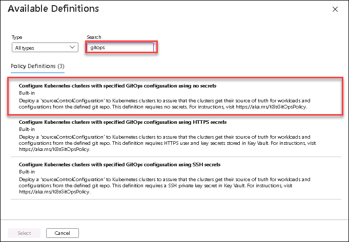
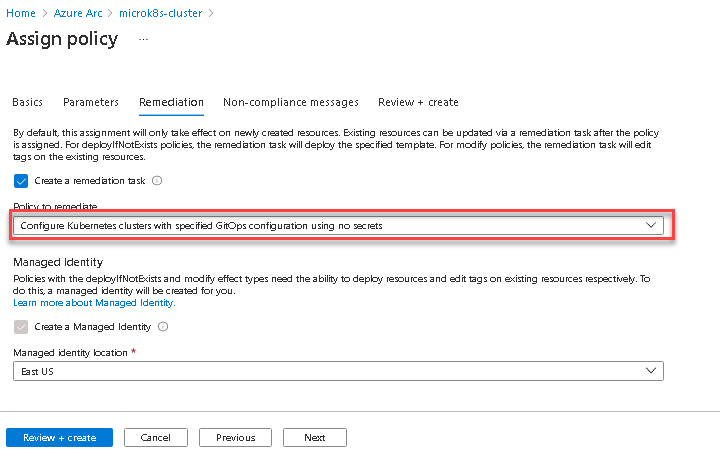
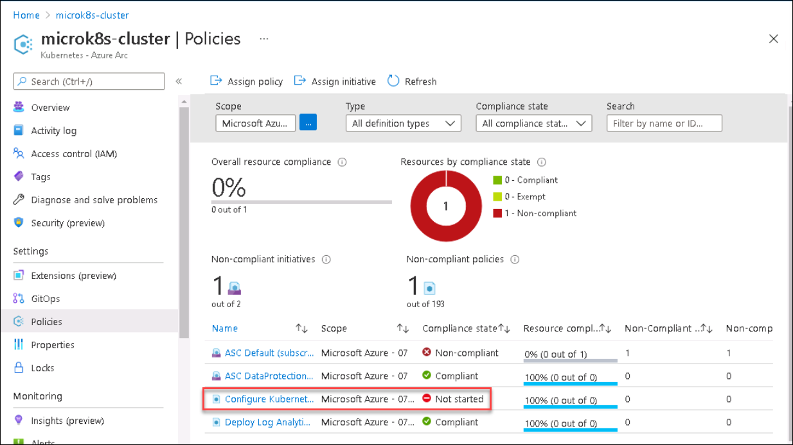

# HOL-2: Exercise 2: Enforce GitOps using Azure Policy for Azure Arc enabled Kubernetes
Contoso’s Central IT team also want to ensure that any new distribution site is quickly ready to set up and start operations with the applications they need. Leveraging Azure Policy, they are able to ensure that any new Kubernetes cluster is automatically connected to the same Git repository where the applications are configured so these can be deployed to the new cluster without any manual intervention from DevOps teams.

In this exercise, you will see how to use Azure Policy to enforce that each Azure Arc enabled Kubernetes cluster has specific GitOps configurations applied on it.

## Task 1: Create a Policy Assignment
In this task you will select an existing policy definition and create a policy assignment. When creating the policy assignment you set the scope for the assignment: this will be the Azure Arc enabled Kubernetes Cluster. You will also set the parameters for the sourceControlConfiguration that will be created. Once the assignment is created the Policy engine will identify all connectedCluster or managedCluster resources that are located within the scope and will apply the sourceControlConfiguration to each one.

1. From the Azure Portal ```https://portal.azure.com```, navigate to the resource group ```azure-arc``` and click on **microk8s-cluster** resource. 

    

1. From the **Kuberenetes Azure Arc** blade, click on **Go to Policies** under Configure Azure Policy.

    

1. Now, Click on **Assign policy**.

    

1. On the Basics section, click on the ellipses (…) to the right of **Policy definition**.

    

1. In the **Search** window for available definitions, type ```GitOps``` and select the one named **Configure Kubernetes clusters with specified GitOps configuration using no secrets**.  Then, click on the blue **Select** button below.

    

1. Click **Next** at the bottom of the window.

1. Provide the following details under **Parameters** tab and Click **Next**
    - Configuration resource name: **cluster-config**
    ```bash
    cluster-config
    ```
    - Operator resource name: **cluster-config**
      ```bash
      cluster-config
      ```
    - Operator namespace: **cluster-config**
      ```
      cluster-config
      ```
    - Operator scope: **cluster**
      ```
      cluster
      ```
    - Operator type: **Flux**
      ```
      Flux
      ```
    - Operator Parameters: **--git-readonly**
      ```
      --git-readonly
      ```
    - Repository URL: The forked repo name of **https://github.com/Azure/arc-k8s-demo** that you are using for performing the lab
    - Set the **Enable helm** option to **false**
    - **Leave the other options set to default**
     
    
   
1. Select the **Create a remediation task** check box and then click **Review+create**, skip the Non-compliance messages.

    
     
1. Click **Create**.

    

1. Navigate to **Azure-Arc RG** -> **microk8s-cluster** -> **Policies**.

1. You can check if your cluster is **compliant** or **not** against **“Configure Kubernetes clusters with specified GitOps configuration using no secrets
”** policy you assigned in previous step by looking at the Compliance State Column. It will be **Compliant** in 15-20 Minutes, sometime can take more than that also. If it is shows **Not started** then you have to run the **remediation task** again by clicking on the policy -> Create Remediation Task -> Remediate.

     
     
   > **Note**: The Compliant shows as **non-compliant**, you will need to create a remediation task in the next task and after sometime you will see the complaint state changed to **Compliant**
   
