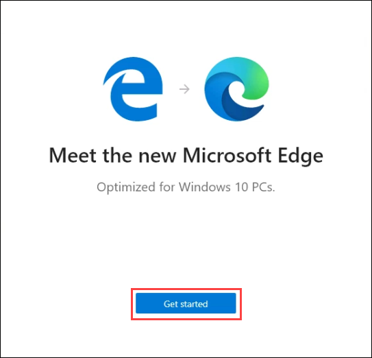
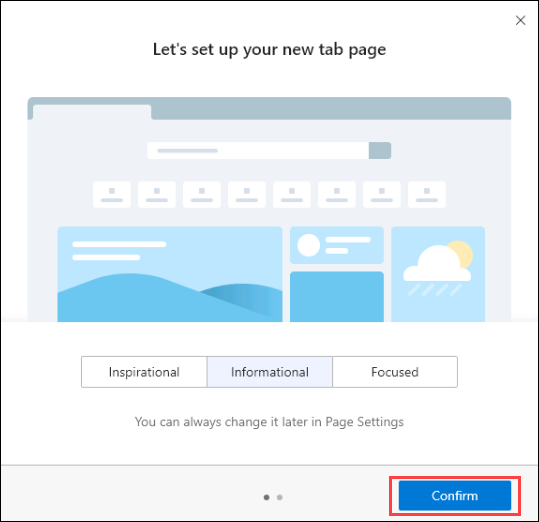
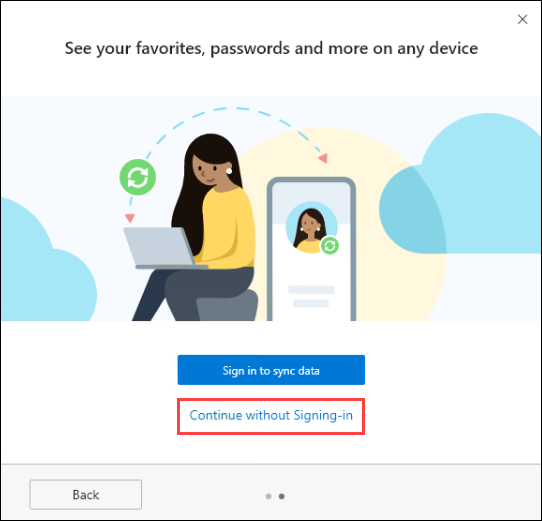
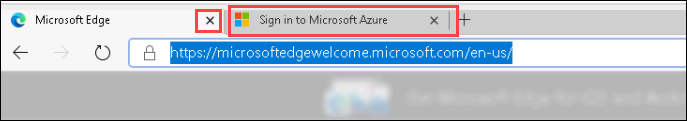
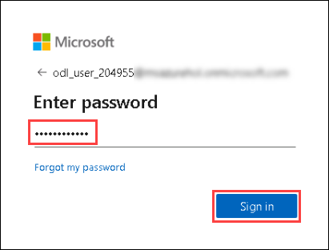
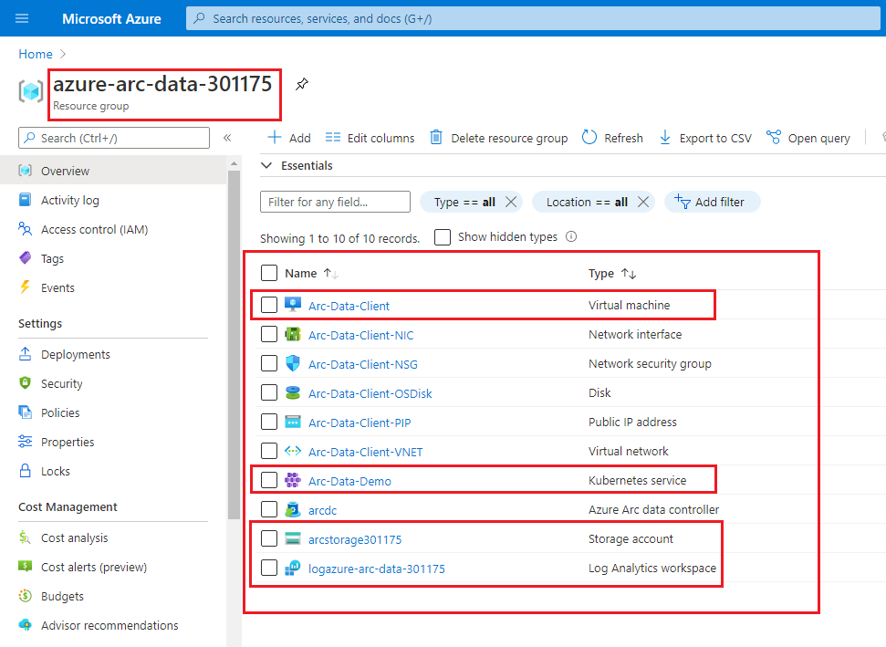

# Exercise 1: Getting Started with Azure 

Duration: 10 mins

## Instructions

1. Once the environment is provisioned, a virtual machine (JumpVM) and lab guide will get loaded in your browser. Use this virtual machine throughout the workshop to perform the lab.

2. To get the lab environment details, you can select the **Lab Environment** tab. Additionally, the credentials will also be sent to your email address provided during registration. You will see Deployment ID value on **Lab Environment** tab, use it wherever you see SUFFIX or DeploymentID in lab steps. 

3. You can also open the Lab Guide on Separate full window by selecting the **Arrow** icon on the upper right corner.

## Login to Azure Portal

1. Lets start by logging into the Azure Portal to check the resources deployed for the lab environment. In the JumpVM on the left, click on the Azure portal shortcut of Microsoft Edge browser which is available on the desktop.

2. When you click on Azure portal, the edge browser welcome screen will pop up, select **Get started**.

   

3. On the next window, click on **Confirm**.

   

4. You can close the popup which is shown below.

   

5. Now, you will see two tabs in the edge browser, close the first tab named **Microsoft Edge** to move to the other tab.

   

6. On the **Sign into Microsoft Azure** tab, you will see the login screen, enter the following username, and, then click on **Next**.

   * Email/Username: <inject key="AzureAdUserEmail"></inject>

   

7. Now enter the following password and click on **Sign in**. 

   * Password: <inject key="AzureAdUserPassword"></inject>

   

8. If you see the pop-up **Stay Signed in?**, click on No

9. If you see the pop-up **You have free Azure Advisor recommendations!**, close the window to continue the lab.

10. If a **Welcome to Microsoft Azure** popup window appears, click **Maybe Later** to skip the tour.

12. Now you can see Azure Portal Dashboard, click on **Resource groups** to see the resource groups.

   

13. Click on the azure-arc-data-SUFFIX Resource group and confirm whether you have all the below resources deployed successfully.

   

   * In the Resource group we have one **Virtual Machine**, **Kubernetes Service**, **Storage account** and **Log Analytics workspace** deployed.

   * **Virtual Machine**: You will be using the Virtual Machine which is already open on the left side of the page to perform all the Lab exercises.

   * **Kubernetes Services**: We have already deployed the Azure Arc Data controller on to the Kubernetes Service and in later exercises we will be deploying Azure arc enabled data resources on to the Kubernetes cluster using Azure Arc data services.

   * **Storage Account**: You will use this storage account to backup and restore the database to SQL MI.
   
   * **Log Analytics workspace**: You will be using this Log Analytics workspace to upload and view the logs generated from both Postgres Hyperscale and SQL MI servers.
