# HOL-3: Exercise 1: Getting Started with Azure Arc enabled data services 

Duration: 20 minutes

Contoso’s R&D teams are well-invested in containerized workloads for the modernized applications. Contoso is using Kubernetes as their container orchestration platform. Kubernetes is deployed both as self-managed Kubernetes clusters in their on-premises environments and managed Kubernetes deployments in the cloud. Contoso has already deployed Data Controller in their Azure Arc data services environment.

Contoso wants you to verify their Azure Arc data services environment and connect to the Data Controller. Azure Data Controller is the local control plane that enables Azure Data Services in customer managed environments. To know more about Azure Arc data controller, you can check : [Azure Arc enabled data services](https://azure.microsoft.com/en-in/resources/videos/azure-arc-enabled-data-services-deploying-azure-arc-data-controller/)

Let us get familiar with the existing Kubernetes cluster and the following
   - How to connect to the data controller
   - Verifying the status of the Azure Arc data controller.

## Task 1: Getting started with the existing Kubernetes cluster 

1. On the JumpVM provided, launch the **Command Prompt** by double-clicking on the cmd shortcut on the desktop.
  
    

1. Now the command prompt window will open up. In the command prompt, run the following command to retrieve the Kubernetes cluster-info.

   ```BASH
   kubectl cluster-info
   ```
   
 
1. Run the following command to list the current namespaces in the cluster. A namespace in Kubernetes creates a logical isolation boundary.

   ```BASH
   kubectl get namespace
   ```

1. A node is a worker machine in Kubernetes and may be either a virtual or a physical machine, depending on the cluster. 

   > ***Info***: Each node is managed by the Master. A node can have multiple pods, and the Kubernetes master automatically handles scheduling the pods across the nodes in the cluster. 
  
   Run the following command to see the status of the Kubernetes node.

   ```BASH
   kubectl get nodes
   ```
   
   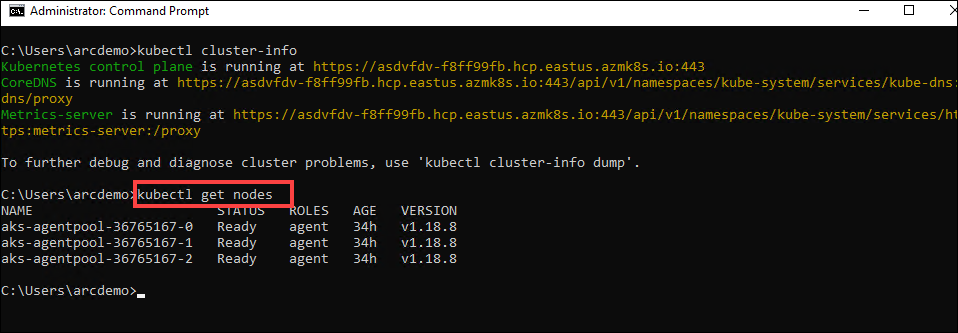
   
1. Now, run the following command to get the list of all pods in all namespaces. 
 
   ```BASH
   kubectl get pods -A
   ```
   
   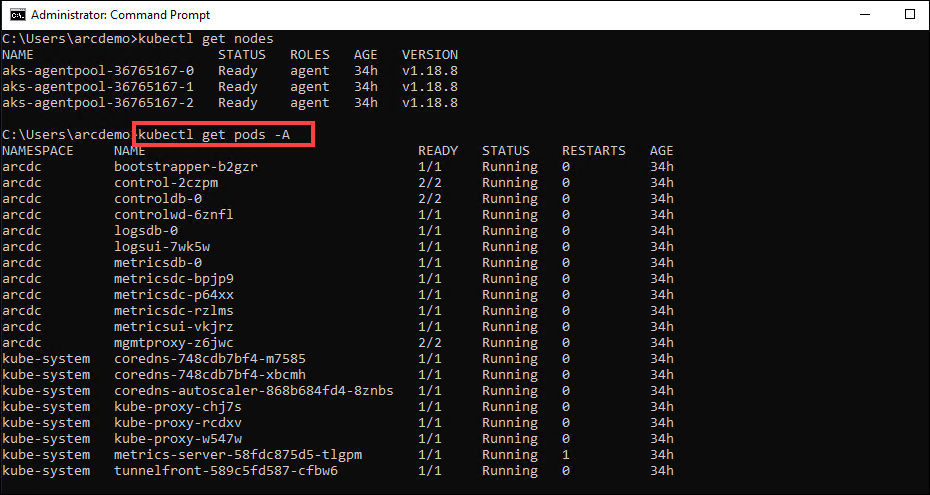

1. Run the following command to get the detailed information of a specific pod. 

   > **Note**: In the below command, please replace the pod name and namespace name with any pod name and the corresponding namespace from the previous command's output.

   >   kubectl describe pod \<pod name\> -n \<your namespace name\>

   ```
   kubectl describe pod controldb-0 -n arcdc
   ```
   
   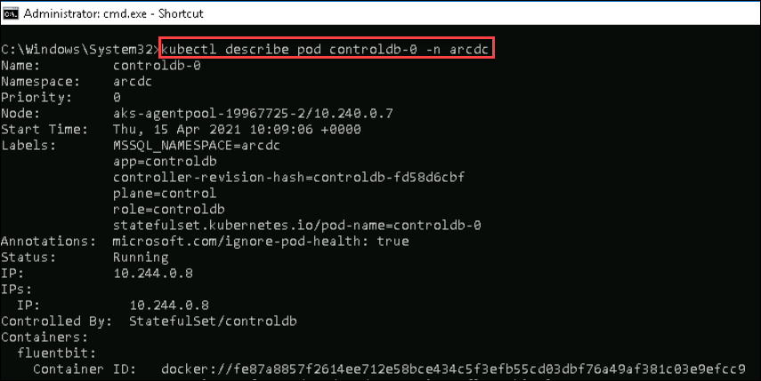
   
  > **Note**: You can explore and learn more about Kubernetes from the following links - [Azure Kubernetes Services Workshop](https://docs.microsoft.com/en-us/learn/modules/aks-workshop/).
  
## Task 2: Connect to the data controller using Azure Data Studio/ Azure Data CLI.

Now let us connect to the data controller using Azure Data Studio and Azure Data CLI

In the environment provided, the Azure Arc Data controller is already deployed on to the Kubernetes Cluster. We are using **direct** connectivity mode for the Azure Arc enabled data services environment to Azure.
  
   > ***Info***: There are multiple modes available to connect to Azure. if the Azure Arc enabled data services are directly connected to Azure, then users can use Azure Resource Manager APIs, the Azure CLI, and the Azure portal to operate the Azure Arc data services. The experience in directly connected mode is much like how you would use any other Azure service with provisioning/de-provisioning, scaling, configuring, and so on all in the Azure portal.
   
   If you want to know more about this, refer to the [Connectivity Modes](https://docs.microsoft.com/en-us/azure/azure-arc/data/connectivity)

   First let us see how to connect to the data controller using Azure Data CLI.

1. On your JumpVM, open a **Command Prompt** window from the desktop shortcut if not already opened.

1. Run the following command in the command prompt window.

   ```BASH
   azdata login
   ```
   
   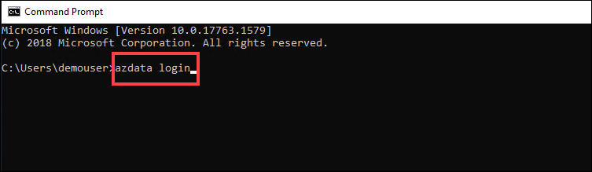
   
1. When prompted to enter the Namespace, copy the value of Arc DC Name from the Environment details page and paste it in the command prompt. 
   
   ```
   arcdc
   ```

   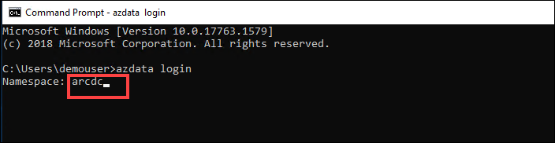
   
1. After executing the command, copy the data controller **service API endpoint URL** value from the output to a **Notepad**.
   
   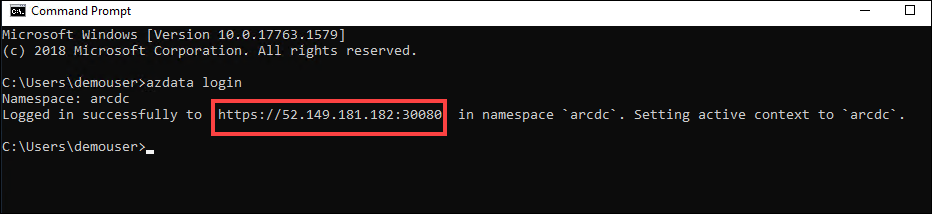
   
1. Now, you are logged in to the Azure Arc data controller. You can minimize the command prompt window.

1. Next, let us see how to connect to Azure Arc Data controller using Azure data studio.

1. On your JumpVM, open **Azure Data studio** from the desktop shortcut and select **Connections**.

   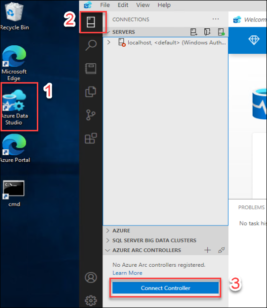
   
1. In the **Connections** panel under **Azure Arc Controllers**, click on **Connect Controller**.

1. In the **Connect to Controller** page, provide the following details.

   - **Namespace**:
     ```BASH
     arcdc
     ```
   
   - **Controller URL**: Enter the Azure Arc data controller service API endpoint URL value which you copied to **Notepad** earlier 
   
   - **Name** : Enter arcdc
     ```BASH
     arcdc
     ```
   
   - **Username** : Enter arcuser
     ```BASH
     arcuser
     ```
   
   - **Password** : Enter Password.1!!
     ```BASH
     Password.1!!
     ```
   
   - Select the Remember Password checkbox
   
     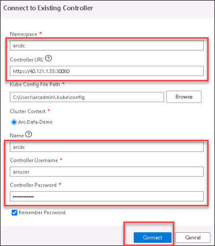

1. Now, click on **Connect**.

1. Once the connection is successful, you can see the Azure Arc data controller listed under Azure Arc Controllers on the bottom left of the Azure Data Studio.

    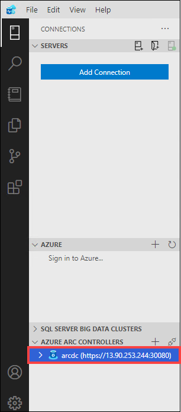

## Task 3: Monitor with Data Controller Dashboard

Now that you are connected to an Azure Arc data controller, let us view the dashboards for the data controller and any SQL managed instances or PostgreSQL Hyperscale server group resources that you have.

1. In the **Connections** panel, under **AZURE ARC CONTROLLERS**, right-click on the **arcdc** data controller and select **Manage**.

   > **Note**: You will see that there is no Azure Arc Resources. This is because you have not deployed any resource on the Azure Arc data services environment yet. In the next exercises, you will be deploying the resources.

    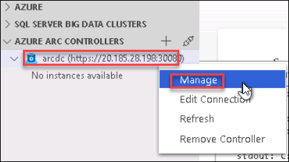

1. Once you are in the Azure Arc Data Controller dashboard, you can see following details about the data controller 
   - Name of the Arc Data Controller
   - Region where it is deployed
   - Connection mode
   - Resource Group
   - Subscription ID of the Azure Subscription
   - Controller Endpoint
   - Namespace
   
   You will also see that we have deployed using the Indirect connection mode of the Azure Arc Data controller.

   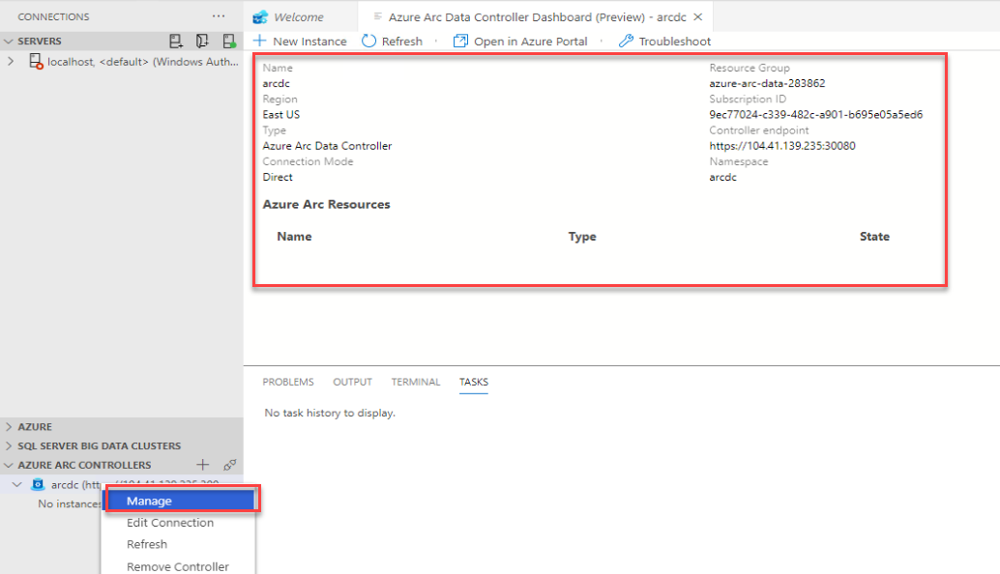
   
   > **Note**: If you click on the **Open in Azure portal** button from the menu on the top, you will not be able to find the resources because we have not yet uploaded any logs to the Azure portal and without uploading any logs to azure, you will not be able to view the Azure Arc data controller resource in Azure portal.

## In this exercise, you have covered the following:
 
   - Getting started with the existing Kubernetes cluster.
   - Deploying Azure Arc Data controller on to Azure Kubernetes Cluster(AKS). 
   - Connect to the data controller using Azure Data Studio/ Azure Data CLI.
   - Monitor with Data Controller Dashboard.
