# Exercise 1: Deploying Azure Arc Data Controller and Azure Arc SQLMI business critical in Direct Mode
  Duration: 30 Minutes
  
 In this exercise you will connect an existing Kubernetes cluster to Azure using Azure Arc-enabled Kubernetes. You will also deploy an Azure data controller in direct connectivity mode to a customer location using Azure portal and Azure CLI. 
 
 
# Connect an existing Kubernetes cluster to Azure using Azure Arc-enabled Kubernetes
 
## Task 1: Login to Azure and install Azure CLI extensions
 
1. Open **Windows PowerShell** from the desktop of your ARCHOST VM and run the below command to login to Azure.
    ```
    az login
    ```
1. After running the above command a browser tab will open to login to azure portal.
 
1. On the **Sign into Microsoft Azure** tab you will see the login screen, in that enter following **Email/Username** and then click on **Next**. 
   * Email/Username: <inject key="AzureAdUserEmail"></inject>

1. Now enter the following **Password** and click on **Sign in**.
   * Password: <inject key="AzureAdUserPassword"></inject>

1. After adding the creds you will see that you have logged into the Microsoft Azure.

    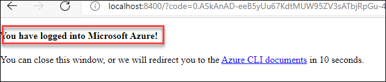

1. Now switch back to Windows PowerShell and you will be able to see that you have logged in to Azure.

1. Run the below commands to install required Azure CLI extensions.
   
   ```
   az extension add --name k8s-extension
   az extension add --name connectedk8s
   az extension add --name k8s-configuration
   az extension add --name customlocation   
   ```
   
   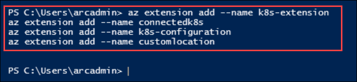
   
1. You can validate you have all the required extensions with the latest versions by running the below command: 
   
   ```
   az version
   ```   
   
   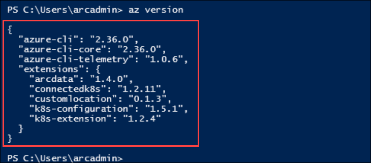
   
1. After confirming the required tools are installed, next step is to register your subscription with Arc for Kubernetes.

1. Run the below commands to register the required Resource providers if not already registered. 

   ```
   az provider register --namespace Microsoft.Kubernetes
   az provider register --namespace Microsoft.KubernetesConfiguration
   az provider register --namespace Microsoft.ExtendedLocation
   ```
   
   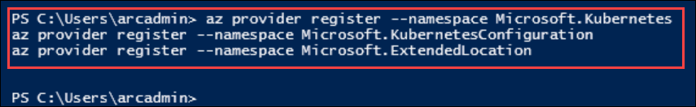
   
## Task 2: Onboard an existing Kubernetes cluster to Azure using Azure Arc-enabled Kubernetes

In this Task you will be connecting an existing Kubernetes cluster to Azure using Azure Arc-enabled Kubernetes and will be enabling custom features by adding an Azure Arc data services extension and a custom location on the Azure Arc-enabled Kubernetes cluster. 

1. Also, you should reword this to: Run the below command to connect the existing Kubernetes to your Azure subscription using Azure Arc-enabled Kubernetes. Once you run the below command, it will take a few minutes to onboard the cluster to Azure Arc. 

   ```
   az connectedk8s connect --name Arc-Data-Demo-DirectMode --resource-group azure-arc
   ```
  
   > **Note:** We have already defined your Cluster name and Azure resource group name in the above commands, If you are trying this in your own subscription, please make sure that you have entered correct details.
 
1. Once the previous command is executed successfully, the provisioning state in output will show as succeeded.

    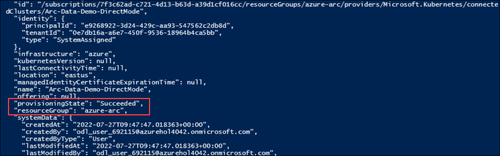 
 
1. Verify whether the Azure Arc-enabled Kubernetes cluster is onboarded and connected to the resource group in the Azure subscription by running the following command:

   ```
   az connectedk8s list -g azure-arc -o table 
   ``` 
   
   
   
1. Azure Arc-enabled Kubernetes deploys a few operators into the azure-arc namespace. You can view these deployments and pods by running the command in the command prompt:  

   ```
   kubectl -n azure-arc get deployments,pods
   ```
   
   The output should be similar as shown below:
    
   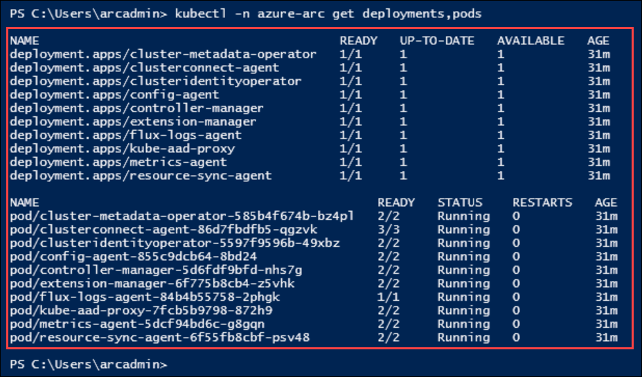

1. Navigate to the Resource Group from the Azure portal navigation pane and click on the Resource Group named azure-arc. Look for the resource named **Arc-Data-Demo-DirectMode** of resource type Azure Arc-enabled Kubernetes resource.

   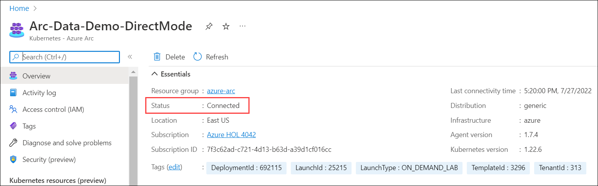

## Create a custom location on the Azure Arc-enabled Kubernetes cluster

   Custom Locations provides administrators a way to deploy Azure Arc data services and other Azure Arc-enabled services to their own locations, similar to Azure locations. 
 
1. Now run the below command to enable features to create the custom location:

     ```
     az connectedk8s enable-features -n Arc-Data-Demo-DirectMode -g azure-arc --features cluster-connect custom-locations
    
     ```
    The output should be similar as shown below:
    
    **"Successsfully enabled features: ['cluster-connect', 'custom-locations'] for the Connected Cluster Arc-Data-Demo-DirectMode"**
        
      > **Note:** Custom Locations feature is dependent on the Cluster Connect feature. So both features have to be enabled for custom locations to work. Also, az connectedk8s enable-features needs to be run on a machine where the kubeconfig file is pointing to the cluster on which the features are to be enabled.
    
1. Run the below command to deploy the extension of Azure Arc-enabled Data Services on Azure Arc Kubernetes cluster.
  
     ```
    az k8s-extension create --name azdata --extension-type microsoft.arcdataservices --cluster-type connectedClusters -c Arc-Data-Demo-DirectMode -g azure-arc --scope cluster --release-namespace azure-arc --config Microsoft.CustomLocation.ServiceAccount=sa-bootstrapper
     ```

1. After running the above command you will notice that the **ProvisioningState** is **Succeeded**. If this is pending, because the extension will take a few minutes to complete the installation.

    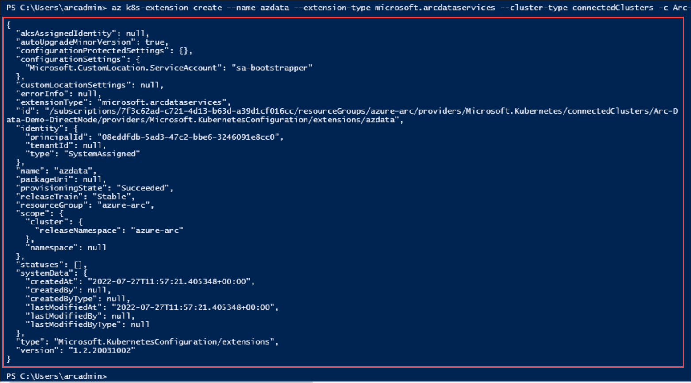

1. To verify the extension installation, switch back to Azure Portal in the browser and search for **Kubernetes - Azure Arc** and select your cluster.

1. Now select **Extension** from left side menu and check if the Install status in **Installed** or not, if not please refresh after some time and then check.

    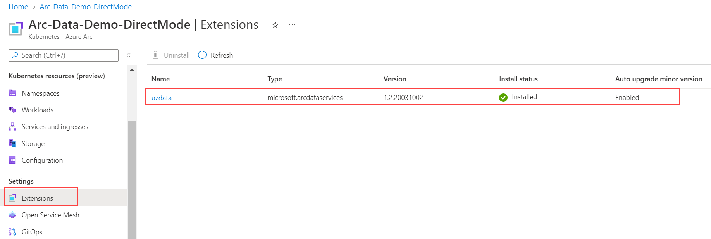

1. Now run the below command to get the Azure Resource Manager identifier of the Azure Arc-enabled Kubernetes cluster, you will be using the cluster id in later steps while creating the custom location.

    ```  
    $clusterID = az connectedk8s show -n Arc-Data-Demo-DirectMode -g azure-arc  --query id -o tsv
    $clusterID
    ```
     > **Note:** The clusterID is stored in $clusterID parameter and you will be using this parameter only in later steps. 
    
    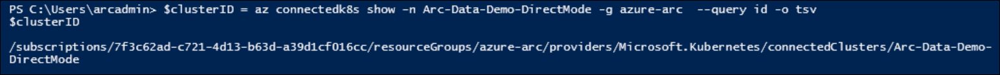
    
1. Now run the below command to get the Azure Resource Manager identifier of the cluster extension deployed on top of Azure Arc-enabled Kubernetes cluster, referenced in later steps as extensionId:

    ```
    $extensionID = az k8s-extension show --name azdata --cluster-type connectedClusters -c Arc-Data-Demo-DirectMode -g azure-arc  --query id -o tsv
    $extensionID
    ```
      > **Note:** The extension resource ID is stored in $extensionID parameter and you will be using this parameter only in later steps.
    
    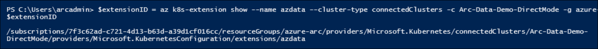
    
1. Now run the below command to create custom location by referencing the Azure Arc-enabled Kubernetes cluster ID and the extension ID.

    ```  
    az customlocation create -n azurearc-customlocation -g azure-arc --namespace azure-arc --host-resource-id $clusterID --cluster-extension-ids $extensionID
    ```
    
    The output should be similar as shown below:
    
     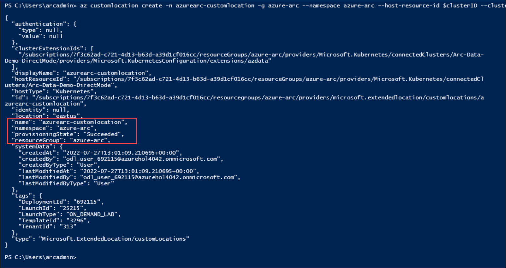
     
1. To verify the custom location deployment, switch back to the browser and login to [Azure Portal](https://portal.azure.com) if not already done.

1. Search for custom location in search bar and select custom locations. 

    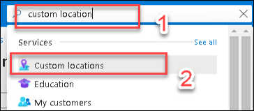
      
1. After selecting the custom locations from search bar, Select your **azurearc-customlocation**.

    
     
1. Explore the overview section. You can see the namespace and Kubernetes cluster details on overview page.

   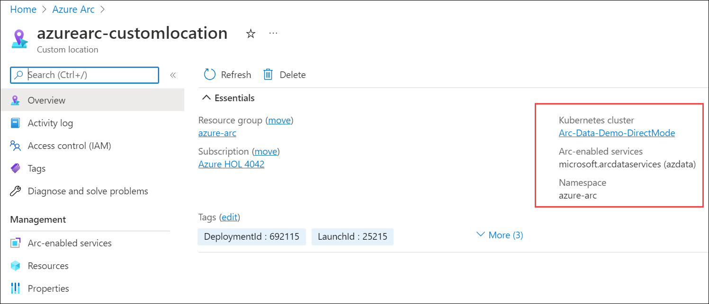

1. Now search for the log analytics workspace in azure portal.
   
   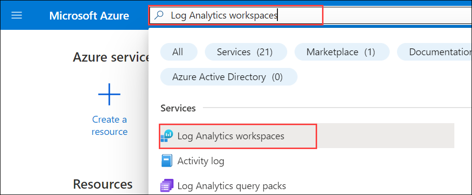

1. Navigate to LoganalyticsWS-Direct workspace. 

   

1. Select **Agent management** from the left side menu. Copy the value of **Workspace ID** and **Primary key** and save the values in a notepad for later use while creating the Azure arc data controller.

    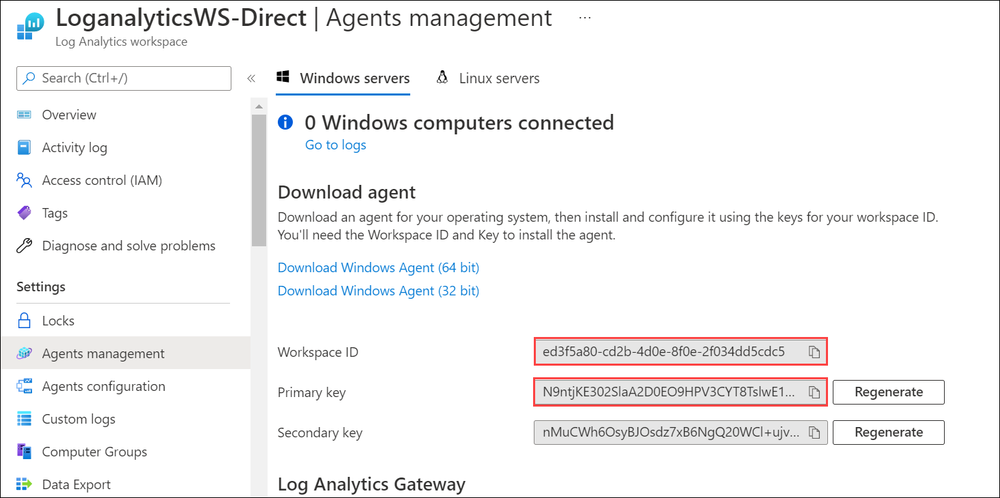
    
## Task 3: Deploy Azure Arc Data Controller in directly connected mode using Azure Portal

1. From the Azure Portal, search for **Azure arc data controllers** from the search box and then click on it.  

    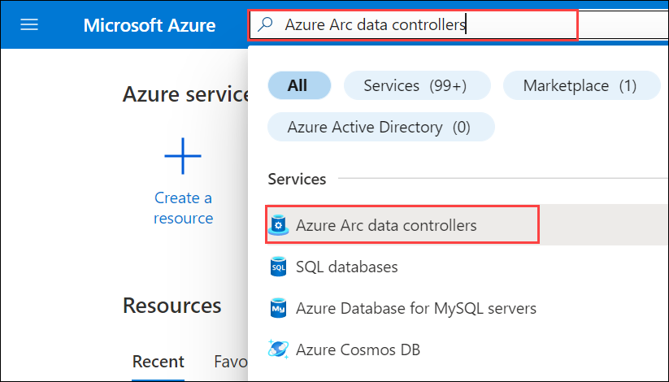
 
1. After select the Azure Arc data controller click on **+ Create** button to deploy ```Azure arc data controller```.

    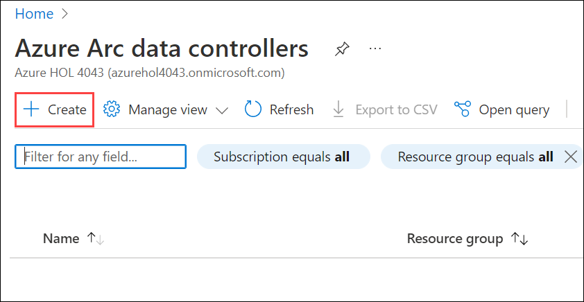
     
1. Now, on ```Create Azure Arc data controller``` blade select **Azure Arc-enabled Kubernetes (Direct connectivity mode)**. and click on **Next: Data Controller details**.

    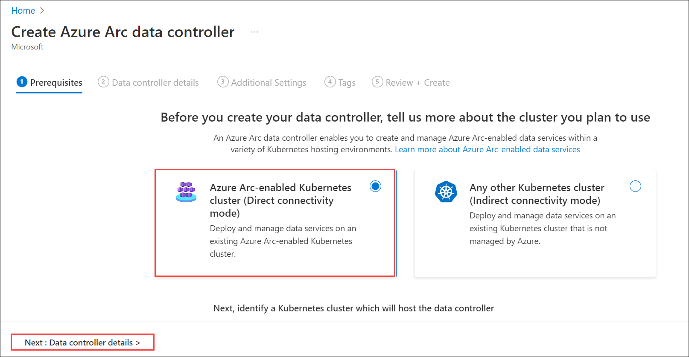
   
1. On **Data controller details** blade enter the following details:

   * Select the available subscription from drop down.
   * Resource Group: Select **Azure-arc** **(1)** from drop down.
   * Data Controller Name: **arcdc** **(2)**
   * Custom location: Select the available custom location from drop down **(3)**.

      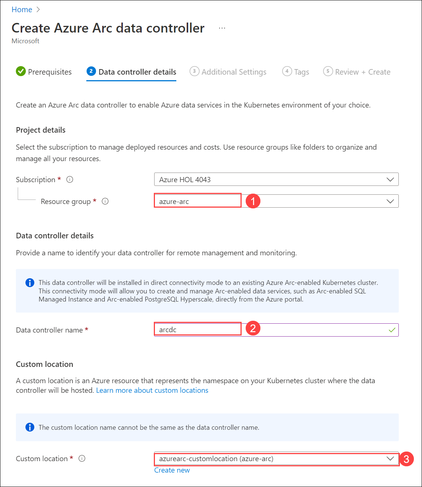
      
1. Now scroll down and enter the below details in the remaining sections.
   
   Under Kubernetes configuration enter the details below:
   
   * Kubernetes configuration template: Select **azure-arc-aks-default-storage** **(1)** from drop down.
   * Data Storage class: Leave default
   * Log Storage class: Leave default 
   * Service type: **Load balancer** **(2)** 
   
   Under Administrator account enter the below details.
   * Data controller login: **arcuser** **(3)**
   * Password: **Password.1!!** **(4)**
   * Confirm password: **Password.1!!** **(5)**

   After entering all the required details click on **Next: Additional settings** **(6)**

    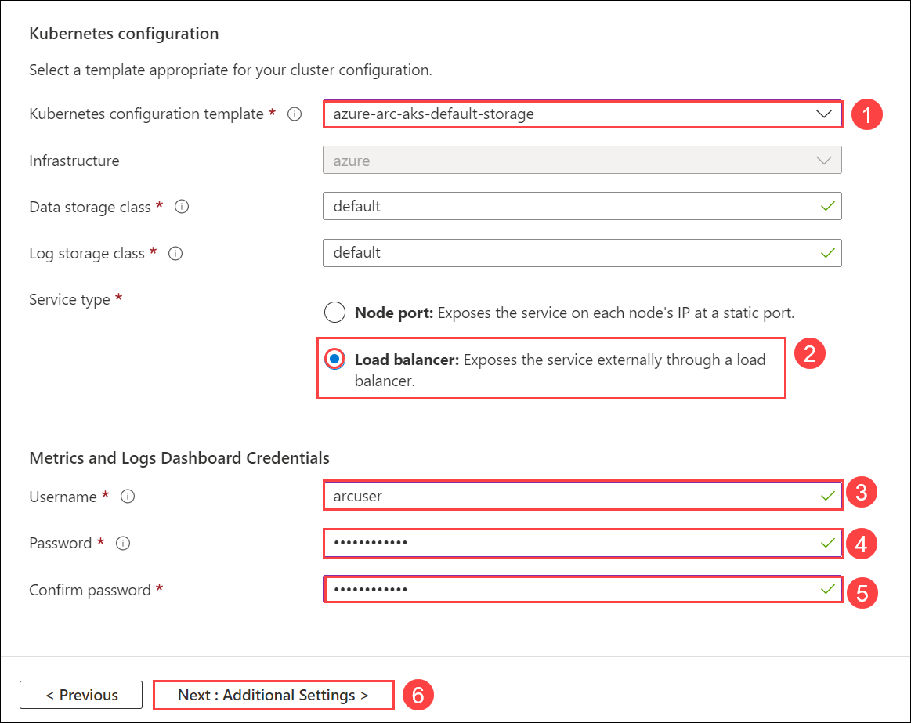

1. In Additional settings blade, select the **LoganalyticsWS-Direct** **(1)** from the dropdown for Log Analytics workspace. You see that Log Analytics workspace ID occurs by default. Enter the Log Analytics primary key which is given here: **<inject key="loganalyticsWorkspacePrimaryKey" enableCopy="true"/>** **(2)** and click on **Next: Tags** **(3)** button.

    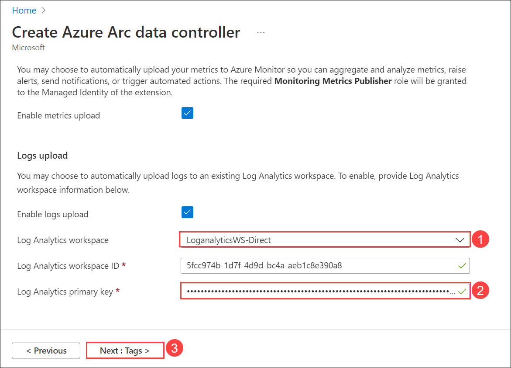
    
1. Leave default on **Tags** blade and click on **Next: Review + Create** button. to start the Azure Arc data controller deployment.

   

1. On Review + Create blade, you can check all the given details and click on **Create** button to start the Azure Arc data controller deployment. 

   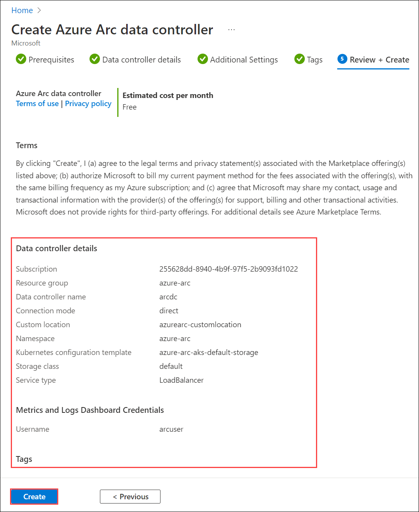
   
1. Once the deployment got completed click on **Go to resource group** button.

   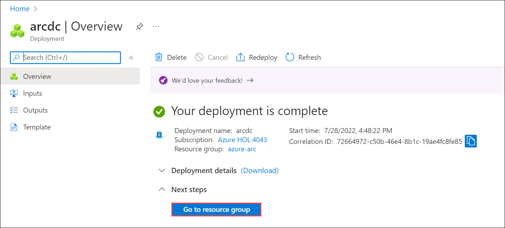
   
1. From the **azure-arc** resource group, select **arcdc** Azure Arc Data Controller from the resources.

   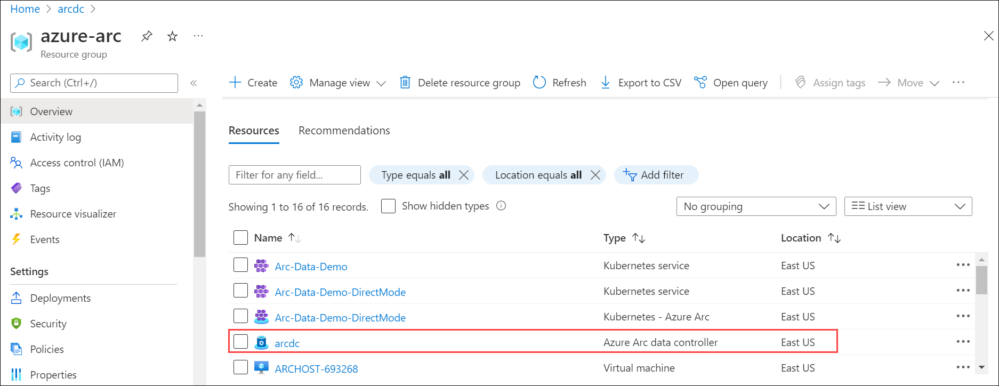  
   
  # Monitor the creation of Azure Arc data controller on cluster.
   
1. When the Azure portal deployment status shows the deployment was successful, you can check the status of the Arc data controller deployment on the cluster by running the below command on PowerShell window:

   ```
   kubectl get datacontrollers -n azure-arc
   ```
   
   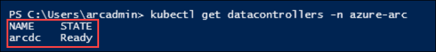
   
 1. Once the data controller state is changed to ready then proceed to next steps, please note the data controller deployment can take 5 to 10 minutes to change it to ready.

1. On Azure Ac data controller resource overview blade, explore the given information about the Namespace and Connection mode.

   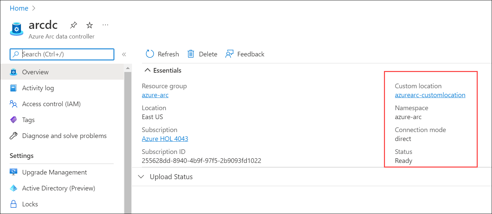

## Task 4: Deploy Azure Arc-enabled SQL Managed Instance with Direct Connected Mode.

In this exercise, let's create an **Azure Arc-enabled SQL Managed Instance** using Azure Portal on a directly connected Azure Arc data controller in a custom location. 

Also, we will be exploring the Kibana and Grafana Dashboards and upload the logs and metrics to the Azure portal and view the logs.

1. Open your browser and login to Azure portal if not already done.

1. Now search for **SQL Managed Instance - Azure Arc** and select it.

    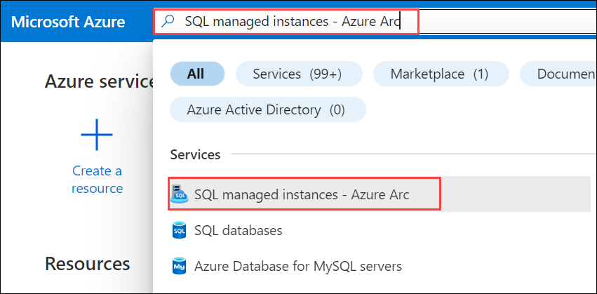
   
1. Click on create **+ Create** button to create the SQL Managed instance - Azure Arc.

    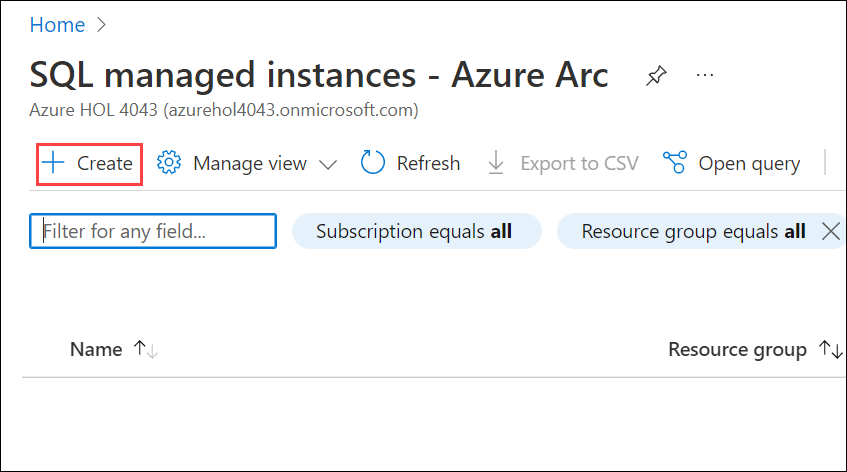
 
1. Now on **Basics** tab enter the below details:
 
   - **Under Project details**
    
     - **Subscription**: Leave ```default```.
    
     - **Resource Group**: Select **azure-arc** **(1)** from drop down     
   
   - **Under Managed Instance details**
   
     - **Instance name**: Enter **arcsql** **(2)**
  
     - **Custom location**: Select available custom location from dropdown **(3)**.
   
     - **Service type**: Select **Load balancer** from drop down **(4)**
    
     - **Compute+ Storage**: Click on **Configure compute + storage** **(5)**
      
       
      
1. Now on **Compute+ Storage** blade enter the following details:
    
     - Service Tier: **Business Critical** **(1)**
     - High availability: Select **1 replica** **(2)**
     - Instance Compute
       - Memory Limit (in Gi): Enter ```4``` **(3)**
       - CPU vCores Limit: Enter ```2``` **(4)**
     
     
     
     - Instance Storage
       - Data storage class: leave default
       - Data volume size (in Gi): ```2```
       - Data-logs storage class: leave ```default```
       - Data-logs volume size (in Gi): ```1```
       - Logs storage class: Leave ```default```
       - Logs storage class: Enter ```1```
       - Backup Storage class: leave ```default```
       - Backups volume size (in Gi): ```1```
      
    After adding all the above details click on **Apply** button.  
      
      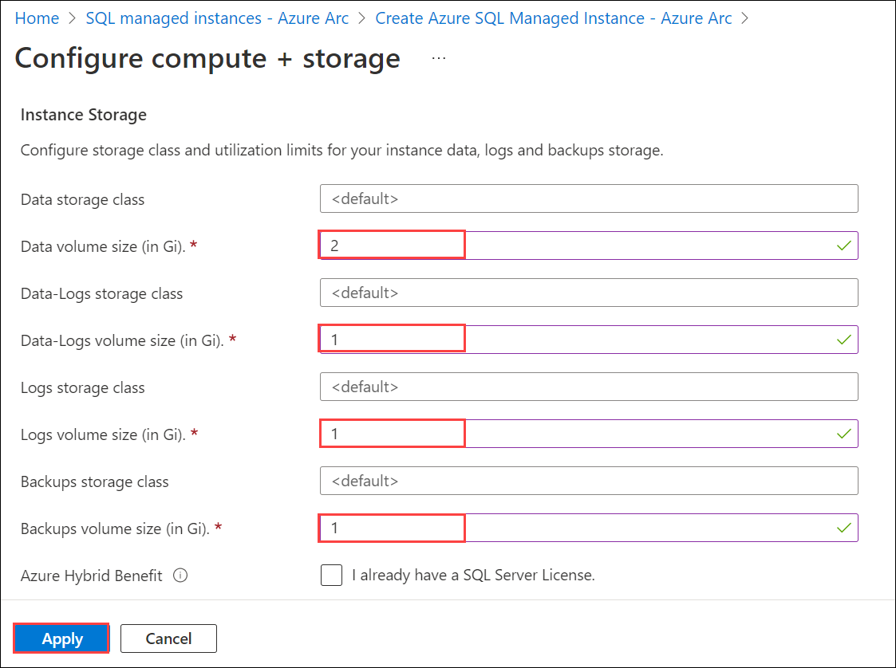
   
1. Under Administrator account, enter the below details:

     - **Managed Instance admin login**:  Enter **arcsqluser**
   
     - **Password**: Enter **Password.1!!**
     
     - **Confirm Password**: Enter **Password.1!!**

   After adding all the required details click on **Review + Create button** to review the all details.
    
    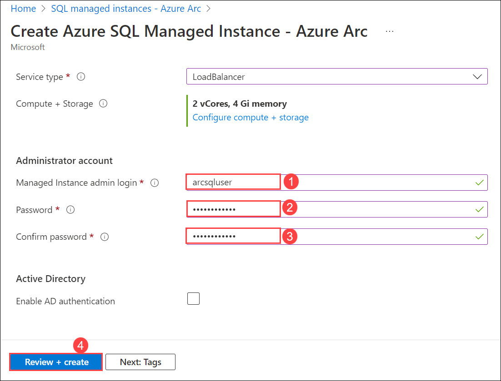
    
1. Now Click on **Create** button to start the deployment.  
 
    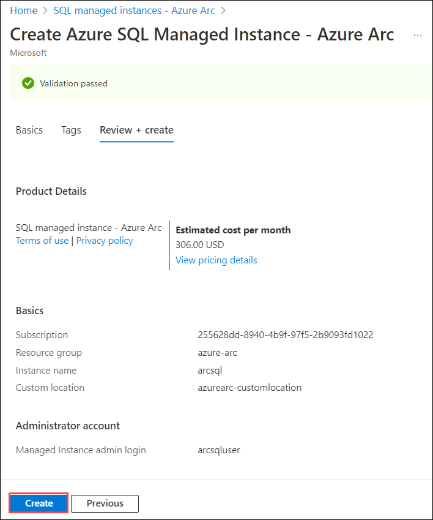
 
1. After some time you see that the deployment of **SQL Managed Instance - Azure Arc** in completed. Now click on **Go to resource** button to navigate to the resource.

   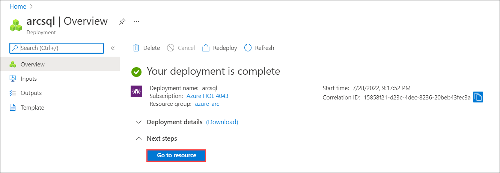

1. Now we have successfully deployed the Azure Arc-enabled SQLMI on top of Directly connected mode Azure Arc data controller, you can explore more on metric and logs on the same page from left side menu.

   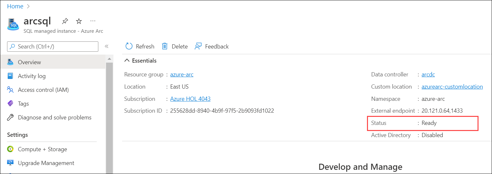

## Task 5: Connecting Azure Arc Data Controller using Azure Data Studio

1.

 In this exercise we have connected our cluster to Azure Arc-enabled cluster and deployed custom location and data controller with direct connected mode with the help of Azure portal and Azure CLI and created a Azure Arc-enabled SQLMI server on directly connected mode of Azure Arc data controller.
