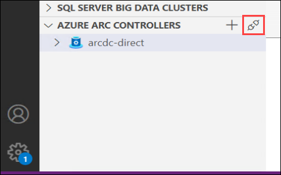
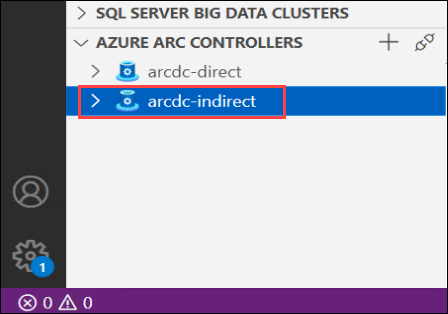
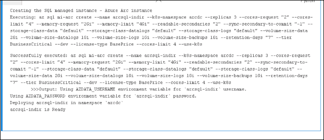
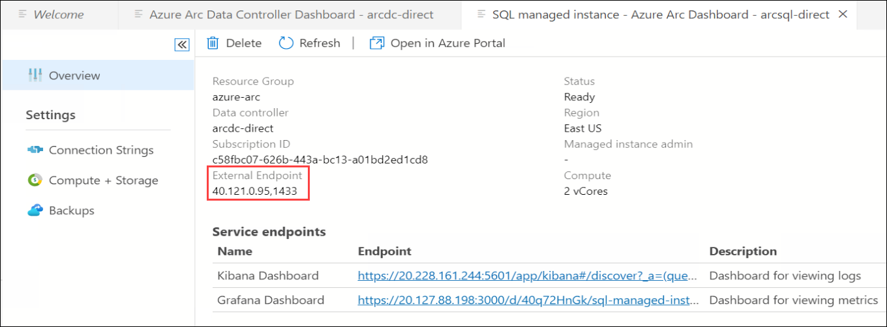
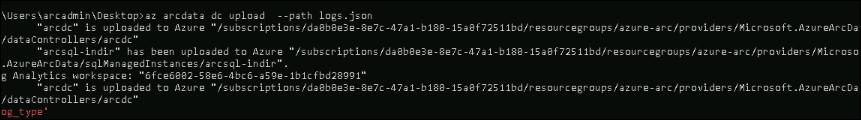
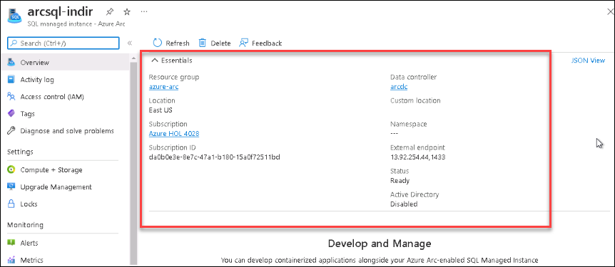
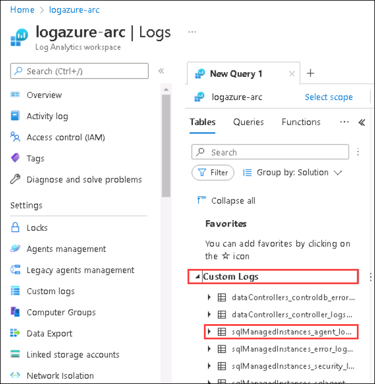
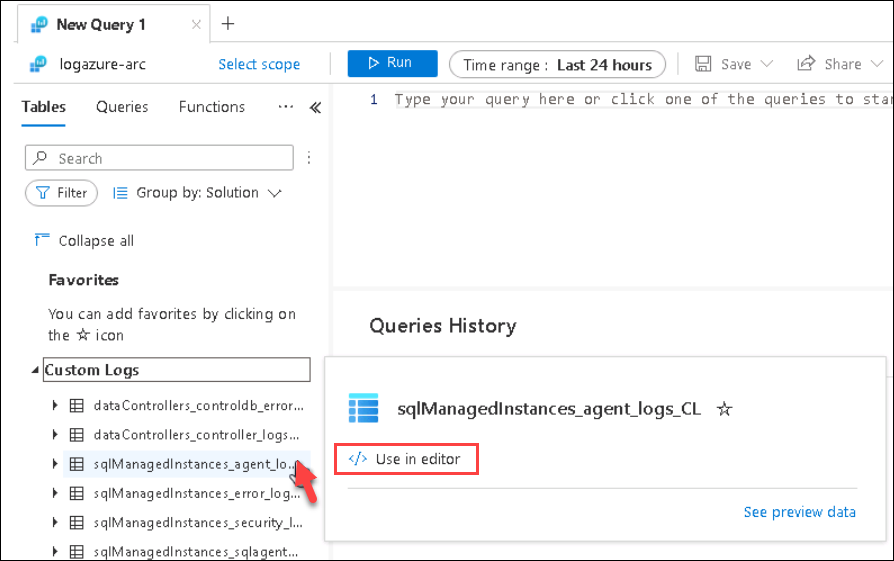
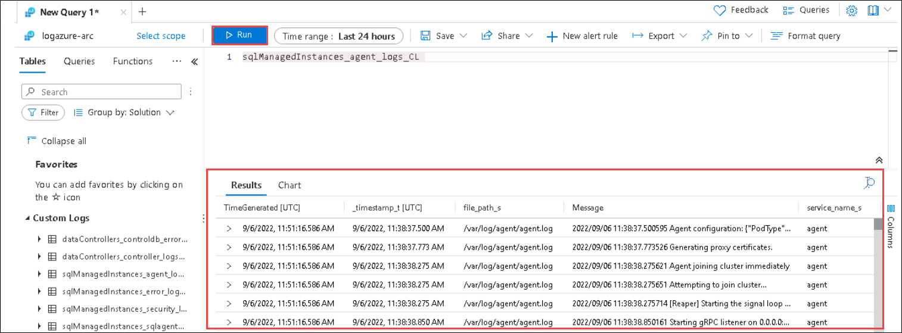

## Exercise 3: Connecting to Azure Arc Data Controller and deploying Azure Arc-enabled SQL Managed Instance Business Critical in Indirect connectivity mode

In this exercise, you will be connecting to the pre-deployed Azure Arc Data Controller with indirect connectivity mode using Azure Data Studio.  we will also create an Azure Arc-enabled SQL Managed Instance Business Critical on top of an Azure Arc Data Controller with indirect connectivity mode.

### Task 1: Connect to the Azure Arc data controller using Azure Data Studio.

Let us now connect to the Azure Arc data controller using Azure Data Studio.

In the environment provided, the Azure Arc Data controller is already deployed on top of the Kubernetes Cluster. We are using **Indirect** connectivity mode for the Azure Arc-enabled data services environment to Azure.
  
   > **Info**: There are multiple modes available to connect to Azure. if the Azure Arc-enabled data services are directly connected to Azure, users can use Azure Resource Manager APIs, the Azure CLI, and the Azure portal to operate the Azure Arc data services. The experience in directly connected mode is much like how you would use any other Azure service with provisioning/de-provisioning, scaling, configuring, and so on, all in the Azure portal.
   
   If you want to know more about this, refer to the [Connectivity Modes](https://docs.microsoft.com/en-us/azure/azure-arc/data/connectivity)

1. Open **Windows PowerShell** from the Desktop and run the below command to delete the existing cluster context and create a new one to connect with the Azure Arc Data controller Indirect connectivity mode.

   ```BASH
   Remove-Item C:\Users\arcadmin\.kube\config
   ```
   
   ```BASH
   Import-AzAksCredential -ResourceGroupName $env:resourceGroup -Name $env:clusterName -Force
   ```
   
1. Navigate back to **Azure Data studio** and in **Azure Arc Controllers** section, click on **Connect to Existing Azure Arc Controller**.

   
   
1. In the **Connect to Existing Controller** page, provide the following details and click on **Connect**.

   - **Namespace**:
     ```BASH
     arcdc
     ```
   
   - **Cluster Context**:
     ```BASH
     Arc-Data-Demo
     ```

   - **Name** :
     ```BASH
     arcdc-indirect
     ```
   
     

1. Once the connection is successful, you can see the **arcdc-indirect** Azure Arc data controller listed under Azure Arc Controllers on the bottom left of the Azure Data Studio.

    

### Task 2: Monitor with Data Controller Dashboard

Now that you are connected to an Azure Arc data controller, let us view the dashboards for the data controller and any SQL-managed instances or PostgreSQL Hyperscale server group resources that you have.

1. In the **Connections** panel, under **AZURE ARC CONTROLLERS**, right-click on the **arcdc-indirect** data controller and select **Manage**.

   > **Note**: You will see that there is no Azure Arc Resource. This is because you have not deployed any resources on the Azure Arc data services environment yet. You will be deploying the resources in the next exercises.

    

1. Once you are in the Azure Arc Data Controller dashboard, you can see the following details about the data controller 
   - Name of the Arc Data Controller
   - Region where it is deployed
   - Connection mode
   - Resource Group
   - Subscription ID of the Azure Subscription
   - Controller Endpoint
   - Namespace
   
   You will also see that we have deployed using the Indirect connection mode of the Azure Arc Data controller.

   
   
   > **Note**: If you click on the **Open in Azure portal** button from the menu on the top, you will not be able to find the resources because we have not yet uploaded any logs to the Azure portal and without uploading any logs to Azure, you will not be able to view the Azure Arc data controller resource in the Azure portal.

### Task 3: Create Azure Arc-enabled SQL Managed Instance

In this task, you will be creating an SQL Managed Instance using Azure Data Studio. Azure SQL Managed Instance is an intelligent and scalable cloud database service that combines the broadest SQL Server database engine compatibility with all the benefits of a fully managed and evergreen platform as a service.

1. Open **Azure Data Studio** from the desktop if not already opened. 
   > **Note**: Azure Data Studio is a free cross-platform database tool for data professionals using on-premises and cloud data platforms on Windows, macOS, and Linux

1. Now, right-click on the Azure Arc data controller connection, click on Manage, and then click on the **+ New Instance** button within the Azure Arc Data controller dashboard. 

   
  
1. Now, select the **Azure SQL Managed Instance** and click on **Select** at the bottom of the page.

   
   
1. On the next page that opens, read the Microsoft Privacy statement, and then click on **Next button** to proceed with the deployment. You can click on the privacy statement link to view the terms and conditions if you want to read through it.

   > **Note**: You will also see a **Required tools** table under the terms and conditions line. These tools are required to deploy the Azure Arc-enabled Azure SQL Managed Instance. You don't have to worry about the installation of any of those tools because we have already installed these required tools for you.

   

1. In the deploy **Azure SQL Managed Instance - Azure Arc blade**, enter the following information:

   **Under SQL Connection information**
   
    - **Target Azure Arc Controller**: Select **arcdc-indirect**  
    - **Instance name**: Enter **arcsql-indir**       
    - **Username**:  Enter **arcsqluser** 
    - **Password**: Enter **Password.1!!**
    - **Confirm Password**: Enter **Password.1!!**    

      
      
   **Under SQL Instance Settings**
   
    - **Service Tier**: **Business Critical** 
    - **For Development use only**: **Check the box** 
    - **storage class(Data)**: leave ```default```
    - **volume size in Gi(Data)**: ```2```
    - **storage class(Database logs )**: leave ```default```
    - **volume size (Database logs)**: ```1```
    - **storage class(Logs)**: Leave ```default```
    - **volume size in Gi(Logs )**: Enter ```1```
    - **Storage class(Backup)**: leave ```default```
    - **volume size in Gi(Backups)**: ```1```
    - **Cores Rquest**: ```2```
    - **Cores Limit**: ```4```
    - **Memory Request**: Enter ```2``` 
    - **Memory Limit**: Enter ```4``` 
     
     
      

1. Leave the other things to default and click on the **Deploy** button to start the deployment of the  **Azure SQL Managed instance - Azure Arc** on the data controller.
   
1. If prompted, select **New Python installation** and click on **Next** button.

   > **Note**: If you are not prompted with the below screen you can skip to step 10.

   
  
1. On the Install Dependencies tab, click on **Install**.

   
     
1. After clicking on Install, a Notebook will open up and the cell execution will start automatically to deploy the **SQL Managed Instance**. Once the deployment is complete, you will see the text **arcsql-Indir is Ready** at the bottom of the notebook as shown in the screenshot. The deployment of **Azure SQL Managed instance - Azure Arc** will take around 5-10 minutes to complete, During this time you can explore through the commands in the notebook

   

1. Once the installation is complete, in **Azure Arc Data Controller dashboard** under Azure Arc Resources you can see the newly created Azure Arc-enabled Azure SQL Managed instance.

   

   > **Note**: You might have to right-click and refresh on Arc data controller to view the instance if you don't see one after seeing the text **arcsql-Indir is Ready** at the bottom of the notebook.

### Task 4: Connect to Azure Arc-enabled SQL Managed Instance using Azure Data Studio.

In this task, you will learn how to connect to your newly created Azure Arc-enabled Azure SQL Managed instance using Azure Data Studio.

1. Now, Right-click on the newly created Azure Arc-enable SQL Managed Instance and click on **Manage**. A new window should open, and you should be able to see the overview of SQL Managed Instance, Copy the **External Endpoint** from the dashboard. We will use the endpoints in the next steps to connect to the Azure Arc-enabled SQL Managed Instance. 

     

1. In Azure Data Studio, in the connections tab within the servers, click on **Add Connection**.

   

1. Enter the following on the connection details page:

    - **Connection type** : Select **Microsoft SQL Server** **(1)**
   
    - **Sever**: Paste the external endpoint value of SQL Managed Instance which you copied earlier **(2)**

      >**Note**: Make sure you have entered **IP Address** with **port number**.
   
    - **Authentication type** : Select **SQL Login** from the drop-down options **(3)**
   
    - **User name** : Enter arcsqluser **(4)**
      ```BASH
      arcsqluser
      ```
   
    - **Password** : Enter Password.1!! **(5)**
      ```BASH
      Password.1!!
      ```
    
    - Click on **Connect** **(6)**
   
   
   
1. You are now successfully connected with your Azure Arc-enabled SQL MI Server. You can see it under servers. You can explore the SQL Managed Instance - Azure Arc Dashboard to view the databases and run a query.

   
   
   
## Task 5: View SQL MI resource and SQL MI logs in the Azure portal.
   
Now that we have the SQL Managed Instance created, let us upload some metrics, usages, and logs to the Azure Portal and view the SQL Managed Instance Resource in the Azure portal.
   
1. Navigate back to the **command prompt** window. 

1. Run the below commands to check if the variables are set or not.
   
   ```BASH
   echo %WORKSPACE_ID%
   ```

   ```BASH
   echo %WORKSPACE_SHARED_KEY%
   ```

   ```BASH
   echo %SPN_TENANT_ID%
   ```

   ```BASH
   echo %SPN_CLIENT_ID%
   ```

   ```BASH
   echo %SPN_CLIENT_SECRET%
   ```

   ```BASH
   echo %SPN_AUTHORITY%
   ```
       
1. If the variables are not defined, set it now using the below commands.
   
   ```
   SET WORKSPACE_ID=<workspaceId>
   ```

   ```
   SET WORKSPACE_SHARED_KEY=<primarySharedKey>
   ```

   ```
   SET SPN_CLIENT_ID=<appId>
   ```

   ```   
   SET SPN_CLIENT_SECRET=<password>
   ```

   ```
   SET SPN_TENANT_ID=<tenant>
   ```

   ```
   SET SPN_AUTHORITY=https://login.microsoftonline.com
   ```

   > **Note**: You can get the workspace ID and key from the Azure portal and service principal details from the Environment Details tab at the top and then navigate to Service Principal details.

1. Export all logs to the specified file:
   
   ```
   az arcdata dc export --type logs --path logs.json --k8s-namespace arcdc --use-k8s
   ```
    > **Note**: You may see a message "logs.json already exists already, do you want to overwrite it? (Y/N):", then enter `Y` to overwrite. Also if you see any bypass server certificate check, then please enter 'y' to continue. The data will be exported to this location: 'C:\Users\arcadmin\logs.json'

1. Upload logs to an existing Azure monitor log analytics workspace:
   
    ```
    az arcdata dc upload  --path logs.json
    ```
      
1. After some time, you will see some outputs uploaded to Azure.

    
    
1. Now open the Azure portal and search for **Azure SQL Managed instances - azure arc**  and select the resource.

    
      
1. Now you will see some basic information about the Azure Arc-enabled SQL Managed Instance.
      
    
   
1. Now to view your logs in the Azure portal, open the Azure portal and then search for your log analytics workspace by name in the search bar at the top and then select it.

1. In the **Log Analytics workspaces** page, select your workspace **logazure-arc**.
   
    

1. Then, from the left navigation menu under **General** select **Logs**

1. Now on your page that opens up, click on the ``X``  at the top right corner as shown in the below image.

    
   
1. And then, click on ```>>``` icon to expand the Schema and Filter tab.

    

1. Then, check if CustomLogs is there under the Tables section. If you don't see CustomLogs there, refresh the page every 2 minutes until it is available.
     
1. Once the Custom logs are available, expand Custom Logs at the bottom of the list of tables and you will see a table called **sqlManagedInstances_agent_logs_CL**.
   
    

1. Hover the cursor on the table name and select the **Use in editor** button.
   
    

1. Now, you will have a query in the query editor. Run the query that will show the logs by clicking on **Run** **(1)** button and explore the **Results** **(2)**. 
   
    

    > **Note**: You might have to resize the editor, to view the logs from the output window.

### In this exercise, you have covered the following:
 
   - Connecting Azure Data Controller indirect mode using Azure Data Studio 
   - Monitor with Data Controller Dashboard.
   - Creating Azure Arc-enabled SQL Managed Instance
   - Connecting to Azure Arc-enabled SQL Managed Instance using Azure Data Studio.
   - Exporting and uploading logs to Azure Portal.
   - Browsing the resources in Azure Portal
