# Exercise 3: Connecting to Azure Arc Data Controller and deploying Azure Arc-enabled SQLMI business critical in Indirect connectivity mode

In this exercise, You will be connecting to the pre-deployed Azure Arc Data Controller with indirect connectivity mode using Azure Data Studio.  we will also create an Azure Arc-enabled SQL Managed Instance business critical on top of a Azure Arc Data Controller with indirect connectivity mode .

## Task 1: Connect to the Azure Arc data controller using Azure Data Studio.

Let us now connect to the Azure Arc data controller using Azure Data Studio.

In the environment provided, the Azure Arc Data controller is already deployed on to the Kubernetes Cluster. We are using **Indirect** connectivity mode for the Azure Arc-enabled data services environment to Azure.
  
   > ***Info***: There are multiple modes available to connect to Azure. if the Azure Arc-enabled data services are directly connected to Azure, users can use Azure Resource Manager APIs, the Azure CLI, and the Azure portal to operate the Azure Arc data services. The experience in directly connected mode is much like how you would use any other Azure service with provisioning/de-provisioning, scaling, configuring, and so on, all in the Azure portal.
   
   If you want to know more about this, refer to the [Connectivity Modes](https://docs.microsoft.com/en-us/azure/azure-arc/data/connectivity)

1. Open **Windows PowerShell** from the Desktop and run the below command to switch the cluster context from **Direct to Indirect mode**.

   ```BASH
   Remove-Item C:\Users\arcadmin\.kube\config
   Import-AzAksCredential -ResourceGroupName $env:resourceGroup -Name $env:clusterName -Force

   ```
   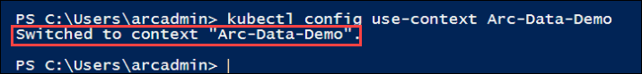

1. Open **Azure Data Studio** from the desktop if not already opened. 
   > **Note**: Azure Data Studio is a free cross-platform database tool for data professionals using on-premises and cloud data platforms on Windows, macOS, and Linux

1. Now, right click on the Azure Arc data controller connection, click on Manage, and then click on the **+ New Instance** button within the Azure Arc Data controller dashboard. 

   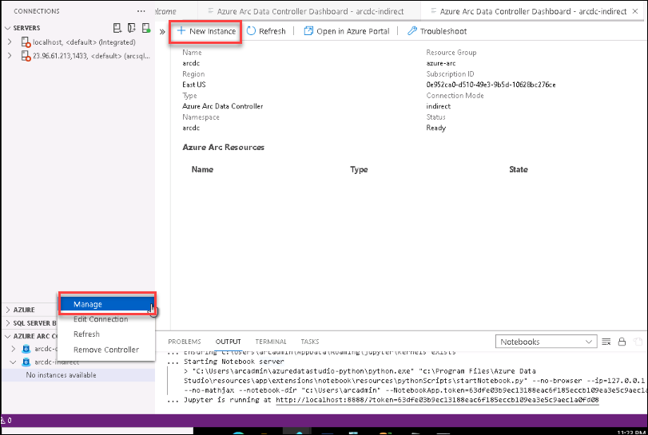
  
1. Now, select the **Azure SQL Managed Instance** and click on **Select** at the bottom of the page.

   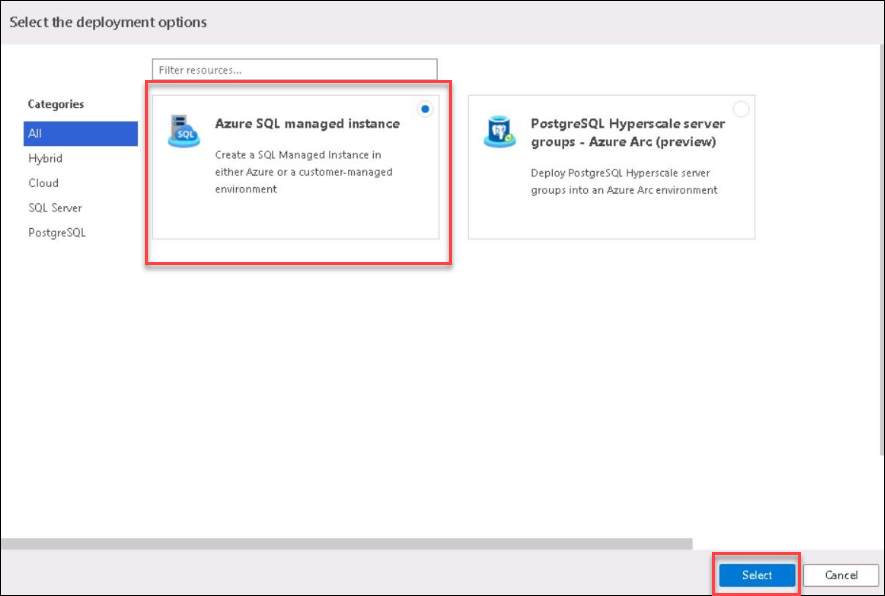
   
1. In the next page that opens up, read the Microsoft Privacy statement and then click on **Next button** to proceed with the deployment. You can click on the privacy statement link to view the terms and conditions if you want to read through it.

   > **Note**: You will also see a **Required tools** table under the terms and conditions line. These tools are required to deploy the Azure Arc enabled Azure SQL Managed Instance. You don't have to worry about installation of any of those tools because we have already installed these required tools for you.

   

1. In the deploy **Azure SQL Managed Instance - Azure Arc blade**, enter the following information:

   **Under SQL Connection information**
   
    - **Target Azure Arc Controller**: Select **arc-indirect**  
    - **Instance name**: Enter **arcsql-indir**       
    - **Username**:  Enter **arcsqluser** 
    - **Password**: Enter **Password.1!!**   

      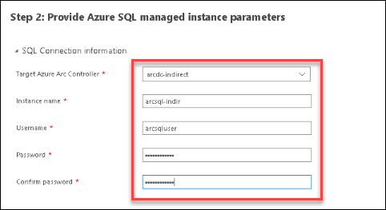
      
   **Under SQL Instance Settings**
   
    - **Service Tier**: **Business Critical** 
    - **For Development use only**: **Check the box** 
    - **storage class(Data)**: leave default
    - **volume size in Gi(Data)**: ```2```
    - **storage class(Database logs )**: leave ```default```
    - **volume size (Database logs)**: ```1```
    - **storage class(Logs)**: Leave ```default```
    - **volume size in Gi(Logs )**: Enter ```1```
    - **Storage class(Backup)**: leave ```default```
    - **volume size in Gi(Backups)**: ```1```
    - **Cores Rquest**: ```2```
    - **Cores Limit**: ```4```
    - **Memory Request**: Enter ```2``` 
    - **CPU vCores Limit**: Enter ```4``` 
     
     
      

1. Leave the other things default and click on the **Deploy** button to start the deployment of the  **Azure SQL Managed instance - Azure Arc** on the data controller.
   
1. If prompted, select **New Python installation** and click on **Next** button.

   > **Note:** If you are not prompted with the below screen you can skip to step 9.

   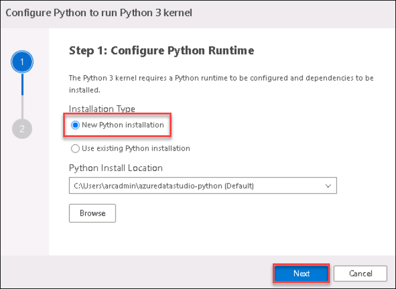
  
1. On Install Dependencies tab, click on **Install**.

   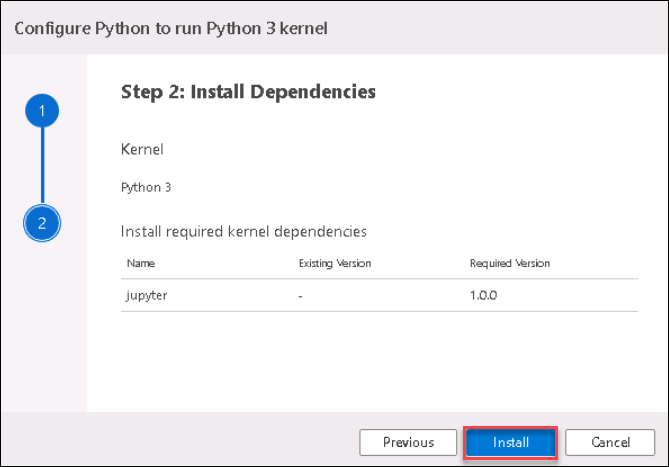
     
1. After clicking on Install, a Notebook will open up and the cell execution will start automatically to deploy the **SQL Managed Instance**. Once the deployment is complete, you will see the text **arcsql is Ready** at the bottom of the notebook as shown in the screenshot. The deployment of **Azure SQL Managed instance - Azure Arc** will take around 5-10 minutes to complete, in this time you can explore through the commands in the notebook

   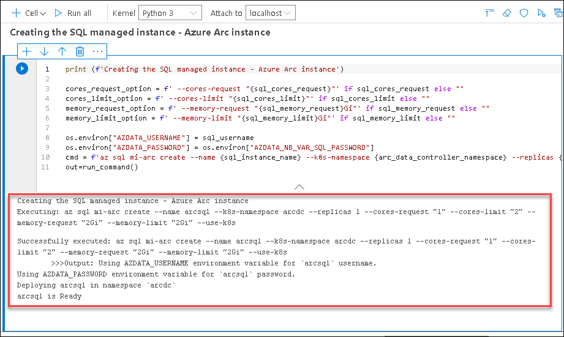

1. Once the installation is complete, in **Azure Arc Data Controller dashboard** under Azure Arc Resources you can see the newly created Azure Arc-enabled Azure SQL Managed instance.

   

   > **Note**: You might have to right-click and refresh on Arc data controller to view the instance if you don't see one after seeing the text **arcsql is Ready** at the bottom of the notebook.

## Task 2: Monitor with Data Controller Dashboard

Now that you are connected to an Azure Arc data controller, let us view the dashboards for the data controller and any SQL managed instances or PostgreSQL Hyperscale server group resources that you have.

1. In the **Connections** panel, under **AZURE ARC CONTROLLERS**, right-click on the **arcdc-indirect** data controller and select **Manage**.

   > **Note**: You will see that there is no Azure Arc Resource. This is because you have not deployed any resource on the Azure Arc data services environment yet. You will be deploying the resources in the next exercises.

    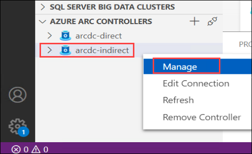

1. Once you are in the Azure Arc Data Controller dashboard, you can see following details about the data controller 
   - Name of the Arc Data Controller
   - Region where it is deployed
   - Connection mode
   - Resource Group
   - Subscription ID of the Azure Subscription
   - Controller Endpoint
   - Namespace
   
   You will also see that we have deployed using the Indirect connection mode of the Azure Arc Data controller.

   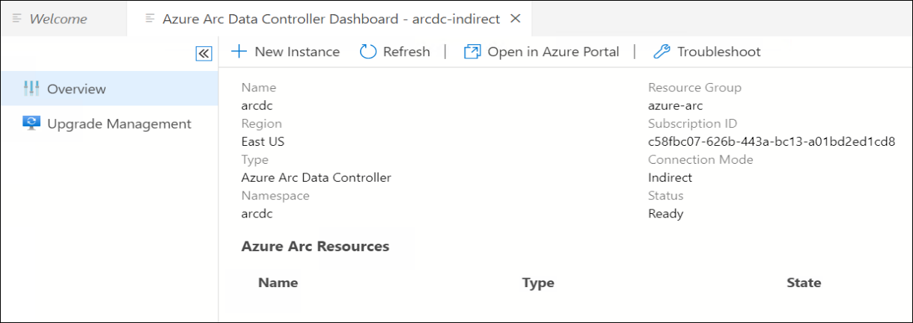
   
   > **Note**: If you click on the **Open in Azure portal** button from the menu on the top, you will not be able to find the resources because we have not yet uploaded any logs to the Azure portal and without uploading any logs to Azure, you will not be able to view the Azure Arc data controller resource in the Azure portal.

## Task 3: Create Azure Arc-enabled SQL Managed Instance

In this task, you will be creating an SQL Managed Instance using Azure Data Studio. Azure SQL Managed Instance is the intelligent and scalable cloud database service that combines the broadest SQL Server database engine compatibility with all the benefits of a fully managed and evergreen platform as a service.

1. On the JumpVM provided, launch the **Command Prompt** by double-clicking on the cmd shortcut on the desktop.
  
    

1. Once the command prompt window opens up, run the following command to create SQL MI instance.

   ```BASH
   az sql mi-arc create --name arcsql-indir --k8s-namespace arcdc --replicas 1 --cores-request "2" --cores-limit "4" --memory-request "4Gi" --memory-limit "8Gi" --storage-class-data "default" --storage-class-datalogs "default" --storage-class-logs "default" --volume-size-data 5Gi --volume-size-datalogs 5Gi --volume-size-logs 5Gi  --tier BusinessCritical --dev --license-type BasePrice --cores-limit 4 --use-k8s
   ```
   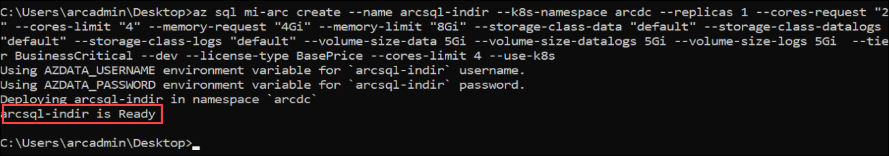
   
   >**Note**: The SQL MI instance will take 5-10 minutes to create. Please wait until it gets created.

1. Once the Deployment of SQLMI is complete, navigate back to Azure data studio and in **Azure Arc Data Controller dashboard** under Azure Arc Resources you can see the newly created Azure Arc-enabled Azure SQL Managed instance.

   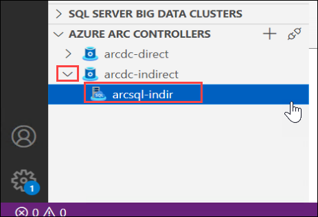

   > **Note**: You might have to right-click and refresh on Arc data controller to view the instance if you do not see one after seeing the text **arcsql is Ready** at the bottom of the notebook.

## Task 4: Connect to Azure Arc-enabled SQL Managed Instance using Azure Data Studio.

In this task, you will learn how to connect to your newly created Azure Arc-enabled Azure SQL Managed instance using Azure Data Studio.

1. If the **Command Prompt** window is not already opened, open a new one by clicking on the Command Prompt icon from the desktop shortcut and run the following command to create a new service for port 1533.

   ```BASH
   kubectl expose pod arcsql-indir-0 -n arcdc --port=1533 --type=LoadBalancer --name=sqlconnection
   ```
   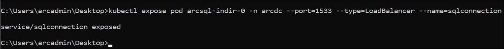
      
   >**Note**: This command will create a new service which will be used to connect to the SQL MI instance directly.

1. You can now run the below command to check the service creation. It might take 2-5 minutes for the external IP to appear. Copy the external IP for later use.

   ```BASH
   kubectl get svc -n arcdc
   ```
   
   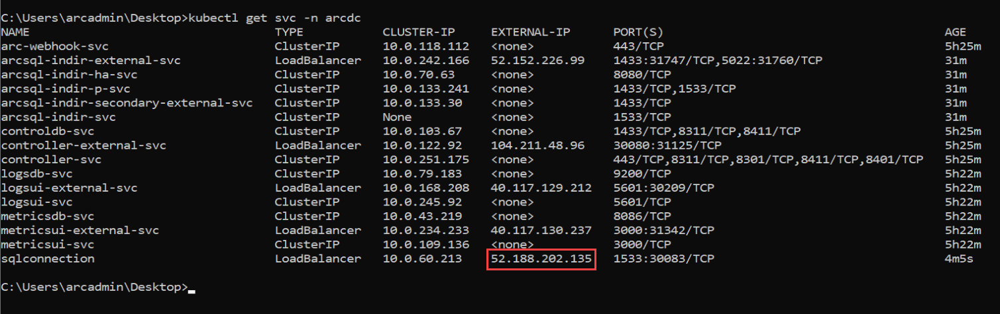
   
   >**Note**: Retry the running command multiple times until the external IP is visible.

1. Copy the external IP and add **,1533** to the end of the external IP.

   ```BASH
   <external IP>,1533
   ```

1. In Azure Data Studio, in the connections tab within the servers, click on **Add Connection**.

   

1. Enter the following in the connection details page:

    - **Connection type** : Select **Microsoft SQL Server** **(1)**
   
    - **Sever**: Paste the external endpoint value of SQL Managed Instance which you copied earlier **(2)**

      >**Note**: Make sure you have entered **IP Address** with **port number**.
   
    - **Authentication type** : Select **SQL Login** from the drop down options **(3)**
   
    - **User name** : Enter arcuser **(4)**
      ```BASH
      arcuser
      ```
   
    - **Password** : Enter Password.1!! **(5)**
      ```BASH
      Password.1!!
      ```
    
    - Click on **Connect** **(6)**
   
   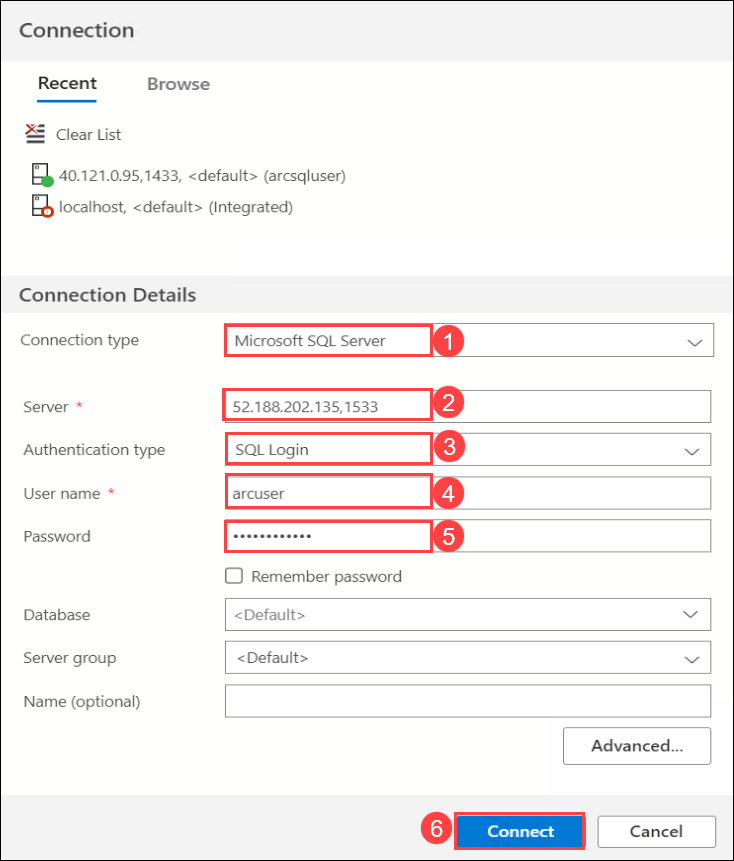
   
1. You are now successfully connected with your Azure Arc-enabled SQL MI Server. You can see it under servers. You can explore the SQL Managed Instance - Azure Arc Dashboard to view the databases and run a query.

   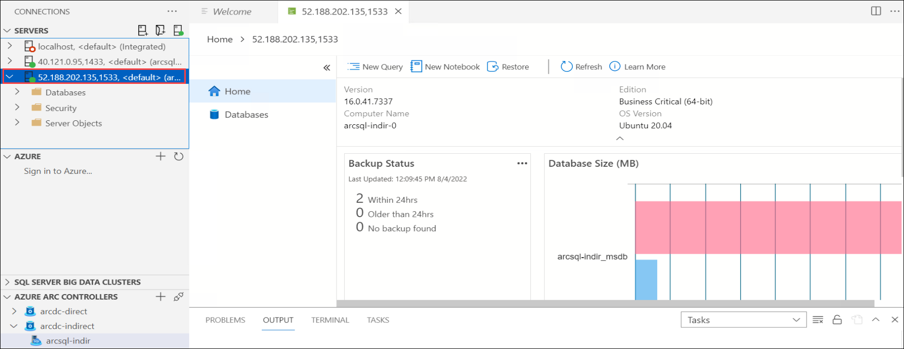

## In this exercise, you have covered the following:
 
   - Connecting Azure Data Controller indirect mode using Azure Data Studio 
   - Monitor with Data Controller Dashboard.
   - Creating Azure Arc-enabled SQL Managed Instance
   - Connecting to Azure Arc-enabled SQL Managed Instance using Azure Data Studio.
