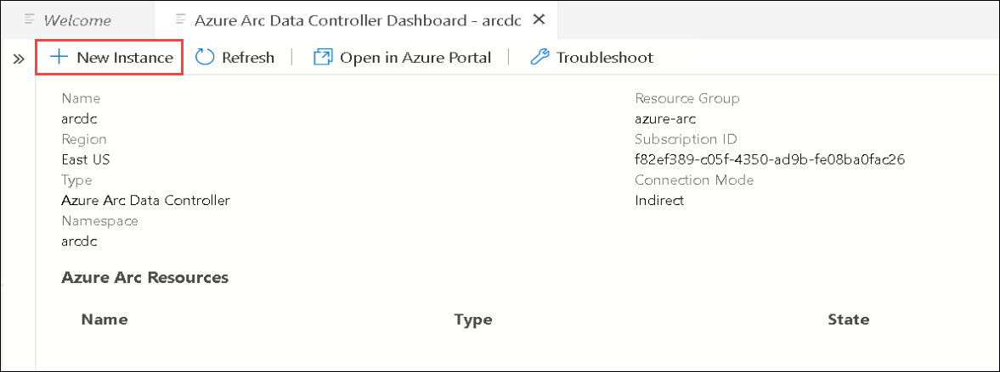
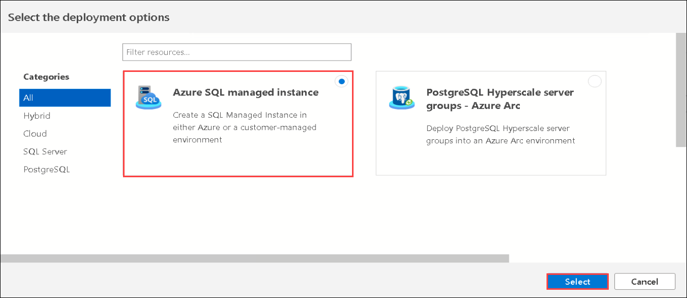
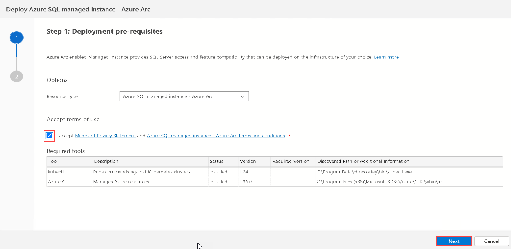
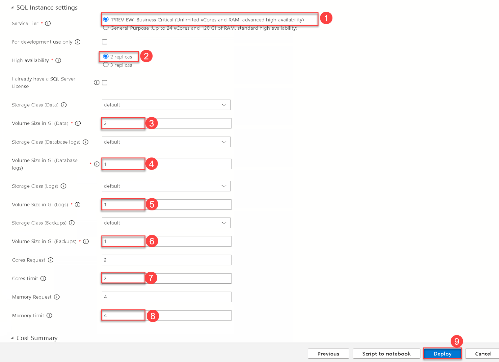
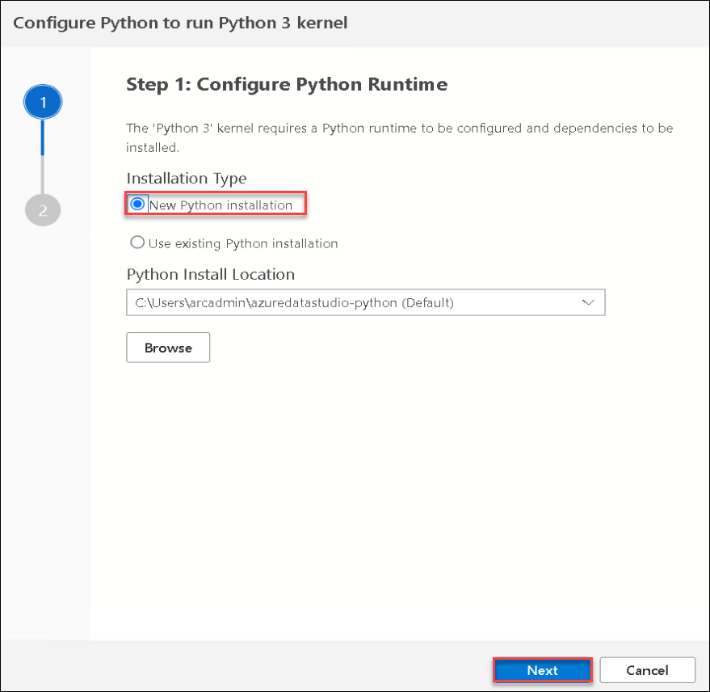
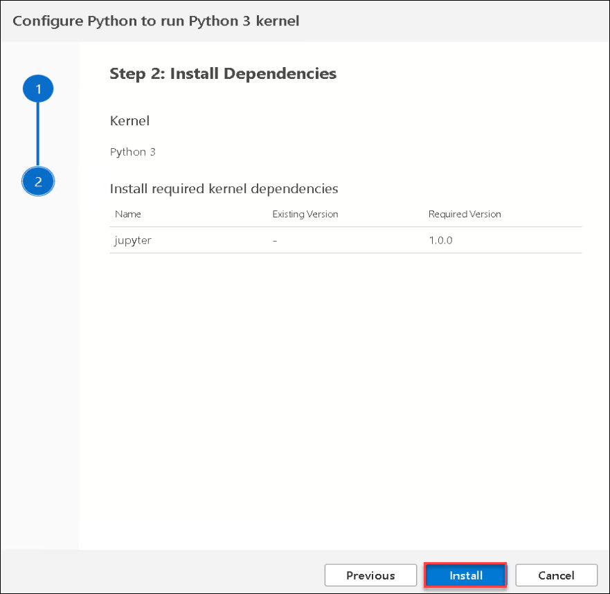
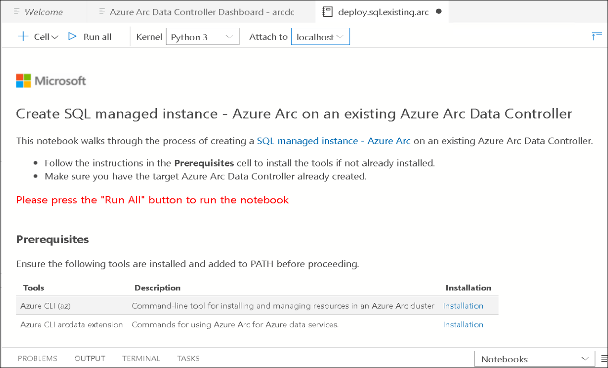

# Exercise 2: Connect to data controller disconnected mode and deploy SQLMI business critical using Azure Data Studio 
 
## Task 1: Connect to the data controller using Azure Data Studio.

Now let us connect to the data controller using Azure Data Studio.

In the environment provided, the Azure Arc Data controller is already deployed on to the Kubernetes Cluster. We are using **direct** connectivity mode for the Azure Arc enabled data services environment to Azure.
  
   > ***Info***: There are multiple modes available to connect to Azure. if the Azure Arc enabled data services are directly connected to Azure, then users can use Azure Resource Manager APIs, the Azure CLI, and the Azure portal to operate the Azure Arc data services. The experience in directly connected mode is much like how you would use any other Azure service with provisioning/de-provisioning, scaling, configuring, and so on all in the Azure portal.
   
   If you want to know more about this, refer to the [Connectivity Modes](https://docs.microsoft.com/en-us/azure/azure-arc/data/connectivity)

1. On your JumpVM, open **Azure Data studio** from the desktop shortcut and select **Connections**.

   
   
1. In the **Connections** panel under **Azure Arc Controllers**, click on **Connect Controller**.

1. In the **Connect to Controller** page, provide the following details.

   - **Namespace**:
     ```BASH
     arcdc
     ```
     
   - **Name** : Enter arcdc
     ```BASH
     arcdc
     ```
   
     

1. Now, click on **Connect**.

1. Once the connection is successful, you can see the Azure Arc data controller listed under Azure Arc Controllers on the bottom left of the Azure Data Studio.

    

## Task 2: Monitor with Data Controller Dashboard

Now that you are connected to an Azure Arc data controller, let us view the dashboards for the data controller and any SQL managed instances or PostgreSQL Hyperscale server group resources that you have.

1. In the **Connections** panel, under **AZURE ARC CONTROLLERS**, right-click on the **arcdc** data controller and select **Manage**.

   > **Note**: You will see that there is no Azure Arc Resources. This is because you have not deployed any resource on the Azure Arc data services environment yet. In the next exercises, you will be deploying the resources.

    

1. Once you are in the Azure Arc Data Controller dashboard, you can see following details about the data controller 
   - Name of the Arc Data Controller
   - Region where it is deployed
   - Connection mode
   - Resource Group
   - Subscription ID of the Azure Subscription
   - Controller Endpoint
   - Namespace
   
   You will also see that we have deployed using the Indirect connection mode of the Azure Arc Data controller.

   
   
   > **Note**: If you click on the **Open in Azure portal** button from the menu on the top, you will not be able to find the resources because we have not yet uploaded any logs to the Azure portal and without uploading any logs to azure, you will not be able to view the Azure Arc data controller resource in Azure portal.

## Task 3: Deploy SQL Managed Instance business critical using Azure Data Studio

In this task, you will be deploying an SQL Managed Instance using Azure Data Studio. Azure SQL Managed Instance is the intelligent, scalable cloud database service that combines the broadest SQL Server database engine compatibility with all the benefits of a fully managed and evergreen platform as a service.

1. From the Azure Arc Data Controller Dashboard - arcdc, click on **+ New Instance** to deploy  Azure SQL Managed Identity.

   
   
2. In the Select the deployment options pane, select **Azure Arc managed instance** and click on **Select**.

   
   
3. Next in the Step 1: Deployment pre-requisites pane, Accept terms of use by selecting the **Checkbox** and then click on **Next**.

   
   
4. In Step 2: Provide Azure SQL managed instance parameters blade enter the following details:

   - SQL Connection information:
     - **Instance name**: Enter **arcsql<inject key="DeploymentID" enableCopy="true"/>** **(1)**
     - **Managed Instance admin login**:  Enter **arcsqluser** **(2)**
     - **Password**: Enter **Password.1!!** **(3)**
     - **Confirm Password**: Enter **Password.1!!** **(4)**

   
   
   - SQl instance settings:
     - Service Tier: **Business Critical** **(1)**
     - High availability: Select **2 replica** **(2)**
     - Storage class (Data): leave default
     - Volume size in Gi (Data): ```2``` **(3)**
     - Storage class (Databaselogs): leave ```default```
     - Volume size in Gi (Databaselogs): ```1``` **(4)**
     - Storage class (Logs): Leave ```default```
     - Volume size in Gi (Logs): Enter ```1``` **(5)**
     - Storage class (Backup): leave ```default```
     - Volume size in Gi (Backup): ```1``` **(6)**
     - Cores Limit: Enter ```2``` **(7)**
     - Memory Limit: Enter ```4``` **(8)**
     
   After entering all the above values, click on **Deploy** **(9)**.

   

5. In Configure Python to run Python 3 kernal, select **New Python installation** for Installation Type and click on **Next** button.

   
   
6. On Install Dependencies tab, click on **Install**.

   
   
7. Now a deploy.sql.existing.arc Notebook will open after clicking on the deploy button and automatically execution of the cells starts to deploy the SQL managed instance.

   
   
8.    

## In this exercise, you have covered the following:
 
   - Getting started with the existing Kubernetes cluster.
   - Deploying Azure Arc Data controller on to Azure Kubernetes Cluster(AKS). 
   - Connect to the data controller using Azure Data Studio.
   - Monitor with Data Controller Dashboard.
