## Exercise 2: Restoring an AdventureWorks database backup taken from SQL Server 2012 instance

Contoso has some applications that use SQL Server as the backend database. They have installed SQL Server on their Windows servers in their manufacturing plants, but these locations don’t necessarily have local IT support to update the operating system and SQL Server with the latest security updates. They have explored Azure Database for SQL Server and found that it meets their requirements and offers some unique capabilities such as easy to manage and migrate from different cloud platforms. Therefore, they are excited about the opportunity of deploying SQL Server in their Azure Arc Arc-enabled environment.

Also, we will be exploring the Kibana and Grafana Dashboards and upload the logs and metrics to the Azure portal and view the logs.

### Task 1: Restore the AdventureWorks2012 database into Azure SQL Managed instance - Azure Arc Using Kubectl

Restoring an existing SQL database from a SQL Server to Azure Arc Arc-enabled SQL MI is very simple. All you have to do is to take a backup from your existing SQL Server and then restore that backup to SQL MI. In this lab, we have already taken the backup and downloaded it in the local drive folder. 

Now let's copy and restore the already taken backup file into your Azure SQL Managed instance container using Kubectl commands.

1. Launch a **Command Prompt** window from the desktop of your JumpVM if you have already closed the existing one.

1. Run the following command to get the list of pods that are running on your data controller. 

   > **Note**: The namespace name for your data controller will be **azure-arc**.

   ```BASH
   kubectl get pods -n azure-arc
   ```
   
1. From the output of the above command, copy the pod name of the SQL MI instance from the output which will be in the following format sqlinstancename-0. If you followed the same naming convention as in the instructions, the pod name will be **arcsql-direct-0**.

   > **Note**: Please copy the Pod Name for the next step.

   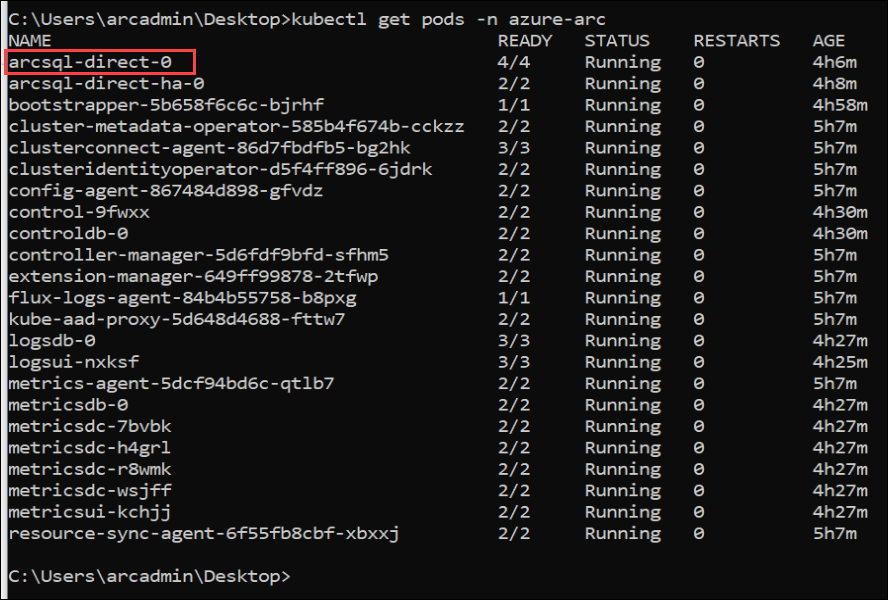
   
1. In the Command Prompt, run the following command after replacing the required values. This will remotely execute a command in the Azure SQL Managed instance container to copy the .bak file onto the container from the local directory.

   >**Note**: The value of the namespace name and pod name is already updated in the below command. Please confirm if the pod name that you had copied matches the one given below: arcsql-direct-0. 

   ```BASH
   cd C:\
   kubectl cp \AdventureWorks2012.bak arcsql-direct-0:var/opt/mssql/data/AdventureWorks2012.bak -n azure-arc
   ```
   

1. Now, to restore the AdventureWorks database, switch back to the Azure Data Studio and right click on the Connection of your connected SQL Managed Instance Server and click on **New query**.

   

1. Once the query window is open, paste the below query and execute it to restore the copied database to Azure Arc-enable SQL Managed instance 

   ```BASH
   RESTORE DATABASE AdventureWorks2012 FROM DISK = '/var/opt/mssql/data/AdventureWorks2012.bak'
   WITH MOVE 'AdventureWorks2012' to '/var/opt/mssql/data/AdventureWorks2012.mdf'  
   ,MOVE 'AdventureWorks2012_log' to '/var/opt/mssql/data/AdventureWorks2012_log.ldf'  
   ,RECOVERY;  
   GO
  
   ```

   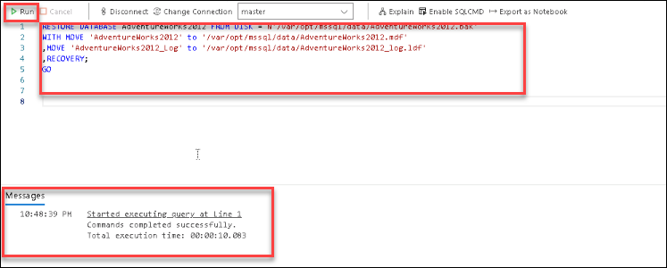

1. Then, right-click on the **arcsql-direct** SQL Managed Instance Server under CONNECTIONS tab on the top left of the Azure Data Studio and click on **Refresh**.

   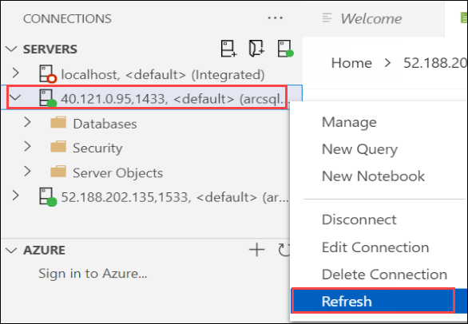

1. Now expand your SQL Managed Instance server if not already by clicking on the arrow icon on the left of the IP Address, then expand Databases and verify that the **AdventureWorks2012** database is listed there.

   

### Task 2: View Azure Arc Arc-enabled SQL managed instance logs in Azure Portal

1. Navigate to [Azure Portal](https://portal.azure.com/#home) and then search for **Log Analytics workspace** in the search bar at the top and then select it.

   

1. In the **Log Analytics workspaces** page, select **LoganalyticsWS-Direct** workspace.
   
    

1. Then, from the left navigation menu under **General** select **Logs** **(1)** and on the Queries tab, click on the ```X``` **(2)** at the top right corner as shown in the below image.

   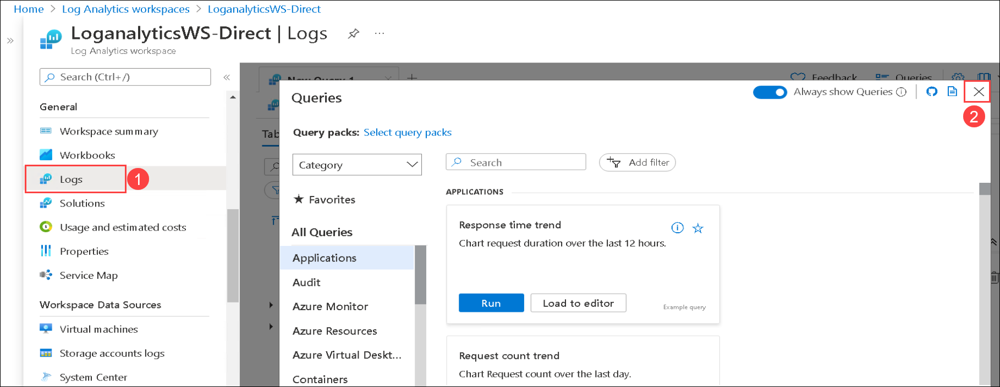
   
1. And then, click on ```>>``` icon to expand the Schema and Filter tab.

    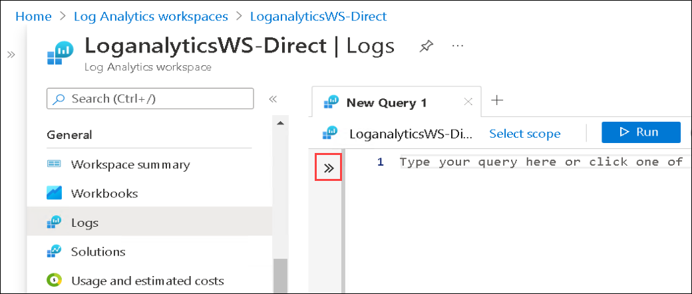

1. Check for CustomLogs under Tables section. If you do not see CustomLogs under Tables, refresh the page every 2 minutes until it is available.
     
    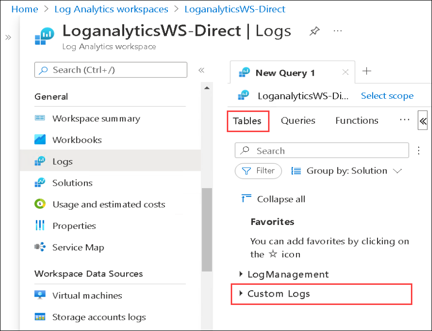

1. Once the Custom logs are available, expand Custom Logs at the bottom of the list of tables and you will see a table called **sqlManagedInstances_agent_logs_CL**.
   
    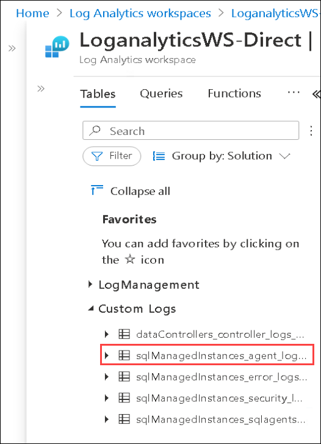

1. Hover the cursor on the table name and select the **Use in editor** button.
   
    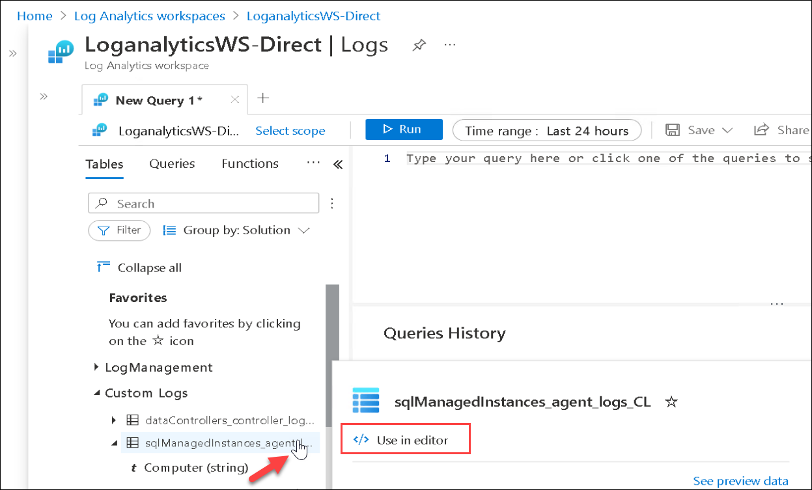

1. Now, you will have a query in the query editor. Run the query that will show the logs by clicking on **Run** **(1)** button and explore the **Results** **(2)**. 
   
    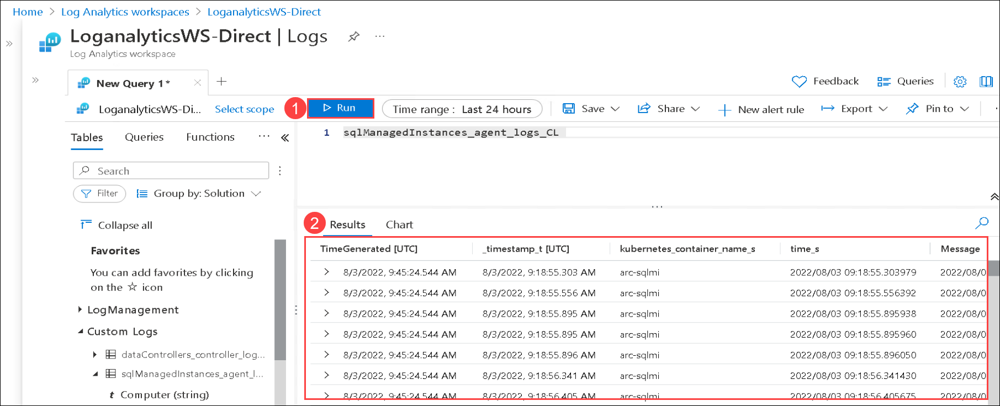

    > Note: You might have to resize the editor, to view the logs from the output window.

### Task 3: Monitor with Azure Data Studio

Now let us Monitor the SQL MI status using Grafana and Kibana.
  
1. Navigate back to **Azure Data Studio** and click on the arrow next to **arcdc-direct** under the Azure Arc controller. Then right-click on the **arcsql-direct** and click on **Manage**.

   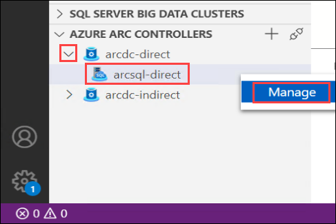
  
1. From the SQL managed instance - Azure Arc Dashboard, copy the **Endpoint** for **Kibana dashboard** and browse this endpoint.

   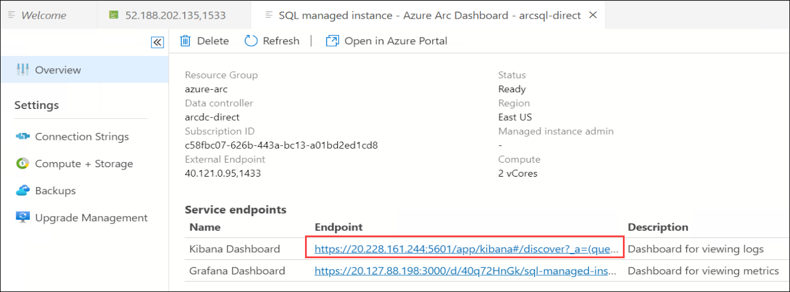

   > **Note**: You may face any error that your connection is not private in the browser. Select **Advanced** and click on **Continue to [ExternalEndpoint]**.

1. Enter the below username and password for SQL Managed Instance.
  
    > **Note** You have to enter the credentials of Azure Arc data controller.
  
    - **User name** : arcuser
      ```BASH
      arcuser
      ```

    - **Password** : Password.1!!
      ```BASH
      Password.1!!
      ```

     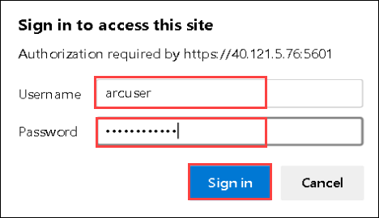
   
   > ***Info***: You can filter the results by searching in the top bar for **arcsql**. That will filter this page to just the logs for the managed SQL Server instance.

1. You can explore the **kibana dashboard**.

   
  
   > ***Info***: You can learn more about Kibana here: [View logs and metrics using Kibana and Grafana](https://docs.microsoft.com/en-us/azure/azure-arc/data/monitor-grafana-kibana)
    
### View the Visualization and metric using Grafana graph
  
1. Navigate back to the **Azure Data Studio** which you had opened earlier.

1. From the SQL managed instance - Azure Arc Dashboard, copy the **Endpoint** for **Grafana dashboard** and browse this endpoint.

   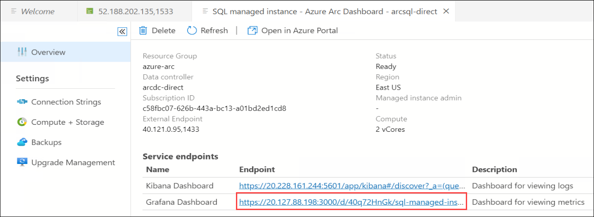

   > **Note**: You may face any error that your connection is not private in the browser. Select **Advanced** and click on **Continue to [ExternalEndpoint]**.

1. Enter below username and password for SQL Managed Instance.
  
    > **Note** You have to enter the credentials of the Azure Arc data controller.
      
    - **User name** : arcuser
      ```BASH
      arcuser
      ```

    - **Password** : Password.1!!
      ```BASH
      Password.1!!
      ```

   
   
1. You can explore the page for Grafana. 
  
   
  
    > ***Info***:  You can learn more about Grafana here: [View logs and metrics using Kibana and Grafana](https://docs.microsoft.com/en-us/azure/azure-arc/data/monitor-grafana-kibana)  
  

### After this exercise, you have performed the following

   - Restored the AdventureWorks database into Azure SQL Managed instance - Azure Arc.
   - View Azure Arc Arc-enabled SQL managed instance logs in Azure portal.
   - Monitored with Kibana and Grafana.
