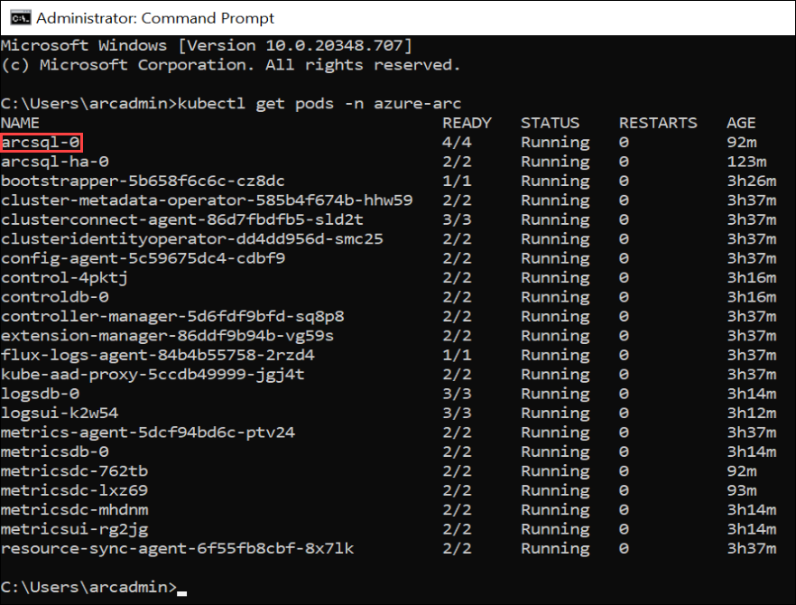
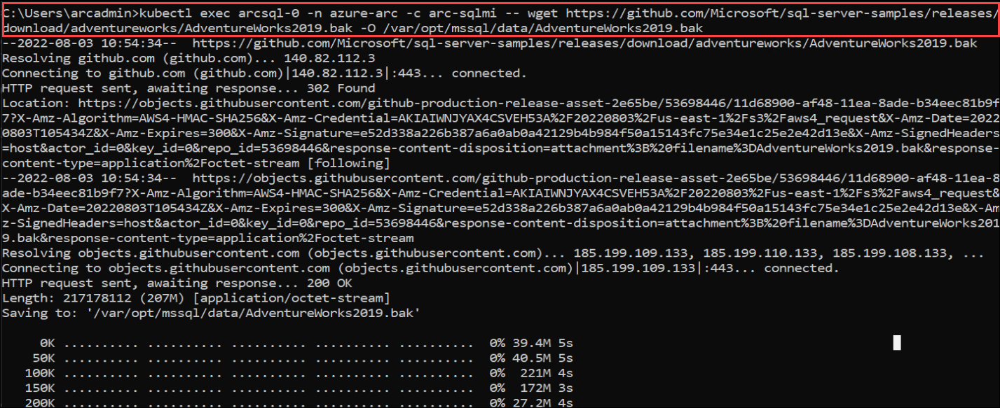
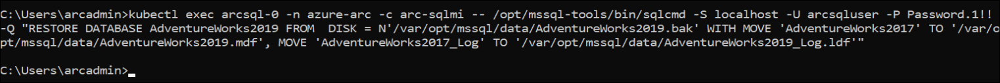
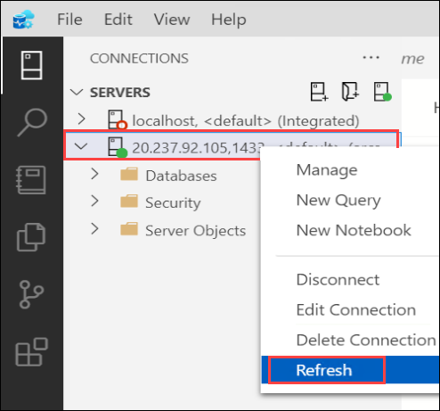
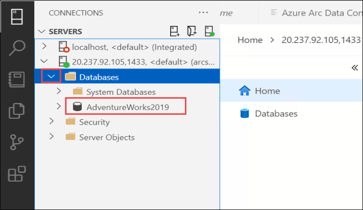

# Exercise 3: Restoring an AdventureWorks database from a backup taken from a SQL Server 2012 instance

Contoso has some applications that use SQL Server as the backend database. They have installed SQL Server on their Windows servers in their manufacturing plants but these locations don’t necessarily have local IT support to update the operating system and SQL Server with the latest security updates. They have explored Azure Database for SQL Server and found that it meets their requirements and offers some unique capabilities such as easy to manage and migrate from different cloud platforms. Therefore they are excited about the opportunity of deploying SQL Server in their Azure Arc enabled environment.

Also, we will be exploring the Kibana and Grafana Dashboards and upload the logs and metrics to the Azure portal and view the logs.

## Task 1: Restore the AdventureWorks sample database into Azure SQL Managed instance - Azure Arc Using Kubectl

Migrating an existing SQL database from a SQL Server to Azure Arc enabled SQL MI is very simple. All you have to do is to take a backup from your existing SQL Server, and then restore that backup to SQL MI.

Now let's restore the sample backup file i.e AdventureWorks backup (.bak) into your Azure SQL Managed instance container using Kubectl commands.

1. Launch a **Command Prompt** window from the desktop of your JumpVM if you have already closed the existing one.

1. In the Command Prompt, run the following command to get the list of pods that are running on your data controller. 

   > **Note**: The namespace name for your data controller will be **azure-arc**.

   ```BASH
   kubectl get pods -n azure-arc
   ```
   
1. From the output of the above command, copy the pod name of the SQL MI instance from the output which will be in following format sqlinstancename-0. If you followed the same naming convention as in the instructions, the pod name will be **arcsql-0**.

   > **Note**: Please copy the Pod Name for the next step.

   
   
1. In the Command Prompt, run the following command after replacing the required values. This will remotely execute a command in the Azure SQL Managed instance container to download the .bak file onto the container.

   >**Note**: The value of the namespace name and pod name is already updated in the below command. Please confirm if the pod name that copied matches the one given below: arcsql-0. 

   ```BASH
   kubectl exec arcsql-0 -n azure-arc -c arc-sqlmi -- wget https://github.com/Microsoft/sql-server-samples/releases/download/adventureworks/AdventureWorks2019.bak -O /var/opt/mssql/data/AdventureWorks2019.bak
   ```

   > ```Info:``` arc-sqlmi in the above command is the name of the container within the SQL Managed Instance Pod arcsql-0   

   

1. Now, to restore the AdventureWorks database, you can run the following command.

   > **Note**: All values including the pod and the namespace name have already been added. You can go through the command and figure out what all are being passed as arguements.

   ```BASH
   kubectl exec arcsql-0 -n azure-arc -c arc-sqlmi -- /opt/mssql-tools/bin/sqlcmd -S localhost -U arcsqluser -P Password.1!! -Q "RESTORE DATABASE AdventureWorks2019 FROM  DISK = N'/var/opt/mssql/data/AdventureWorks2019.bak' WITH MOVE 'AdventureWorks2017' TO '/var/opt/mssql/data/AdventureWorks2019.mdf', MOVE 'AdventureWorks2017_Log' TO '/var/opt/mssql/data/AdventureWorks2019_Log.ldf'"
   ```

   

1. Now you can switch back to Azure Data Studio.

1. Then, right-click on the SQL Managed Instance Server under CONNECTIONS tab on the top left of the Azure Data Studio and click on **Refresh**.

   

1. Now, expand your SQL Managed Instance server if not already by clicking on the arrow icon on the left of the IP Address, then expand Databases and verify that AdventureWorks2019 Database is listed there.

   
