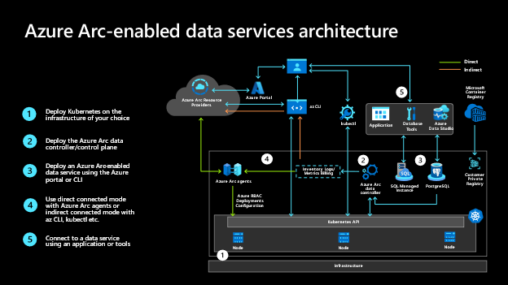

 
# HOL-3: Azure Arc-enabled Data Services

## Overview

## What is Azure Arc?
For customers who want to simplify complex and distributed environments across on-premises, edge, and multi-cloud, [Azure Arc](https://azure.microsoft.com/services/azure-arc/) enables the deployment of Azure services anywhere and extends Azure management to any infrastructure. 
Azure Arc helps you accelerate innovation across hybrid and multi-cloud environments and provides the following benefits to your organization:
   * **Secure and govern your infrastructure and apps anywhere** – Standardize visibility, operations, compliance and manage across a wide range of resources including Windows and Linux, SQL Server, Kubernetes cluster, Azure services. 
      * Perform virtual machine (VM) lifecycle management for your Azure Stack HCI , VMware, and System Center VMM environments from a centralized location. 
      * Meet governance and compliance standards for apps, infrastructure, and data with Azure Policy.
      * Easily enroll in additional Azure services such as Azure Monitor, Microsoft Defender for Cloud, and updates.
      * Learn more about hybrid and multicloud management in the [Microsoft Cloud Adoption Framework for Azure](https://aka.ms/adopt/hybrid).
   * **Build cloud-native apps anywhere, at scale** – Centrally code and deploy applications confidently to any Kubernetes distribution in any location. 
      * Bring DevOps practices anywhere and build iteratively.
      * Get up and running immediately with your existing tools and practices including GitHub, Terraform, and Visual Studio.
      * Reduce errors with consistent policy-driven app deployment and cluster operations at scale from source control and templates.
      * Write to the same application service APIs that can run consistently on premises, across multiple clouds, and in edge environments using Kubernetes.
      * Save time and reduce admin tasks by using purpose-built Azure application and data services in your architecture.
   * **Run Azure data and machine learning services anywhere** – Flexibly use cloud innovation where you need it by deploying Azure services anywhere. Implement cloud practices and automation to deploy faster, consistently, and at scale with always-up-to-date Azure Arc-enabled services.
      * Deploy Azure Arc–enabled Azure SQL and PostgreSQL (in preview) on any Kubernetes distribution and on any cloud. 
      * Work faster with Azure turnkey application services such as Web Apps, Functions, and Logic Apps across clouds, datacenters, and at the edge.
      * Get started in minutes with one-click deployment of the managed machine learning add-on, and train models on any Kubernetes cluster with Azure Machine Learning.
      * Take advantage of elastic scale, consistent on-premises and multicloud management, and cloud-style billing models.
   

### How Azure Arc-enabled Data Services add value?

Azure Arc enables you to bring Azure data services to any infrastructure across on-premises data centers, edge, and 3rd party clouds, using Kubernetes on hardware of your choice. For customers who need to maintain data estate on-premises, you will gain unique benefits for those on-premises data workloads.

**First**, you will always be current, meaning updates and upgrades are fully automated, and the deployment is controlled by your policy. You will gain unique and cloud proven innovation ahead of any other hybrid cloud offering like the evergreen SQL with no end-of-support through Azure SQL Database, and the deployment option of Azure Database for PostgreSQL.

**Second**, we will bring cloud elasticity on-premises so you can optimize the performance of data workloads with the ability to dynamically scale up/down and scale out, without application downtime.

Moreover, by connecting to Azure you will gain unified management. Imagine being able to see your data services running on-premises alongside those running in Azure through a single pane of glass, using familiar tools like Azure Portal, Azure Data Studio and Azure CLI.

**Last** but not the least, you can get those benefits even if your environment does not have a direct connection to Azure either due to network and security policies, or connection constraints, as long as you can set up a media to indirectly connect to Azure for telemetry data exchange and getting the latest container images. However, when you operate under an indirectly connected mode, you will not be able to fully leverage the unified management benefits such as using Azure Monitor, Azure Role Based Access Control(RBAC), and other value-added services from Azure.

## What are Azure Arc-enabled data services?

Azure Arc makes it possible to run Azure data services on-premises, at the edge, and in public clouds using Kubernetes and the infrastructure of your choice.

  Currently, the following Azure Arc-enabled data services are available:

   * Azure SQL Managed Instance
   * PostgreSQL (preview)
    
In this Hands-on lab, we will be talking about only **Azure Arc-enabled SQL Managed Instance** and below are the few services and features of Azure Arc-enabled SQL Managed Instance.

   * **High Availability with Azure Arc-enabled SQL Managed Instance**:- In the Business Critical service tier, in addition to what is natively provided by Kubernetes orchestration, Azure SQL Managed Instance for Azure Arc provides a contained availability group. The contained availability group is built on SQL Server Always On technology. It provides higher levels of availability. Azure Arc-enabled SQL managed instance deployed with Business Critical service tier can be deployed with either 2 or 3 replicas. These replicas are always kept in sync with each other. With contained availability groups, any pod crashes or node failures are transparent to the application as there is at least one other pod that has the instance that has all the data from the primary and is ready to take on connections. [Read More about high Availability with Azure Arc-enabled SQL Managed Instance](https://docs.microsoft.com/en-us/azure/azure-arc/data/managed-instance-high-availability)
    
   * **Transparent data encryption**:- TDE does real-time I/O encryption and decryption of data and log files. The encryption uses a database encryption key (DEK). The database boot record stores the key for availability during recovery. The DEK is a symmetric key. It's secured by a certificate that the server's master database stores or by an asymmetric key that an EKM module protects.
    
        TDE protects data at rest, which is the data and log files. It lets you follow many laws, regulations, and guidelines established in various industries. This ability lets software developers encrypt data by using AES and 3DES encryption algorithms without changing existing applications. [Read More about the Azure Arc-enabled SQL MI Transparent data encryption](https://docs.microsoft.com/en-us/azure/azure-arc/data/configure-transparent-data-encryption-manually?tabs=windows)

   * **Point in time restore**:- Use the point-in-time restore (PITR) to create a database as a copy of another database from some time in the past that is within the retention period. This article describes how to do a point-in-time restore of a database in Azure Arc-enabled SQL managed instance. 

      - Point-in-time restore can restore a database:
        * From an existing database
        * To a new database on the same Azure Arc-enabled SQL managed instance      
   [Read More about the Azure Arc-enabled SQL MI - Point in time restore here](https://docs.microsoft.com/en-us/azure/azure-arc/data/point-in-time-restore)
             
   * **Disaster recovery**:- Configure disaster recovery by setting up another Azure Arc-enabled SQL Managed Instance in a geographically separate data center to synchronize data from the primary data center. This scenario is useful for recovering from events when an entire data center is down due to disruptions such as power outages or other events. [Read More about the Azure Arc-enabled SQL MI - Disaster recovery](https://docs.microsoft.com/en-us/azure/azure-arc/data/point-in-time-restore)
        

## Hands-on Labs Scenario

The following labs provide you a quick and easy way to get started with Azure Arc through virtual environments. 

For the purposes of these exercises, let us consider Contoso is a large manufacturing company. 

Their IT systems run Windows, Linux, Kubernetes, SQL Servers, Oracle and PostgreSQL across multiple locations, including on-premises data centers, manufacturing plans, distribution centers, and multiple public clouds. This poses operational challenges for Contoso. They would like a consistent way to govern and operate across these disparate environments, ensure security across the entire organization, and enable innovation and developer agility (especially with their investments in cloud-native practices), all while meeting regulatory and compliance requirements and being able to leverage the latest innovations of database technologies.

## Lab Objective

Contoso wants to migrate and modernize their databases. They have already migrated some of their Oracle databases to PostgreSQL and they have upgraded some of their SQL Servers to the latest version. Additionally, they would like to reduce the management overhead and stay always current with the evergreen versions of SQL. They would also like to get the benefits of the data services in Azure such as elastic scale and cloud billing without moving their databases to the cloud.

Let’s take the journey together with Contoso and see how easy it is to accomplish all the above with Azure Arc-enabled data services. 

In this lab, you will leverage the existing Kubernetes cluster to deploy the Azure Arc data controller with two different modes (Indirectly connect and Directly connected), Azure Arc-enabled SQL Managed Instance business critical.

