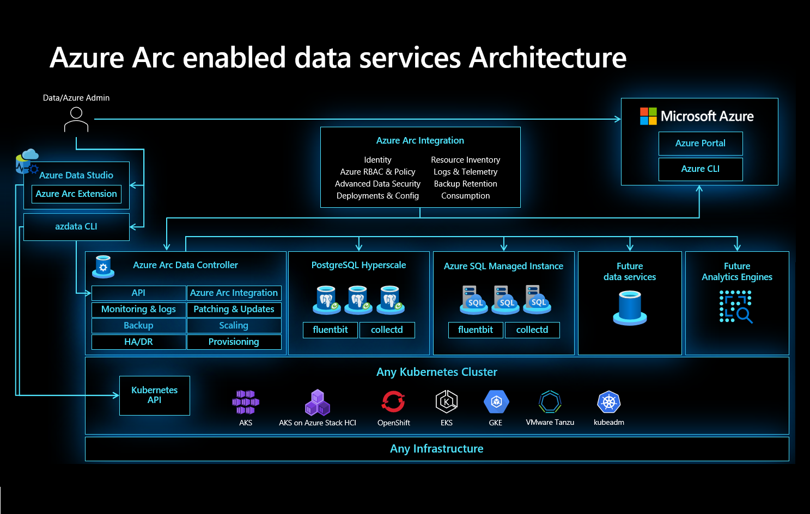

 
# Lab 2: Azure Arc Enabled Data Services

## Overview

## What is Azure Arc?
For customers who want to simplify complex and distributed environments across on-premises, edge, and multi-cloud, [Azure Arc](https://azure.microsoft.com/services/azure-arc/) enables deployment of Azure services anywhere and extends Azure management to any infrastructure. 
Azure Arc helps you accelerate innovation across hybrid and multi-cloud environments and provides the following benefits to your organization:
   * **Gain central visibility, operations, and compliance** – Standardize visibility, operations, and compliance across a wide range of resources and locations by extending the Azure control plane. Right from Azure, you can easily organize, govern, and secure Windows, Linux, SQL Servers and Kubernetes clusters across datacenters, edge, and multi-cloud.
   * **Build Cloud native apps anywhere, at scale** – Centrally code and deploy applications confidently to any Kubernetes distribution in any location. Accelerate development by using best in class applications services with standardized deployment, configuration, security, and observability.
   * **Run Azure data services anywhere** – Flexibly use cloud innovation where you need it by deploying Azure services anywhere. Implement cloud practices and automation to deploy faster, consistently, and at scale with always-up-to-date Azure Arc enabled services.
   

### How Azure Arc Enabled Data Services add value?

Azure Arc enables you to bring Azure data services to any infrastructure across on-premises data centers, edge and 3rd party clouds, using Kubernetes on hardware of your choice. For customers who need to maintain data estate onpremises, you will gain unique benefits for those on-premises data workloads.

**First**, you will always be current, meaning updates and upgrades are fully automated, and the deployment is controlled by your policy. You will gain unique and cloud proven innovation ahead of any other hybrid cloud offering like the evergreen SQL with no end-of-support through Azure SQL Database.

**Second**, we will bring cloud elasticity on-premises so you can optimize performance of data workloads with the ability to dynamically scale up/down and scale out, without application downtime.

Moreover, by connecting to Azure you will gain unified management. Imagine being able to see your data services running on-premises along side those running in Azure through a single pane of glass, using familiar tools like Azure Portal, Azure Data Studio and Azure CLI.

## Hands-on Labs Scenario

The following labs provide you a quick and easy way to get started with Azure Arc through virtual environments that do not require any complex set-up or installations. 

For the purposes of these exercises, let’s consider Contoso is a large manufacturing company. 

Their IT systems run Windows, Linux, Kubernetes, SQL Servers, Oracle and PostgreSQL across multiple locations, including on-premises data centers, manufacturing plans, distribution centers, and multiple public clouds. This poses operational challenges for Contoso. They’d like a consistent way to govern and operate across these disparate environments, ensure security across the entire organization, and enable innovation and developer agility (especially with their investments in cloud-native practices), all while meeting regulatory and compliance requirements and being able to leverage the latest innovations of database technologies.

## Lab Context

Contoso wants to migrate and modernize their databases. They have upgraded some of their SQL Servers to the latest version. Additionally, they would like to reduce the management overhead and stay always current with the evergreen versions of SQL. They would also like to get the benefits of the data services in Azure such as elastic scale and cloud billing without moving their databases to the cloud.

Let’s take the journey together with Contoso and see how easy it is accomplish all the above with Azure Arc enabled data services. 

In this lab, you will leverage the existing Kubernetes cluster to deploy the Azure Arc data controller and Azure Arc enabled SQL Managed Instance.
