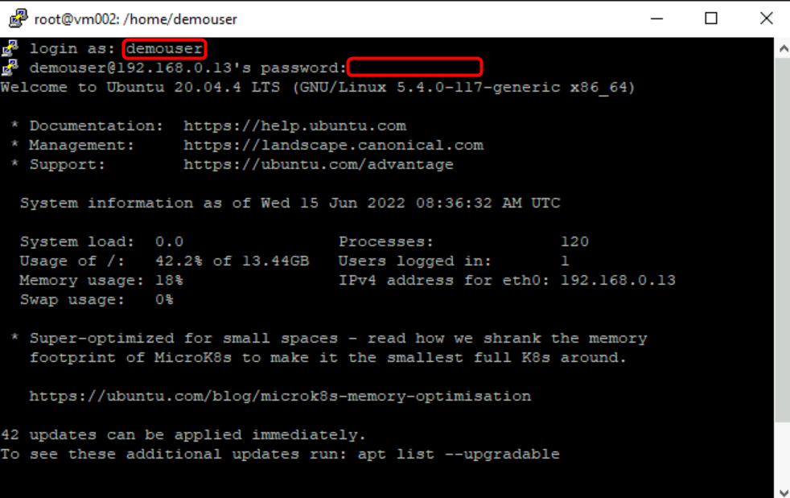
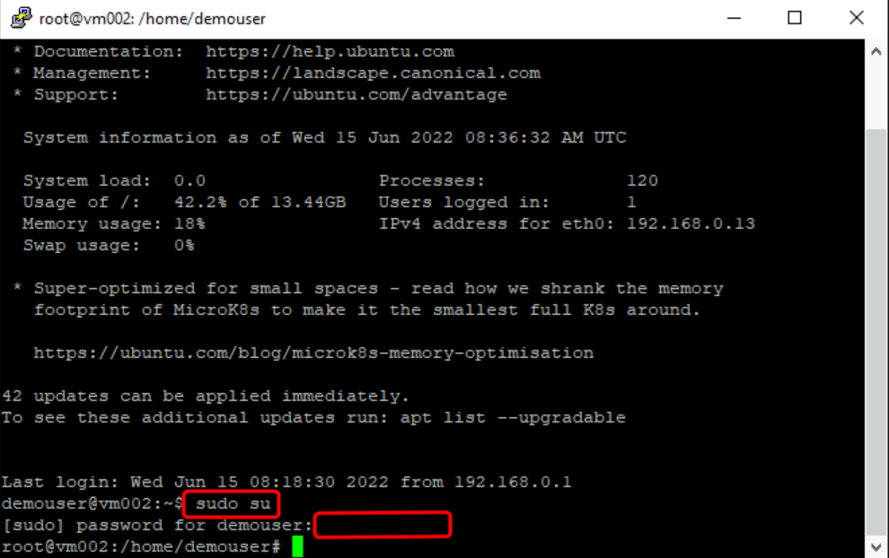

# HOL-4: Exercise 5: Explore Azure Arc integration

## Overview

Now that you have create a Kubernetes cluster and a Virtual Machine in your Azure Stack HCI, you can now explore Azure Arc and other Azure services.

Contents
-----------
- [Overview](#overview)
- [Contents](#contents)
- [Arc-enable the VM you just created](#task-1-arc-enable-the-vm-you-just-created)
- [SSH access to Azure Arc-enabled servers](#task-2-ssh-access-to-azure-arc-enabled-servers)

Task 1: Arc-enable the VM you just created
----
In this step, you will Azure Arc-enable your Ubuntu Server 20.04 virtual machine your created in the previous exercise.

### Arc-enable your Ubuntu Server 20.04 Virtual Machine ###
1. From the start menu of the Hybridhost001, search for **CMD** and open it with double click or other way.

    
    
1. In the Putty Configuration tool, enter the **VM002** VM private IP - ```192.168.0.12``` (remember your assigned ip address!), make sure the Port value is ```22```. Once you entered the private IP of the **VM002** vm, click on the Open to lunch the terminal.
    
1. Enter the **VM002** vm username - ```demouser``` in **login as** and then hit **Enter**. 

   ```
   demouser
   ```

    

1. Now, enter the password - ```demo!pass123``` and press **Enter**. Remember password will be hidden and will not be visible in terminal.

   ```
   demo!pass123
   ```

    
    
    > Note: To paste any value in Putty terminal, just copy the values from anywhere and then right click on the terminal to paste the copied value.

1. Login with Sudo. Run the following command and provide the Password `demo!pass123`.

   ```
   sudo su
   ```
   
   ```
   demo!pass123
   ```
    

1. Install the lastest Azure CLI. Run the following command ```curl -sL https://aka.ms/InstallAzureCLIDeb | sudo bash``` and run ```az version``` to confirm the Azure Cli is working properly.

    ```
    curl -sL https://aka.ms/InstallAzureCLIDeb | sudo bash
    ```
     ```Add screenshot```
    ```
    az version
    ```
    ```Add screenshot```

1. Download the script which will download and install the lastest Azure Connected Machine Agent. Run the following command ```wget https://aka.ms/azcmagent -O ~/install_linux_azcmagent.sh```.
    ```
    wget https://aka.ms/azcmagent -O ~/install_linux_azcmagent.sh
    ```
     ```Add screenshot```

1. Since we are running this Lab on azure in a virtually nested environment we need to change the downloaded script. Run ```apt install nano```. Run ```nano /root/install_linux_azcmagent.sh``` and type **CTRL+_** (underscore). Go to Line **251** and change the ip address to ```169.254.169.250```. Type **CTRL+X** then **Y** and **ENTER** to save the file.
    ```
    apt install nano
    ```
    ```
    nano /root/install_linux_azcmagent.sh
    ```
      ```Add screenshot```   

1. Run the script which will download and install the lastest Azure Connected Machine Agent you just downloaded. Run the following command ```bash ~/install_linux_azcmagent.sh``` to install the Azure Connected Machine Agent on VM002.
    
    ```
    bash ~/install_linux_azcmagent.sh
    ```
     ```Add screenshot```        

1. Now Arc-enable vm002. Run the the following command ```sudo azcmagent connect --resource-group "ResourceGroup" --tenant-id "TenantID" --location "eastus" --subscription-id "SubscriptionID" --cloud "AzureCloud"```, where the resource group is ```HybridHost```. Check the Lab Environment details for the right TenantID and SubscriptionID.
    ```
    sudo azcmagent connect --resource-group "HybridHost" --tenant-id "********-****-****-****-************" --location "eastus" --subscription-id "********-****-****-****-****-************" --cloud "AzureCloud
    ```
    > Note: We are not using a Service Principal to Arc-enable vm002, so we will be prompted for a devicelogin verification. Open an extra browser tab on the HybridHost001 and open ```https://aka.ms/devicelogin``` and type the given code. Sign in with your Lab Environment Azure credentials.

     ```Add screenshot```

1. Check if vm002 is properly Azure Arc-enabled properly. Run the the following command ```azcmagent show```. You show see an Agent Status of Connected.    
    ```
    azcmagent show
    ```
     ```Add screenshot```  

Task 2: SSH access to Azure Arc-enabled servers
----
In this step, you will setup an SSH connection to an Azure Arc-enabled virtual machine without direct connectivity enabled. Normally you should still have an active Putty (SSH) session to vm002, if not go back to the previous Task and redo step 1-5.

### Enable functionality on your Arc-enabled server ###
1. Run command ```azcmagent config list```. You will normally see that the parameter **incomingconnections.ports** is empty **[]**. Now run the following command ```azcmagent config set incomingconnections.ports 22``` to add access to SSH connections.

   ```
   azcmagent config list
   ```
   ```
   azcmagent config set incomingconnections.ports 22
   ```
    ```Add screenshot```


### Enable functionality in your Azure environment ###
 > **Note:** We are using the Putty session to configure the Azure part of this Task, but you could also do this from an Azure CloudShell, ...

1. Run command ```az login``` and sign in with your Lab Environment Azure credentials. Once connected run the command ```az account set --subscription "MySubscriptionID"``` and replace "MySubscriptionID" with the Lab Environment SubscriptionID.

   ```
   az login
   ```
   ```
   az account set --subscription "********-****-****-****-****-************"
   ```
    ```Add screenshot```

1. Register the **Microsoft.HybridConnectivity Resource Provider** on the Subscription we just selected. Do do so run the following command ```az provider register -n Microsoft.HybridConnectivity```. Run ```az provider show -n Microsoft.HybridConnectivity``` until the **registrationState** becomes **Registered**.

   ```
   az provider register -n Microsoft.HybridConnectivity
   ```
   ```
   az provider show -n Microsoft.HybridConnectivity
   ```   

    ```Add screenshot```  

    > Note: This operation can take 2-5 minutes to complete.

1.  Run the following command ``` az rest --method put --uri https://management.azure.com/subscriptions/SUBSCRIPTIONID/resourceGroups/RESOURCEGROUPNAME/providers/Microsoft.HybridCompute/machines/VMNAME/providers/Microsoft.HybridConnectivity/endpoints/default?api-version=2021-10-06-preview --body '{"properties": {"type": "default"}}'```. Make sure to replace the variables SUBSCRIPTIONID, RESOURCEGROUPNAME and VMNAME with your Lab specific settings.

    ```
    az rest --method put --uri https://management.azure.com/subscriptions/********-****-****-****-****-************/resourceGroups/HybridHost/providers/Microsoft.HybridCompute/machines/vm002/providers/Microsoft.HybridConnectivity/endpoints/default?api-version=2021-10-06-preview --body '{"properties": {"type": "default"}}'
    ```

    ```Add screenshot```


### SSH into Azure Arc Servers ###
1. Browse to the Azure Portal by using the dedicated Edge Icon named Azure Portal which you can find on the desktop of the HybridHost001. Open an Azure Cloud Shell based on PowerShell. It will ask to create storage, just click **Create Storage**. After 1 minute you should have an active PowerShell session. Normally for tthe next step to work the Azure cli SSh extension needs to be installed, which is autmatically the case when using an Azure Cloud Shell.

1. SSH into Azure Arc Servers. Users can login using AAD issued certificates or using local user credentials. Here we will leverage the local user credentials. Run ```az ssh arc --resource-group hybridhost --vm-name vm002 --local-user demouser``` to establisg a SSH session into vm002.

   ```
   az ssh arc --resource-group hybridhost --vm-name vm002 --local-user demouser
   ```

    ```Add screenshot```    

