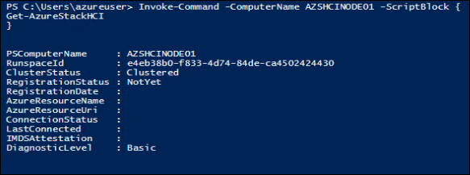
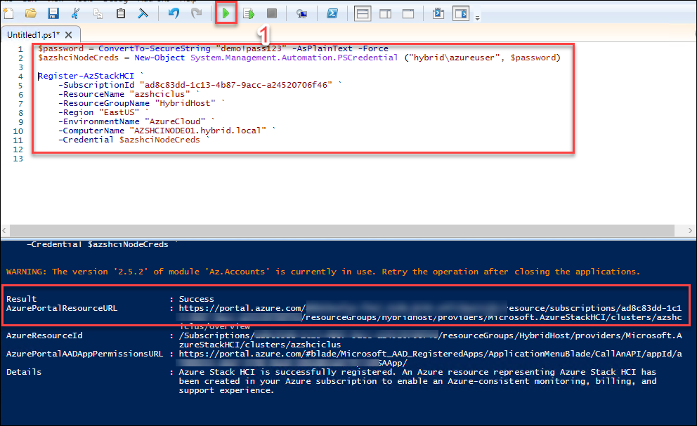
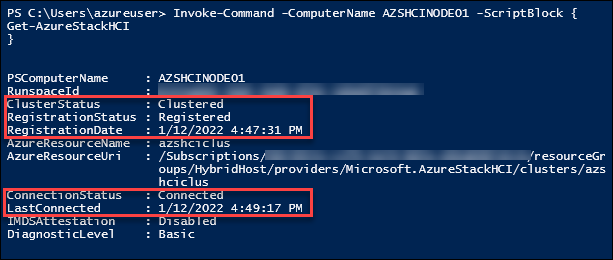
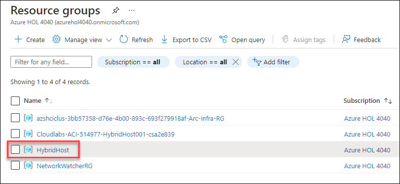
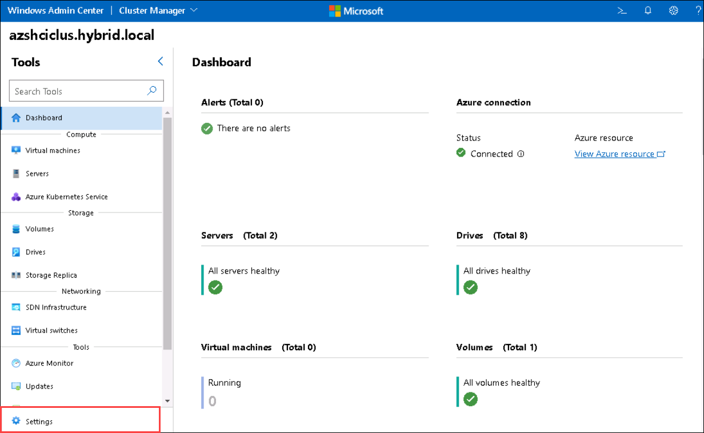
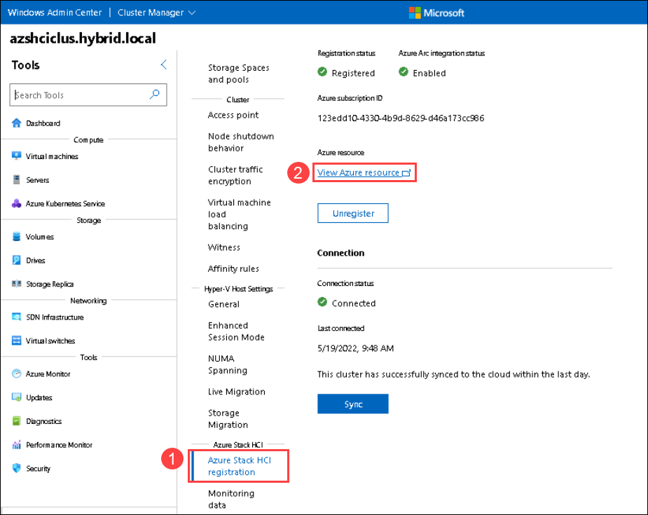

HOL-4: Exercise 1: Integrate Azure Stack HCI 20H2 with Azure
==============
Overview
-----------

As part of the lab environment, we have already deployed the Azure Stack HCI 20H2 Cluster, so you don't have to deploy it and you can continue registering the already deployed cluster to unlock full functionality.

Contents
-----------
- [Overview](#overview)
- [Contents](#contents)
- [Complete Registration](#complete-registration)


Azure Stack HCI 20H2 is delivered as an Azure service and needs to register within 30 days of installation per the Azure Online Services Terms.  With our cluster configured, we'll now register your Azure Stack HCI 20H2 cluster with **Azure Arc** for monitoring, support, billing, and hybrid services. Upon registration, an Azure Resource Manager resource is created to represent each on-premises Azure Stack HCI 20H2 cluster, effectively extending the Azure management plane to Azure Stack HCI 20H2. Information is periodically synced between the Azure resource and the on-premises cluster.  One great aspect of Azure Stack HCI 20H2, is that the Azure Arc registration is a native capability of Azure Stack HCI 20H2, so there is no agent required.


## Task 1: Register Azure Stack HCI 20H2 Cluster on Azure portal.

   To complete registration, you have 2 options - you can use **Windows Admin Center**, or you can use **PowerShell**. For this lab, it's recommended to use the PowerShell as it is less likely that you will encounter unpredictible erros in the lab environment, due to WAC installed on the domain controller. In this environment, we will be using PowerShell to register to the Azure Stack HCI cluster.

 We're going to perform the registration from the **HybridHost001** machine, which we've been using with the Windows Admin Center.

1. After logging in to the **HybridHost001** VM, click on the windows button and search for **PowerShell ISE** then right-click on it to select **Run as administrator**.

    
    
2. With the Az.StackHCI modules installed, it's now time to register your Azure Stack HCI 20H2 cluster to Azure. However, first it's worth exploring how to check the existing registration status. The following code assumes you are still in the remote PowerShell session open from the previous commands.

     ```powershell
     Invoke-Command -ComputerName AZSHCINODE01 -ScriptBlock {
     Get-AzureStackHCI
     } 
     ```
     >Note: If you see the cluster registration status is showing as **Out of Policy**, you can ignore that as there will be no issue during the lab because of this. 
     
    

As you can see from the result, the cluster is yet to be registered, and the cluster status identifies as **Clustered**. Azure Stack HCI 20H2 needs to register within 30 days of installation as per the Azure Online Services Terms. If it is not clustered within 30 days, the **ClusterStatus** will show **OutOfPolicy**, and if not registered within 30 days, the **RegistrationStatus** will show as **OutOfPolicy**.


3. Now copy the below code and paste it in your PowerShell window, replace ``*your-subscription-ID-here*`` with your subscription ID <inject key="Subscription ID" />. After updating the subscription ID, run the PowerShell commands to register your Azure Stack HCI 20H2 to Azure portal. 

   > **Note**: We have already updated the domain user name and password for the local host server. 
   
    ```powershell
     $password = ConvertTo-SecureString "demo!pass123" -AsPlainText -Force
     $azshciNodeCreds = New-Object System.Management.Automation.PSCredential ("hybrid\azureuser", $password)

     Register-AzStackHCI `
    -SubscriptionId *your-subscription-ID-here* `
    -ResourceName "azshciclus" `
    -ResourceGroupName "HybridHost" `
    -Region "EastUS" `
    -EnvironmentName "AzureCloud" `
    -ComputerName "AZSHCINODE01.hybrid.local" `
    –Credential $azshciNodeCreds 
     
     ```

Many of these commands are optional:

* **-ResourceName** - If not declared, the Azure Stack HCI 20H2 cluster name is used
* **-ResourceGroupName** - If not declared, the Azure Stack HCI 20H2 cluster plus the suffix "-rg" is used
* **-Region** - If not declared, "EastUS" will be used.  Additional regions are supported, with the longer term goal to integrate with Azure Arc in all Azure regions.
* **-EnvironmentName** - If not declared, "AzureCloud" will be used, but allowed values will include additional environments in the future
* **-ComputerName** - This is used when running the commands remotely against a cluster.  Just make sure you're using a domain account that has admin privilege on the nodes and cluster
* **-Credential** - This is also used for running the commands remotely against a cluster.

**Register-AzureStackHCI** runs synchronously, with progress reporting, and typically takes 5-10 minutes.  The first time you run it, it may take slightly longer, because it needs to install some dependencies, including additional Azure PowerShell modules.

4. Once dependencies have been installed, you'll receive a popup on **HybridHost001** to authenticate to Azure. Provide your **Azure credentials**, which are declared in the Environment Details page.

    

5. Once successfully authenticated, the registration process will begin and will take some time to finish. Once completed, you should see a message indicating success, as per below:

    

6. Once the cluster is registered, run the following command on **HybridHost001** to check the updated status:

    ```powershell
    Invoke-Command -ComputerName AZSHCINODE01 -ScriptBlock {
    Get-AzureStackHCI
    }
    ```
    

You can see the **ConnectionStatus** and **LastConnected** time, which is usually within the last day unless the cluster is temporarily disconnected from the Internet. An Azure Stack HCI 20H2 cluster can operate fully offline for up to 30 consecutive days.

## Task 2: View registration details in the Azure portal ###

Once the registration is complete, you should take some time to explore the artifacts that are created in Azure.

1. In the virtual machine (VM) on the left, click on the Azure portal desktop icon as shown below.

    
    
1. On the **Sign in to Microsoft Azure** window, you will see the login screen, enter the following username and click on **Next**.

   * Email/Username: <inject key="AzureAdUserEmail"></inject>

   

1. Now enter the following password and click on **Sign in**. 

   * Password: <inject key="AzureAdUserPassword"></inject>
   
   

1. First time users are often prompted to **Stay Signed In**, if you see any such message, click on **No**

   

1. If you see the pop-up **You have free Azure Advisor recommendations!**, close the window to continue the lab.

1. If a **Welcome to Microsoft Azure** popup window appears, click **Maybe Later** to skip the tour.

1. You should see a new **Resource group** listed, with the name you specified earlier, which in our case, is **HybridHost** and click on it.

    

1. Under **HybridHost** resource group page, you'll see a resource **Azure Stack HCI** with the name **azshciclus** has been created.

    
    
   >**Note**: If you are not able to view the **Azure Stack HCI** resource with the name **azshciclus**. Please follow from step 9 - step 12 else skip to step 13.

1. In the virtual machine (VM) on the left, double-click on the **Windows Admin Center** .

    
    
1. On Windows Admin Center page, Select the **azshciclus.hybrid.local** cluster to open it.

    
    
1. Select **Settings** from the Tools side blade.

    
    
1. Select **Azure Stack HCI registration** under Azure Stack HCI and click on **View Azure resource**.

    

1. Click on the **azihciclus**, then you'll be taken to the new Azure Stack HCI Resource Provider, which shows information about all of your clusters, including details on the currently selected cluster.

    


### Congratulations! ###
You've now successfully registered your Azure Stack HCI 20H2 cluster!

Summary
-----------
In this exercise, you've successfully registered your Azure Stack HCI 20H2 cluster. With this completed, you can now move on to the next exercise.

Product improvements
-----------
If, while you work through this guide, you have an idea to make the product better, whether it's something in Azure Stack HCI, AKS on Azure Stack HCI, Windows Admin Center, or the Azure Arc integration and experience, let us know! We want to hear from you!

For **Azure Stack HCI**, [Head on over to the Azure Stack HCI 20H2 Q&A forum](https://docs.microsoft.com/en-us/answers/topics/azure-stack-hci.html "Azure Stack HCI 20H2 Q&A"), where you can share your thoughts and ideas about making the technologies better and raise an issue if you're having trouble with the technology.

For **AKS on Azure Stack HCI**, [Head on over to our AKS on Azure Stack HCI 20H2 GitHub page](https://github.com/Azure/aks-hci/issues "AKS on Azure Stack HCI GitHub"), where you can share your thoughts and ideas about making the technologies better. If however, you have an issue that you'd like some help with, read on... 
