HOL-4: Exercise 4: Arc-enable existing Azure Stack HCI Virtual Machines
==============
Overview
-----------
You used have deployed some virtual machines on the Azure Stack HCI Cluster leveraging the Windows Admin Center, it is now time to Arc-enable those assets and look at the Azure Arc-enabled Server capabilities.

Contents
-----------
- [HOL-4: Exercise 4: Arc-enable existing Azure Stack HCI Virtual Machines](#hol-4-exercise-4-arc-enable-existing-azure-stack-hci-virtual-machines)
  - [Overview](#overview)
  - [Contents](#contents)
  - [Task 1: Prepare your Azure environment before onboarding your Azure Arc-enabled Virtual Machine.](#task-1-prepare-your-azure-environment-before-onboarding-your-azure-arc-enabled-virtual-machine)
    - [Create a Resource Group](#create-a-resource-group)
    - [Add a Policy to the newly created Resource Group](#add-a-policy-to-the-newly-created-resource-group)
  - [Task 2: Azure Arc-enable VM002 - Ubuntu Linux 22.04](#task-2-azure-arc-enable-vm002---ubuntu-linux-2204)
    - [Prepare the step in Azure to onboard VM002 as an Azure Arc-enabled Virtual Machine](#prepare-the-step-in-azure-to-onboard-vm002-as-an-azure-arc-enabled-virtual-machine)
    - [Azure Arc-enable VM002](#azure-arc-enable-vm002)
  - [Task 4: Deploy an Ubuntu Server 22.04 virtual machine](#task-4-deploy-an-ubuntu-server-2204-virtual-machine)
  - [Task 5: Live migrate a virtual machine to another node](#task-5-live-migrate-a-virtual-machine-to-another-node)
  - [Summary](#summary)
  - [Product improvements](#product-improvements)
  - [Raising issues](#raising-issues)

Task 1: Prepare your Azure environment before onboarding your Azure Arc-enabled Virtual Machine.
-----------
In this step, you will create a new Azure Resource Group and assign an extra Azure Policy to this Resource Group

### Create a Resource Group ###

1. In the "Search resources, services, and docs" search box at the top of the Azure Portal page, type **Resource Group** and click **Resource Group** under Services.

    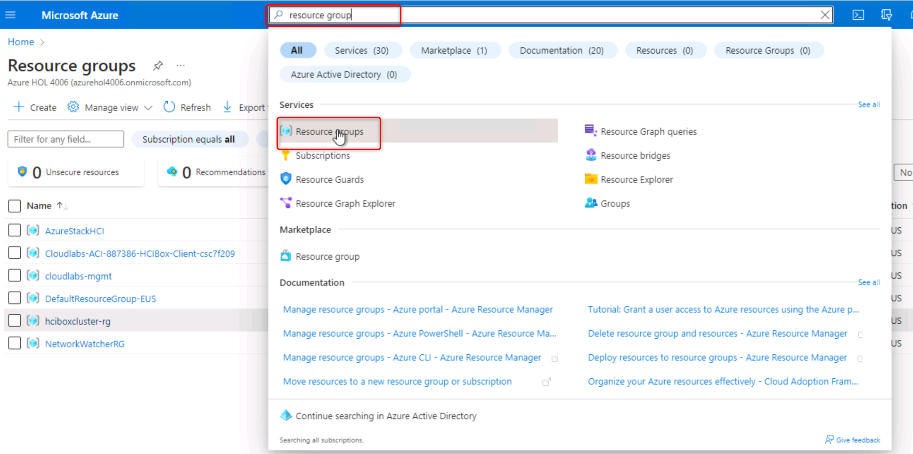
    
2. On the **Resource Group** page, click **+ Create**.

    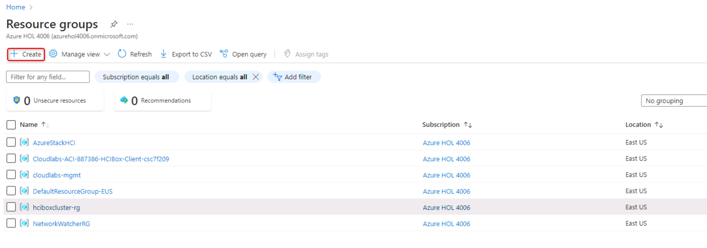

3. On the **Create a resource group** page, type **ArcServers-rg** in the **Resource Group** field. Click **Review + create**. On the next screen click **Create**, to create the new Resource Group.

    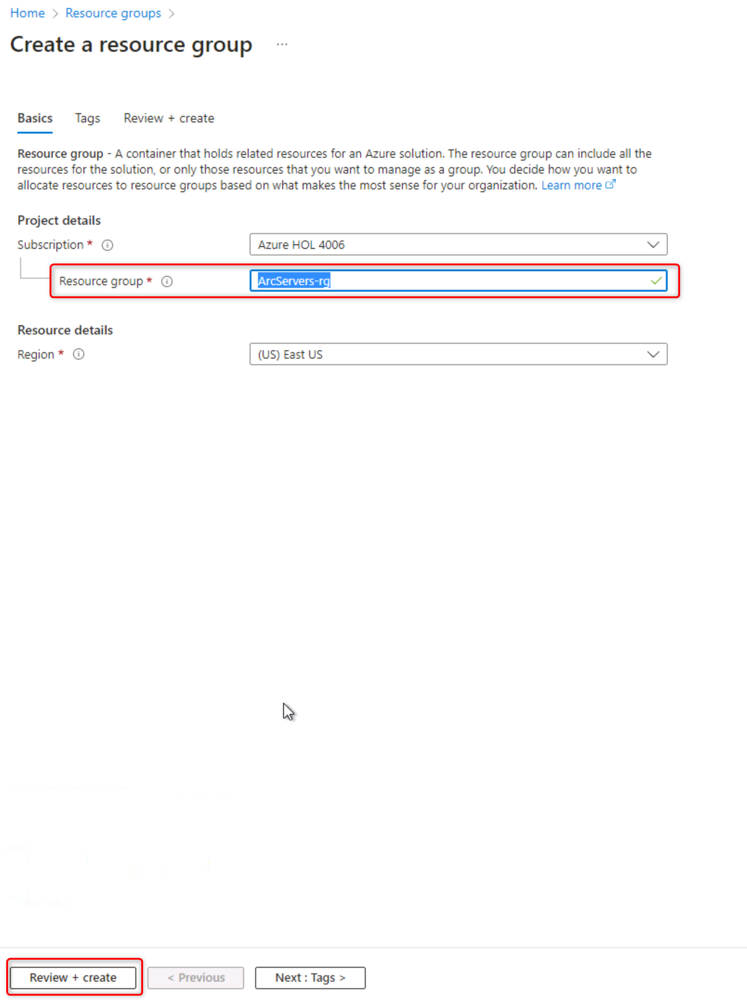

### Add a Policy to the newly created Resource Group ###

1. On the **Resource Group** page, click on the resource group **ArcServers-rg**.

    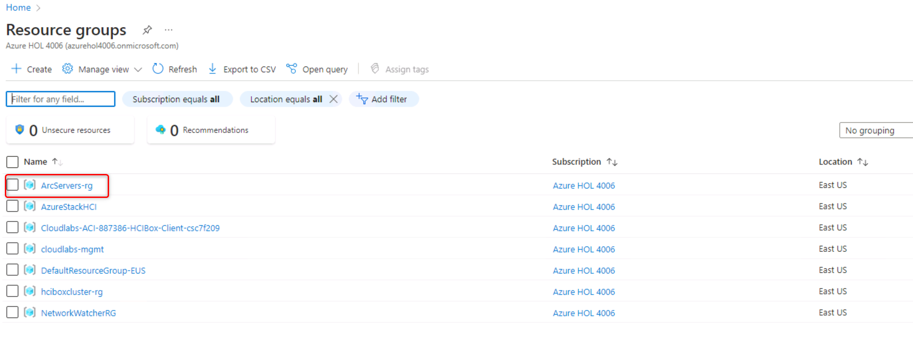
    
2. On the **ArcServers-rg** page, under **Settings**, click **Policies**.

    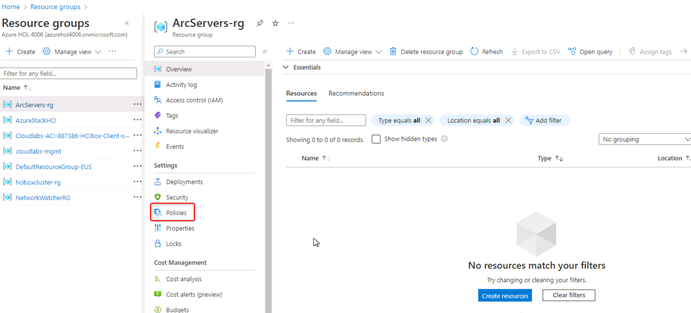

3. On the **Policy | Compliance** page, click **Assign Policy**.

    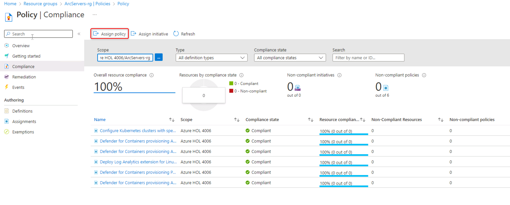

4. On the **Assign policy** page, click on the 3 dots on right of the **Policy definition** field. On the **Available Definitions** page, type in search field **Configure periodic checking for missing system updates on azure Arc-enabled servers**. select the policy found below under the Policy Name, **[Preview]: Configure periodic checking for missing system updates on azure Arc-enabled servers**. Click **Add**.

    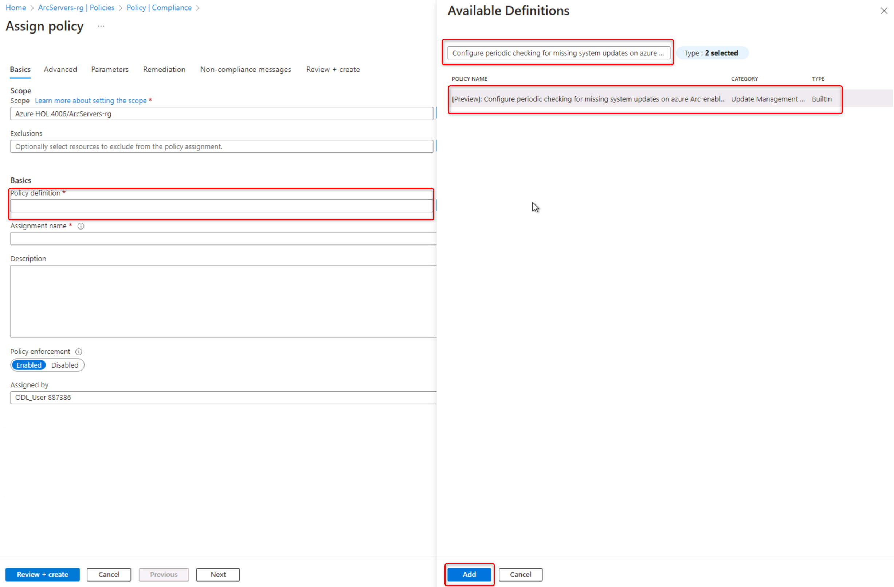

5. On the **Assign policy** page, click **Remediation**. Mark the checkbox before **Create a remediation task**.

    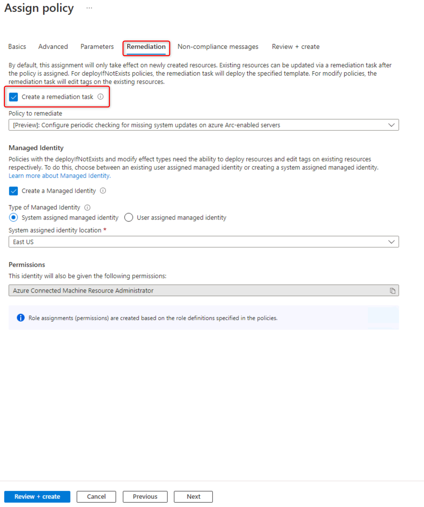

6. On the **Assign policy** page, click **Review + create**. Click **Create**.

    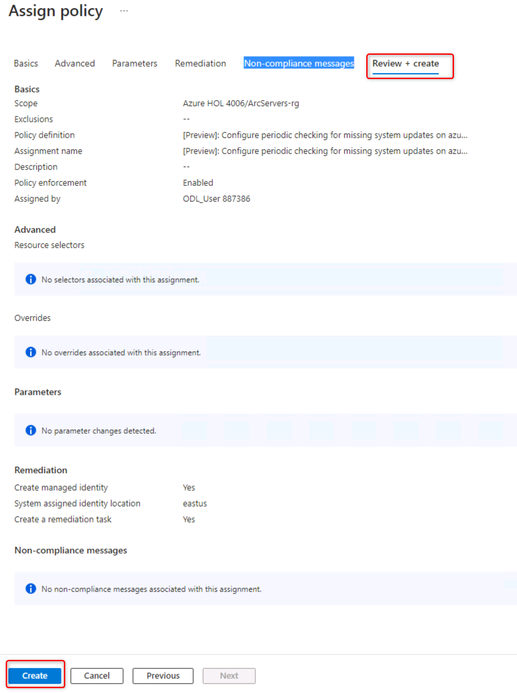

7. After a couple of minutes you should see an extra Policy assigment popping up in the list of Assigned Policies.

    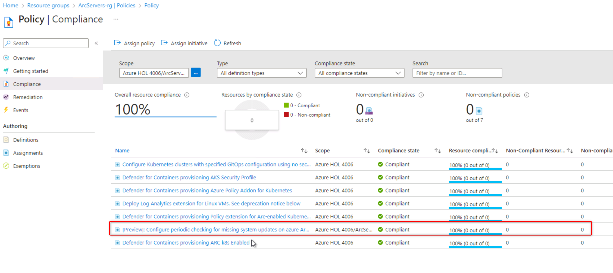

Task 2: Azure Arc-enable VM002 - Ubuntu Linux 22.04
-----------
In this step, you will download a Windows Server 2022 and Ubuntu Server 22.04 .Iso file and upload the .Iso to your Clustered Shared Volume you explored in Task 1. 

### Prepare the step in Azure to onboard VM002 as an Azure Arc-enabled Virtual Machine ###

1. In the "Search resources, services, and docs" search box at the top of the Azure Portal page, type **Servers** and click **Servers - Azure Arc** under Services.

    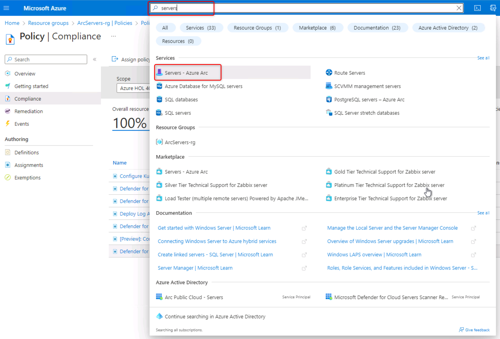
    
2. On the **Azure Arc | Servers** page, Click **+ Add**

    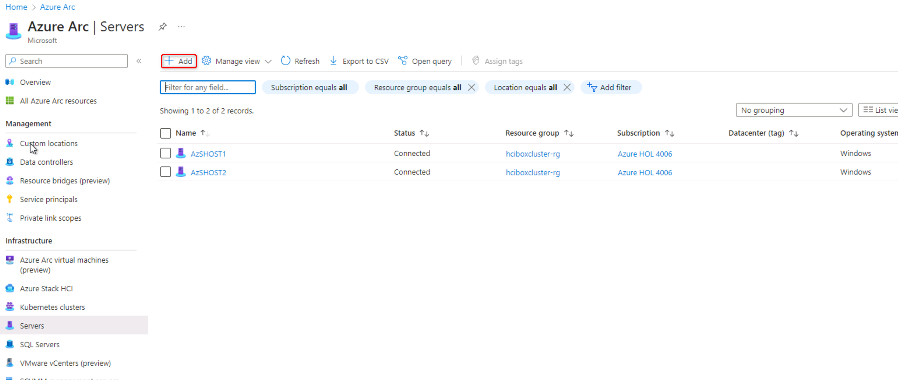

3. On the **Add servers with Azure Arc** page, in the **Add a single server** box, Click **Generate script**

    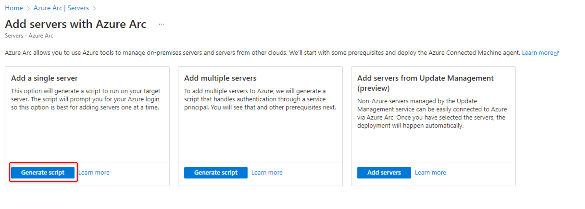

4. On the **Add servers with Azure Arc** page, on the *Prerequisites* tab., Click **NEXT**.

    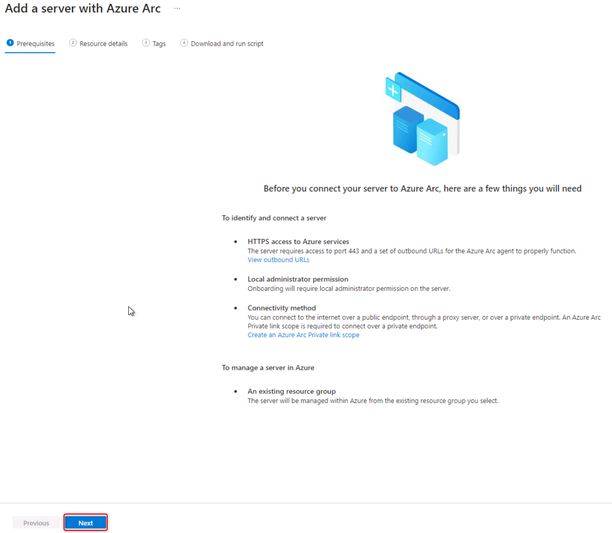

5. On the **Add servers with Azure Arc** page, on the *Resource details* tab, select the Resource Group **ArcServers-rg**, select **Linux** as Operating System and then Click **NEXT**

    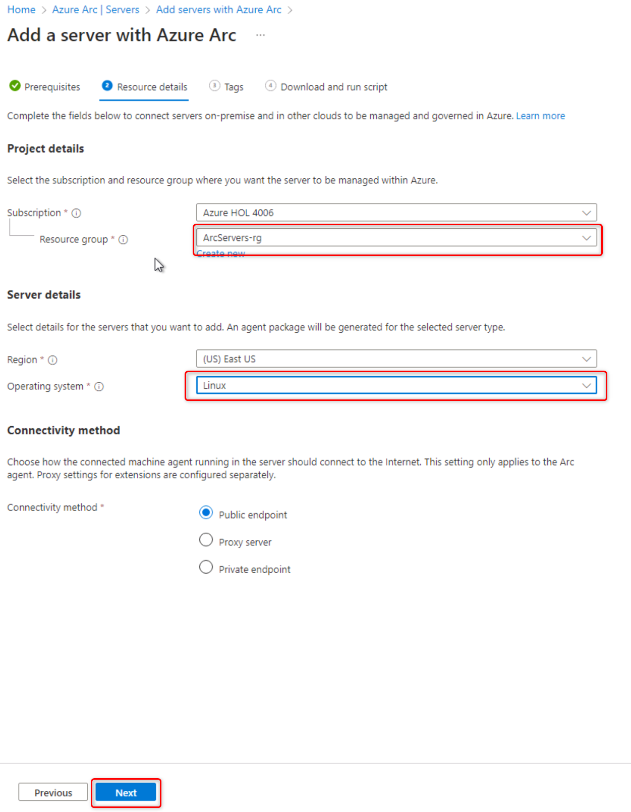

6. On the **Add servers with Azure Arc** page, on the *Tags* tab, Click **NEXT**
   **NOTE** If you want you can of course add an Cutsom tag, but best practice is that you do this via Azure Policies.

    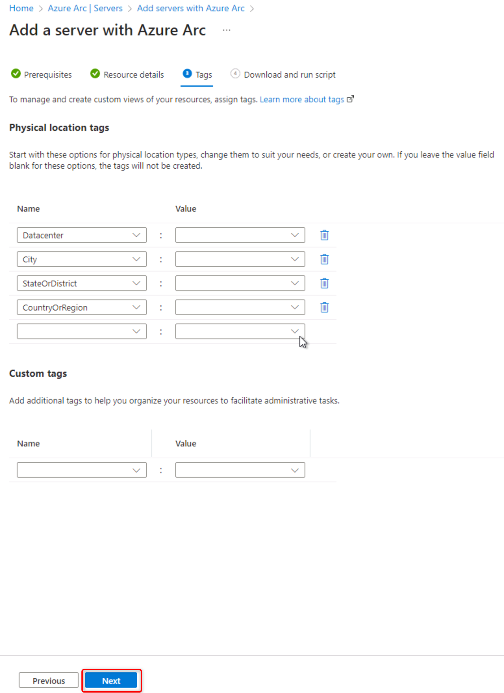

7. On the **Add servers with Azure Arc** page, on the *Download and run script* tab, Click **Download** (You later can find it your Downloads folder). Click **Close**.
   
    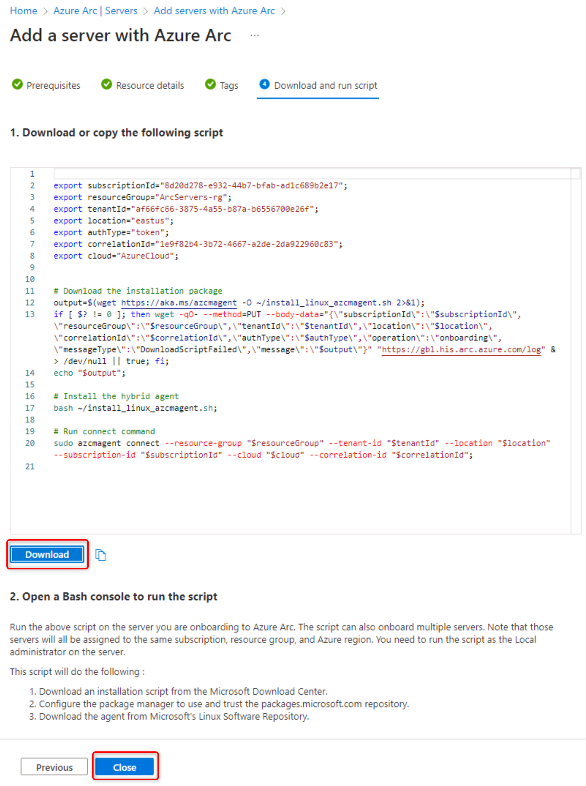

### Azure Arc-enable VM002 ###
 
1. Open **Windows Admin Center** on **AdminCenter** VM from the desktop if it is not already opened, click on your previously deployed cluster, **hciboxcluster.jumpstart.local**
 
    

**UPDATE FROM HERE**

Task 4: Deploy an Ubuntu Server 22.04 virtual machine
----- 
In this step, you will deploy an Ubuntu Server 22.04 virtual machine via Windows Admin Center.

1. Once logged into the **Windows Admin Center** on the **AdminCenter** VM, click on cluster, **hciboxcluster.jumpstart.local**

2. On the left hand navigation, under **Cluster Resources** select **Virtual machines**.  The central **Virtual machines** page shows that there are some virtual machines already running.
    
    

3. On the **Virtual machines** page, select the **Inventory** tab, and then click on **Add** and select **New**.

    

4. In the **New virtual machine** pane, enter **VM002** for the name, and enter the following pieces of information, then click **Create**

 
     * Generation: **Generation 2 (Recommended)**
     * Host: **Leave as recommended**
     * Path: **C:\ClusterStorage\S2D_vDISK1**
     * Virtual processors: **1**
     * Startup memory (GB): **2**     
     * Network: **sdnSwitch**
     * Storage: **Add, then Create an empty virtual hard disk** and set size to **20GB**
     * Operating System: Install an operating system from an image file (.iso). Select the Ubuntu Server 22.04 Iso file!

    
      
    
 
 
5. The creation process will take a few moments, and once complete, VM002 should show within the Virtual machines view

1. Click on the VM name **VM002** and then Click on **Settings** to view all VM properties. Click on **Security**
 
    

1. Make sure to change the Secure Boot template to "Microsoft UEFI Certificate Authority" in the Template drop down box, and click **save security settings**. DO NOT CLICK **Close**.

    

1. Click **Networks** in the left menu under "Settings for VM002" and make sure to change the VLAN identifier to **200** and click **save Networks settings**. Click Close.

    

6. Click on **Power** and select **Start** - within moments, the VM should be running.

    
    
  
7. View the properties and status for this running VM.
 
    
    

8. Click on Connect and select connect button from the drop down.

    
 
9.  Fill in the Username **arcdemo@jumpstart.local** and password **ArcPassword123!!**. Before clicking on **Connect** first make sure to click the checkbox before "Automatically connect with the certificate presented by this machine", when you receive the certificate prompt, click **Confirm**. Now click **Connect**.
  
     
 

1. Once the integrity check is done you will be able to select your language. Select **English**.

     

1. On the "Keyboard configuration" page, select **Done** and ENTER

    

1. On the "Choose type of install" page, select **Done** and ENTER

     

2. On the "Network connections" page, select **Done** and ENTER
   
   **NOTE:** Make sure you see an IP on the DHCPv4 line!

     

3. On the "Configure Proxy" page, select **Done** and ENTER

    

3. On the "Configure Ubuntu archive mirror" page, select **Done** and ENTER

     

7. On the "Guided storage configuration" page, select **Done** and ENTER

    

8.  On the storage configuration screen, select **Done** and then Select **Continue** to confirm the destructive action popup screen.

    

9.  On the Profile setup screen complete the fields a below and then select **Done** and ENTER
     * Your name: arcdemo
     * Your server's name: vm002
     * Pick a username: arcdemo
     * Choose a password: ArcPassword123!!
     * Confirm your password: ArcPassword123!!

    

10. On the "Upgrade to Ubuntu Pro" screen, select **Continue** and ENTER

    

11. On the "SSH setup" screen, select "Install openSSH server" and select **Done**

    

12. On the "Featured Server snaps" screen, select **Done**

    

13. Now wait until you get the "Install complete!" screen and select **Reboot Now** and ENTER

15. Once the virtual machine is up and running try to login!

Task 5: Live migrate a virtual machine to another node
----- 

The final step we'll cover is using Windows Admin Center to live migrate VM002 from it's current node, to an alternate node in the cluster.

1. Still within the **Windows Admin Center** on **AdminCenter** VM, under **Cluster Resources**, click on **Virtual machines**

2. On the **Virtual machines** page, select the **Inventory** tab

3. Under **Host server**, make a note of the node that VM002 is currently running on.  You may need to expand the column width to see the name

    

4. Next to **VM002**, click the tick box next to VM002, then click **More**.  You'll notice you can Clone, Domain Join and also Move the VM. Click **Move**

    

5. Next to **VM002**, click the tick box next to VM002, then click **More**.  You'll notice you can Clone, Domain Join and also Move the VM. Click **Move**    

    

    

You've successfully moved a running VM without downtime using the Windows Admin Center to another Host in the Azure Stack HCI cluster!

Summary
-----------
In this exercise, you have been exploring the existing Cluster Shared Volume which was created for you on Azure Stack HCI cluster. You also looked at more details and options related to the Volumes you can create in Azure Stack HCI. In Task 2 you downloaded some ISO files which you have used in Task 3 and Task 4 to respectively deployed a Windows Server 2022 VM and an Ubuntu 22.04 VM on the Azure Stack HCI Cluster. You finished this exercise by testing a Live migration of the Linux based VM to another available Azure Stack HCI Cluster node.

With this completed, you can now move on to the next exercise.

Product improvements
-----------
If, while you work through this guide, you have an idea to make the product better, whether it's something in Azure Stack HCI, AKS on Azure Stack HCI, Windows Admin Center, or the Azure Arc integration and experience, let us know! We want to hear from you!

For **Azure Stack HCI**, [Head on over to the Azure Stack HCI Q&A forum](https://learn.microsoft.com/en-us/answers/tags/6/azure-stack-hci "Azure Stack HCI Q&A"), where you can share your thoughts and ideas about making the technologies better and raise an issue if you're having trouble with the technology.

For **AKS on Azure Stack HCI**, [Head on over to our AKS on Azure Stack HCI GitHub page](https://github.com/Azure/aks-hci/issues "AKS on Azure Stack HCI GitHub"), where you can share your thoughts and ideas about making the technologies better. If however, you have an issue that you'd like some help with, read on... 

Raising issues
-----------
This lab is based on the Azure Arc Jumpstart HCIBox: https://azurearcjumpstart.io/azure_jumpstart_hcibox/

If you want to setup the lab within your own Azure subscription please follow this link : https://azurearcjumpstart.io/azure_jumpstart_hcibox/#deployment-options-and-automation-flow

If you notice something is wrong with this guide, such as a step isn't working, or something just doesn't make sense - help us to make this guide better!
