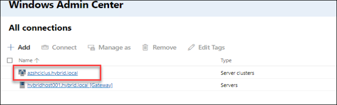
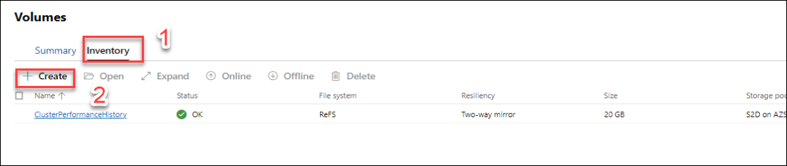
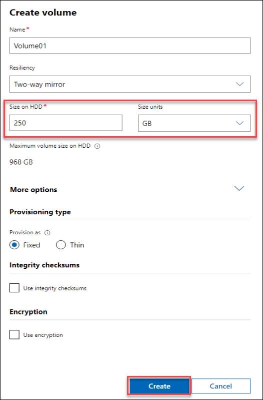
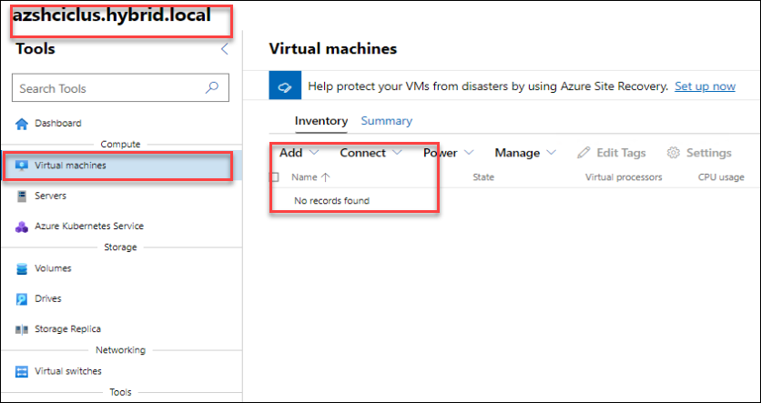
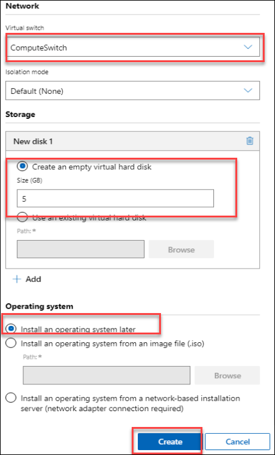
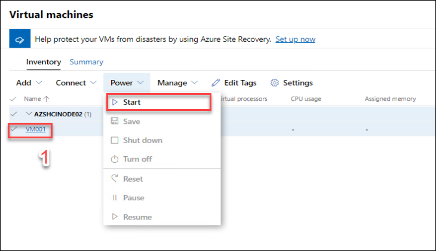
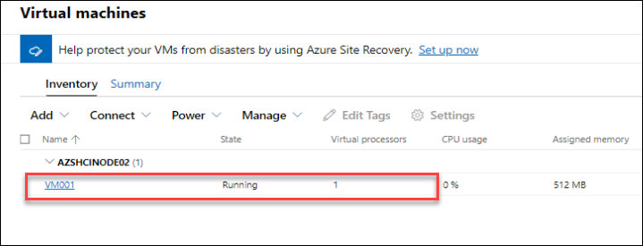
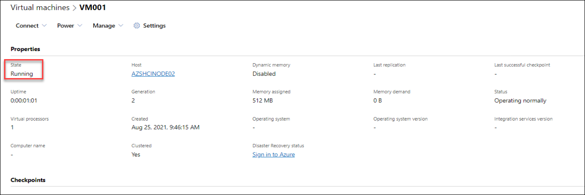
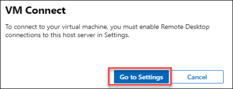
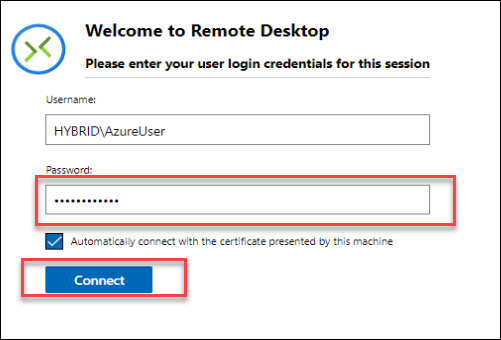

HOL-4: Exercise 4: Explore the management of your Azure Stack HCI 20H2 environment (Optional)
==============
Overview
-----------
With the Azure Stack HCI cluster deployed, you can now begin to explore some of the additional capabilities within Azure Stack HCI 20H2 and Windows Admin Center. We'll cover a few recommended activities below, to expose you to some of the key elements of the Windows Admin Center, but for the rest, we'll [direct you over to the official documentation](https://docs.microsoft.com/en-us/azure-stack/hci/ "Azure Stack HCI 20H2 documentation").

Contents
-----------
- [Overview](#overview)
- [Contents](#contents)
- [Create volumes for VMs](#create-volumes-for-vms)
- [Deploy a virtual machine](#deploy-a-virtual-machine)
- [Congratulations!](#congratulations)

Task 1: Create volumes for VMs
-----------
In this step, you'll create a volume on the Azure Stack HCI 20H2 cluster by using Windows Admin Center, and enable data deduplication and compression.

### Create a two-way mirror volume ###

1. Open **Windows Admin Center** on **HybridHost001** from the desktop is not already opened, click on your previously deployed cluster, **azshciclus.hybrid.local**

    
        
2. On the left hand navigation, under **Storage** select **Volumes**.  The central **Volumes** page shows you should have a single volume currently

    
    
4. On the Volumes page, select the **Inventory** tab, and then select **Create**

    
    
6. In the **Create volume** pane, leave the default for for the volume name, and leave **Resiliency** as **Two-way mirror**
8. In Size on HDD, specify **250GB** for the size of the volume
9. Under **More options**, tick the box for **Use deduplication and compression**
10. Under **Data type**, use the drop-down to select **Hyper-V**, then click **Create**.

    

8. Creating the volume can take a few minutes. Notifications in the upper-right will let you know when the volume is created. The new volume appears in the Inventory list

    

 > **NOTE** - You'll notice there are 3 options for **Data type**; default, Hyper-V and Backup.  If you're interested in learning more about Deduplication in Azure Stack HCI 20H2, you should [refer to our documentation](https://docs.microsoft.com/en-us/windows-server/storage/data-deduplication/overview "Deduplication overview")

You now have a volume created and ready to accept workloads. Whilst we deployed the volume using the Windows Admin Center, you can also do the same through PowerShell. If you're interested in taking that approach, [check out the official docs that walk you through that process](https://docs.microsoft.com/en-us/azure-stack/hci/manage/create-volumes "Official documentation for creating volumes"). For more information on planning volumes with Azure Stack HCI 20H2, you should [refer to the official docs](https://docs.microsoft.com/en-us/azure-stack/hci/concepts/plan-volumes "Planning volumes for Azure Stack HCI 20H2").

Task 2: Deploy a virtual machine
-----------
In this step, you'll deploy a VM onto your new volume, using Windows Admin Center.

### Create the virtual machine ###
You should still be over on **HybridHost001**, but if you're not, log into HybridHost001, and open the **Windows Admin Center**.

1. Once logged into the **Windows Admin Center** on **HybridHost001**, click on your previously deployed cluster, **azshciclus.hybrid.local**

3. On the left hand navigation, under **Compute** select **Virtual machines**.  The central **Virtual machines** page shows you no virtual machines deployed currently
    
    

4. On the **Virtual machines** page, select the **Inventory** tab, and then click on **Add** and select **New**.

    

6. In the **New virtual machine** pane, enter **VM001** for the name, and enter the following pieces of information, then click **Create**

    * Generation: **Generation 2 (Recommended)**
    * Host: **Leave as recommended**
    * Path: **C:\ClusterStorage\Volume01**
    * Virtual processors: **1**
    * Startup memory (GB): **0.5**
    * Network: **ComputeSwitch**
    * Storage: **Add, then Create an empty virtual hard disk** and set size to **5GB**
    * Operating System: **Install an operating system later**

      
      
      

5. The creation process will take a few moments, and once complete, **VM001** should show within the **Virtual machines view**

6. Click on the checkbox before the **VM** and then click click on **Power** button and select **Start** - within moments, the VM should be running.

    
    
    

7. Click on **VM001** to view the properties and status for this running VM.

    

8. Click on **Connect** and select **connect** button from the drop down- you may get a **VM Connect** prompt:

    

9. Click on **Go to Settings** and in the **Remote Desktop** pane, click on **Allow remote connections to this computer**, then **Save**

     
     
10. Click the **Back** button in your browser to return to the VM001 view, then click **Connect**, and when prompted with the certificate prompt, click **Connect** and enter Password as **demo!pass123**

      
      
12. There's no operating system installed here, so it should show a UEFI boot summary, but the VM is running successfully

12. Click **Disconnect**

You've successfully create a VM using the Windows Admin Center!

Congratulations!
-----------
You've reached the end of the evaluation guide.  In this guide you have:

* Deployed/Configured a Windows Server 2019 Hyper-V host in Azure to run your nested sandbox environment
* Deployed the AKS on Azure Stack HCI management cluster on your Windows Server 2019 Hyper-V environment
* Deployed a target cluster to run applications and services
* Optionally integrated with Azure Arc and deployed a sample application
* Set the foundation for further learning!

Great work!

Setup the lab in your own Azure Subscription.
-------------

This lab is based on the the following work by Matt McSpirit: https://github.com/mattmcspirit/hybridworkshop

 

If you want to setup the lab within your own Azure subscription and run through additional scenarios as well, you can go to the above GitHub repo and perform as mentioned.
