HOL-4: Exercise 2: Deploy your AKS-HCI infrastructure
==============
Overview
-----------
It's now time to deploy AKS on Azure Stack HCI. You'll first deploy the AKS on Azure Stack HCI management cluster, and then deploy a target cluster, onto which you can test deployment of a workload.

Contents
-----------
- [Overview](#overview)
- [Contents](#contents)
- [Architecture](#architecture)
- [Next Steps](#next-steps)

Architecture
-----------

From an architecture perspective, as shown earlier, this graphic showcases the different layers and interconnections between the different components:


In this section, you'll use Windows Admin Center to deploy the AKS on Azure Stack HCI, including all the key components. First, the management cluster (kubernetes virtual appliance) provides the the core orchestration mechanism and interface for deploying and managing one or more target clusters. These target, or workload clusters contain worker nodes and are where application workloads run. If you're interested in learning more about the building blocks of the Kubernetes infrastructure, you can [read more here](https://docs.microsoft.com/en-us/azure-stack/aks-hci/kubernetes-concepts "Kubernetes core concepts for Azure Kubernetes Service on Azure Stack HCI").

As mentioned earlier, Azure Stack HCI and AKS-HCI will de deployed as 2 separate environments within the same Azure VM. In a production environment, you would run AKS-HCI **on top of** Azure Stack HCI, but in this nested environment, the performance of the multiple levels of nesting can have a negative impact, so in this case, they will be deployed side by side for evaluation.


## Task 1: Configure Windows Admin Center 
-----------
Your Azure VM deployment automatically installed Windows Admin Center 2103, however there are some additional configuration steps that must be performed before you can use it to deploy AKS on Azure Stack HCI.

1. **Double-click the Windows Admin Center** shortcut on the desktop.

   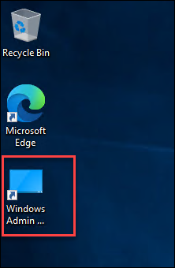
    
2. Once Windows Admin Center is open, you may receive notifications in the top-right corner, indicating that some extensions are updating automatically. **Let these finish updating before proceeding**. Windows Admin Center may refresh automatically during this process. If you didn't receive any notifications you can continue with the next step.

3. Once complete, click on the **Settings**(1) icon from top right corner, then select **Extensions**(2)

   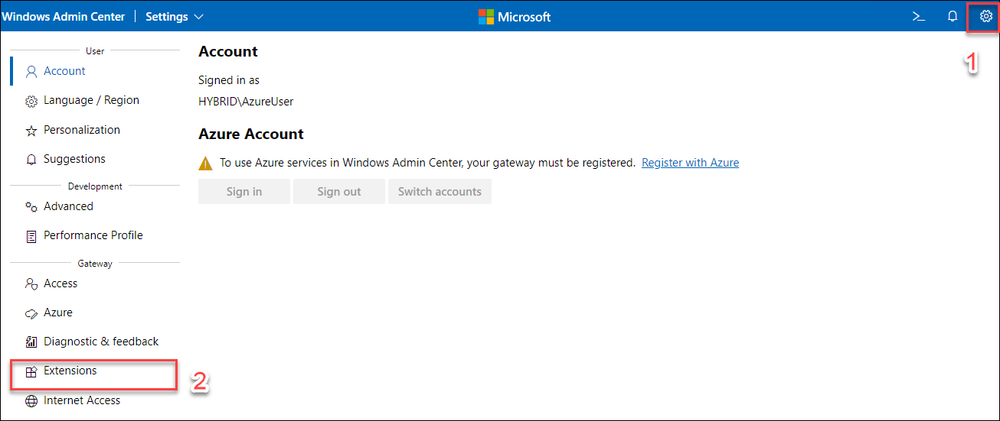
    
4. Click on **Installed extensions** and you will see **Azure Kubernetes Service** is installed.

   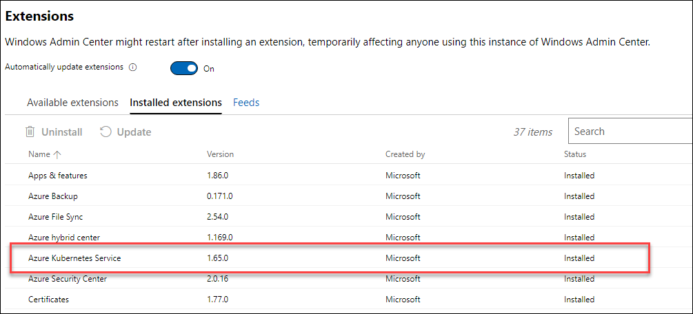
    
5. Please notes, if there are any updates available for the Azure Kubernetes Service, select **Azure Kubernetes Service** and click on **Update** to install the **latest** version.

   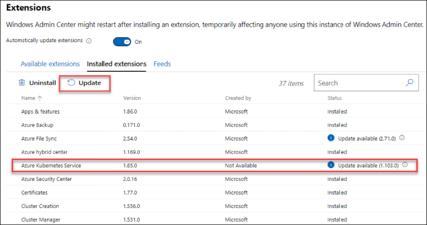

In order to deploy AKS-HCI with Windows Admin Center, you need to connect your Windows Admin Center instance to Azure.

6. Now, in **Settings**, under **Gateway** click on **Azure**.

   
    
7. Click **Register**(1), and in the **Get started with Azure in Windows Admin Center** blade, follow the instructions to **Copy the code**(2) and then click on the link **Enter the Code**(3) to configure device login.

   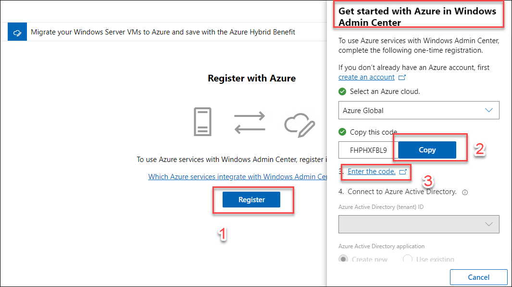
    
8. Now, Paste the code you copied in previous step and click on **Next** button.

   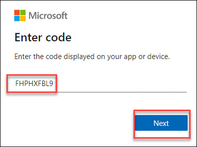
     
9. When prompted for credentials, **enter your Azure credentials** for a tenant you'd like to use to register the Windows Admin Center and click on continue button if you get any popup saying **Are you trying to sign in to Windows Admin Center?**.

10. Now, switch Back in **Windows Admin Center** tab, you'll notice your tenant information has been added.  You can click on **Connect** to connect Windows Admin Center to Azure.

    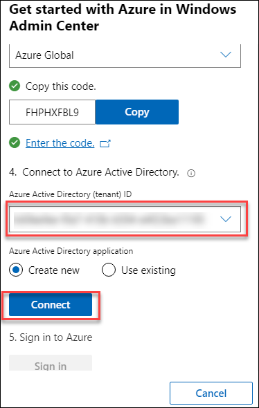

11. Click on **Sign in** and when prompted for credentials, **enter your Azure credentials** and you will see a popup **Permissions requested**. Select **Consent on behalf of your organization** then click **Accept**.

    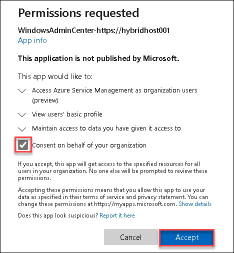

*******************************************************************************************************

**NOTE** - if you receive an error when signing in, still in **Settings**, under **User**, click on **Account** and click **Sign-in**. You should then be prompted for Azure credentials and permissions, to which you can then click **Accept**. Sometimes it just takes a few moments from Windows Admin Center creating the Azure AD application and being able to sign in. Retry the sign-in until you've successfully signed in.

*******************************************************************************************************

## Task 2: Validate Azure integration
-----------
In order to successfully deploy AKS on Azure Stack HCI with Windows Admin Center, additional permissions were applied on the Windows Admin Center Azure AD application that was created when you connected Windows Admin Center to Azure, earlier. In this step, we'll quickly validate those permissions.

1. Still in Windows Admin Center, click on the **Settings** gear in the top-right corner
2. Under **Gateway**, click **Azure**. You should see your previously registered Azure AD app:

    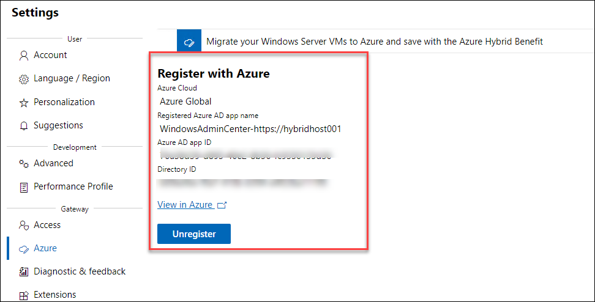

3. Click on **View in Azure** to be taken to the Azure AD app portal, where you should see information about this app, including permissions required. If you're prompted to log in, provide appropriate credentials.
4. Once logged in, under **Configured permissions**, you should see a few permissions listed with the status **Granted for...** and the name of your tenant. The **Microsoft Graph (5)** API permissions will show as **not granted** but this will be updated upon deployment

5. Click on **Grant Admin Consent for Azure HOL** button to give your app the permissions.

    

*******************************************************************************************************

**NOTE** - If you don't see Microsoft Graph listed in the API permissions, you can either [re-register Windows Admin Center using steps here](#configure-windows-admin-center "re-register Windows Admin Center using steps here") for the permissions to appear correctly, or manually add the **Microsoft Graph Appliation.ReadWrite.All** permission. To manually add the permission:

- Click **+ Add a permission**
- Select **Microsoft Graph**, then **Delegated permissions**
- Search for **Application.ReadWrite.All**, then if required, expand the **Application** dropdown
- Select the **checkbox** and click **Add permissions**

*******************************************************************************************************

6. Switch back to the **Windows Admin Center tab** and click on **Windows Admin Center** in the top-left corner to return to the home page. 

    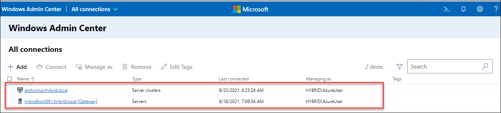
    
    
   You'll notice that your HybridHost001 is already under management, so at this stage, you're ready to proceed to deploy the AKS on Azure Stack HCI management cluster onto your Windows Server 2019 Hyper-V host.

    

## Task 3: Deploying the AKS on Azure Stack HCI management cluster
-----------
The next section will walk through configuring the AKS on Azure Stack HCI management cluster, on your single node Windows Server 2019 host.

1. From the Windows Admin Center homepage, click on your **HybridHost001.hybrid.local** cluster. 
 
    

2. You'll be presented with a rich array of information about your HybridHost001 cluster, of which you can feel free to explore the different options and metrics. When you're ready, on the left-hand side, scroll down and under **Extensions**, click **Azure Kubernetes Service** and then Click on **Set up** to start the deployment process.

   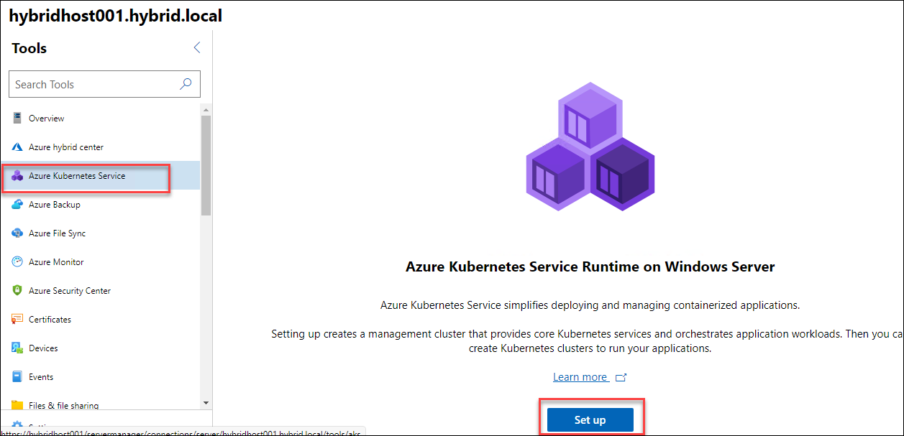

You'll notice the terminology used refers to the **Azure Kubernetes Service Runtime on Windows Server​​** - the naming differs depending on if you're running the installation of AKS on a Windows Server 2019 Hyper-V platform, or the newer Azure Stack HCI 20H2 platform. The overall deployment experience is the same regardless of underlying platform.

3. Firstly, review the prerequisites - your Azure VM environment will meet all the prerequisites, so you should be fine to click **Next: System checks**

     

4. On the **System checks** page, enter the password **demo!pass123** for your **azureuser** account and when successfully validated, click on the **Install** button to **install the required PowerShell modules**, this will take a few moments to install the powershell modules. 

     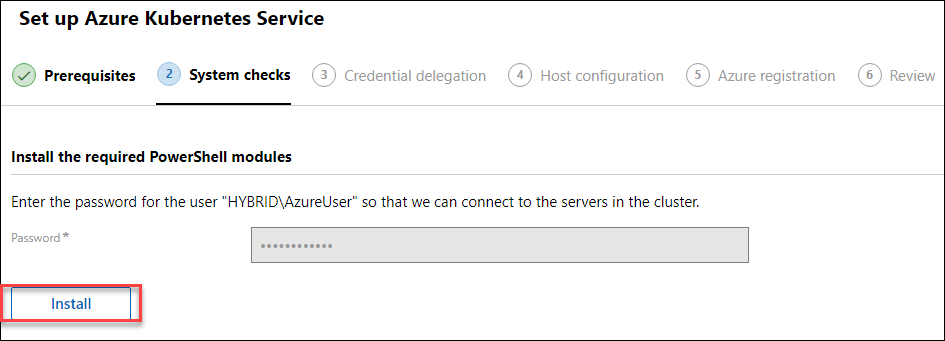
     
5. During the system checks stage, Windows Admin Center will begin to validate it's own configuration, and the configuration of your target nodes, which in this case, is the Windows Server 2019 Hyper-V host (HybridHost001, running in your Azure VM)

   

You'll notice that Windows Admin Center will validate memory, storage, networking, roles and features and more. If you've followed the guide correctly, you'll find you'll pass all the checks and can proceed.

6. Once validated, click **Next: Credential delegation**

7. On the **Credential delegation** page, read the information about **CredSSP**, then click **Enable**. Once enabled, click **Next: Host configuration**

    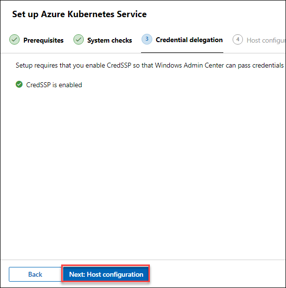

   **NOTE** - if you receive a WinRM error, open an **Administrative PowerShell console** and run the following command and then retry the step 7:


     ```
     Restart-Service WinRm -Force
     ```

8. On the **Host configuration** page, under **Host details**, select your **V:**, and leave the other settings as default

     

9. Under **VM Networking**, ensure that **InternalNAT** is selected for the **Internet-connected virtual switch**

10. For **Use VLANs**, leave this selected as **No**

11. For **IP address allocation method** choose **DHCP**

12. Under **Load balancer settings**, enter the range from **192.168.0.150** to **192.168.0.250** and then click **Next:Azure registration**

     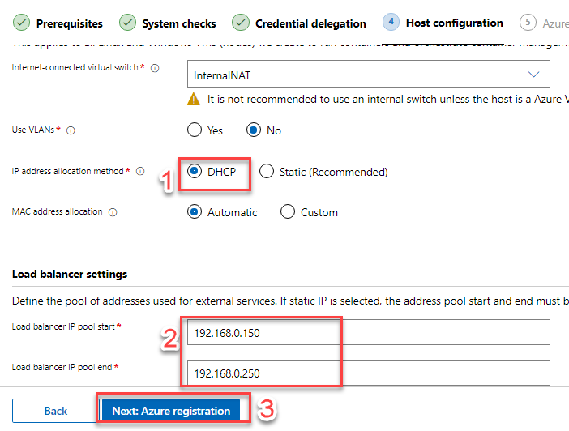

13. On the **Azure registration page**, your Azure account should be automatically populated. Use the drop-down to select your preferred subscription. If you are prompted, log into Azure with your Azure credentials. Once successfully authenticated, you should see your **Account**, then **choose your subscription**

14. Once you've chosen your subscription, Select your resource group **HybridHost** and **East US** in Azure Region.

     

15.  Click on **Next: Review**
  
16. Review your choices and settings, then click **Apply**.

     

17. After a few moments, you may be **prompted to grant consent** to the Windows Admin Center Azure AD application. Ensure you select **Consent on behalf of your organization** then click **Accept**. The settings will be applied, and you should receive some notifications:

     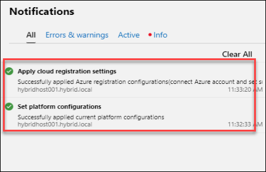

18. Once confirmed, you can click **Next: New cluster** to start the deployment process of the management cluster.

     

*******************************************************************************************************

> **NOTE 1** - Do not close the Windows Admin Center browser at this time. Leave it open and wait for successful completion. if you see that the creation is failed, you can click on back and start the creation from step 16 again and it will deploy the cluster.

> **NOTE 2** - You may receive a WinRM error message stating "Downloading virtual machine images and binaries for the AKS host failed" - this can be ignored, so **do not close/refresh the browser**.

*******************************************************************************************************

19.  Upon completion you should receive a notification of success. In this case, you can see deployment of the AKS on Azure Stack HCI management cluster took just over 12 minutes. In some cases it can take upto 20 minutes to deploy the cluster.

    

20. Once reviewed, click **Finish**. You will then be presented with a management dashboard where you can create and manage your Kubernetes clusters.
     
    
     
### Updates and Cleanup ###
To learn more about **updating**, **redeploying** or **uninstalling** AKS on Azure Stack HCI with Windows Admin Center, you can [read the official documentation here.](https://docs.microsoft.com/en-us/azure-stack/aks-hci/setup "Official documentation on updating, redeploying and uninstalling AKS on Azure Stack HCI")

Task 4: Create a Kubernetes cluster (Target cluster)
-----------
With the management cluster deployed successfully, you're ready to move on to deploying Kubernetes clusters that can host your workloads. We'll then briefly walk through how to scale your Kubernetes cluster and upgrade the Kubernetes version of your cluster.

1. From the same page click on **Add Cluster** under **Kubernetes clusters** section.
    
     
     
3. Firstly, review the prerequisites - your Azure VM environment will meet all the prerequisites, so you should be fine to click **Next: Basics**

    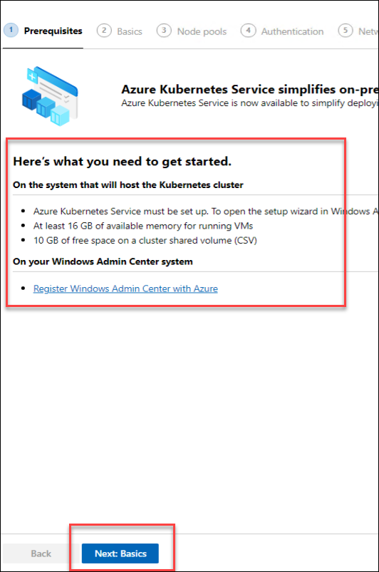

5. On the **Basics** page, firstly, choose whether you wish to **optionally** integrate with Azure Arc enabled Kubernetes. You can click the link on the page to learn more about Azure Arc. If you do wish to integrate, select the **Enabled** radio button, then use the drop downs to select the **subscription**, select  **HybridHost** resource group and  same region where your RG is deployed.

    

3. Still on the **Basics** page, under **Cluster details** enter the following details,
     
     *  **Password**: ```demo!pass123```
     *  **Kubernetes cluster name**: ```akshciclus001``` 
     *  **Kubernetes version**: ```v1.21.1```

    

4. Under **Primary node pool**, accept the defaults, and then click **Next: Node pools**

    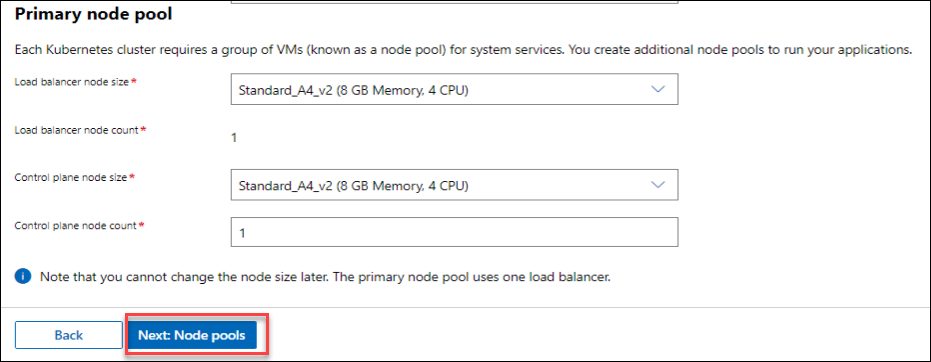

5. On the **Node pools** page, click on **+Add node pool**
6. In the **Add a node pool** blade, enter the following, then click **Add**
   1. **Node pool name**: LinuxPool1
   2. **OS type**: Linux
   3. **Node size**: Standard_K8S3_v1 (6 GB Memory, 4 CPU)
   4. **Node count**: 1

   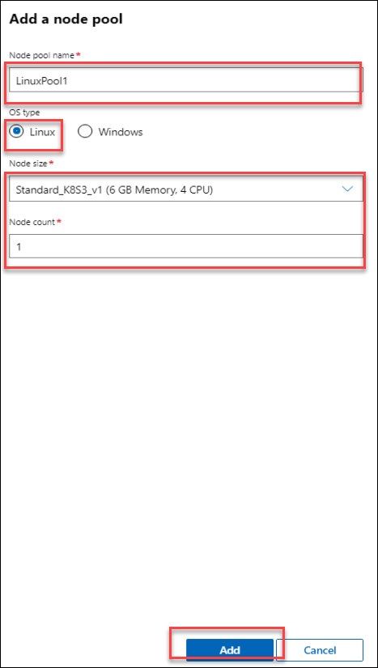

7. Once your **Node pools** have been defined, click **Next: Authentication**
8. For this evaluation, for **AD Authentication** click **Disabled** and then click **Next: Networking**

    

10. On the **Networking** page, review the **defaults**. For this deployment, you'll deploy this kubernetes cluster on the existing virtual network that was created when you installed AKS-HCI in the previous steps.

    

10. Click on the **aks-default-network**, ensure **Flannel** network configuration is selected, and then click **Next: Review + Create**

     

12. On the **Review + Create** page, review your chosen settings, then click **Create**

     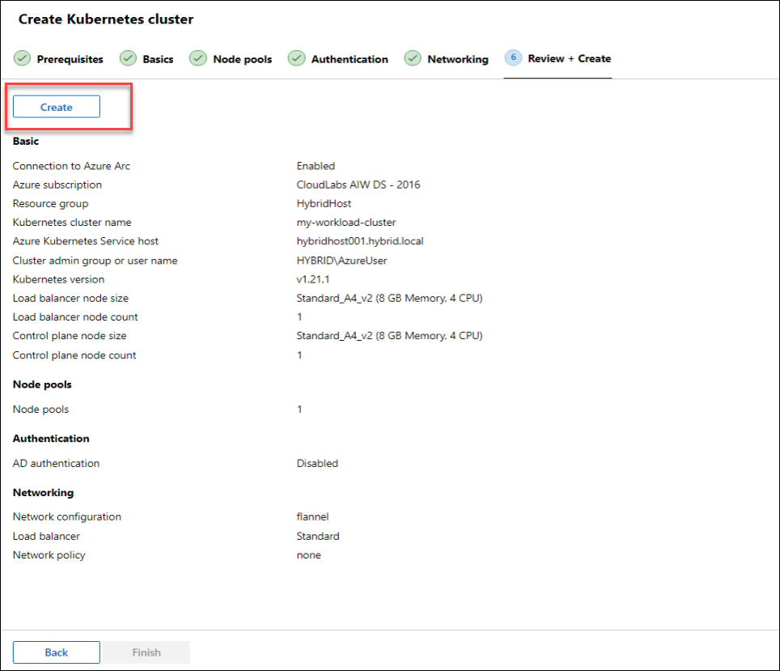

12. The creation process will begin and can take upto 15 minutes to deploy.
    > **Note**: Make sure to not switch to another tab otherwise the creation can be failed due to inactivity.
    
     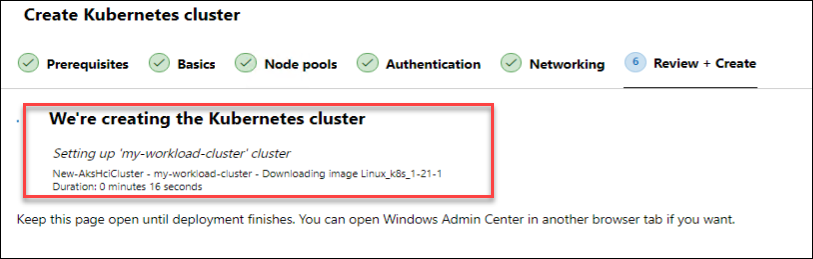

13. Once completed, you should see a message for successful creation, then click **Finish**

     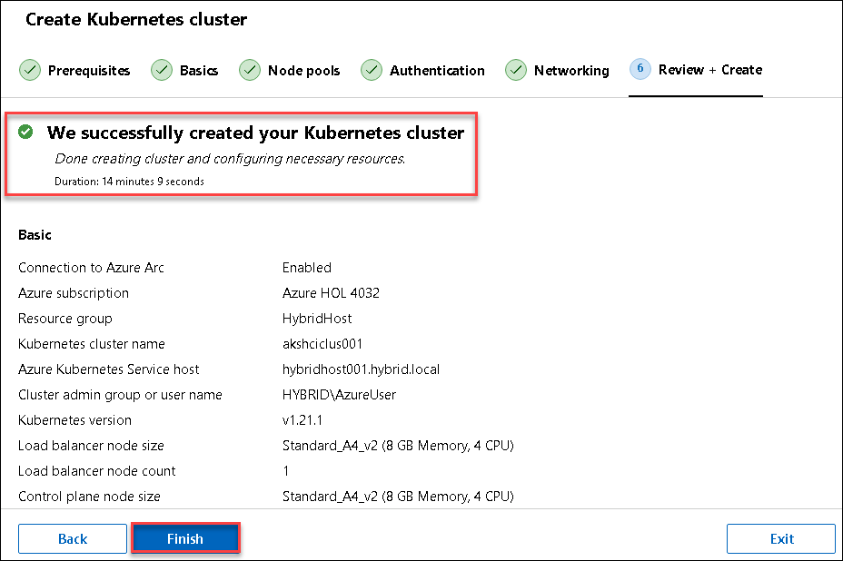

14. Back in the **Azure Kubernetes Service on Azure Stack HCI landing page**, you should now see your cluster listed.

     

16. On the dashboard, if you chose to integrate with Azure Arc, you should be able to click the **Azure instance** link to be taken to the Azure Arc view in the Azure portal.

     

Task 5: Scale your Kubernetes cluster (Target cluster)
-----------
Next, you'll scale your Kubernetes cluster to add an additional Linux worker node. As it stands, this has to be performed with **PowerShell** but will be available in Windows Admin Center in the future.

1. Open **PowerShell as Administrator** if not already opened and run the following command to import the new modules, and list their functions.

     ```powershell
     Import-Module AksHci
     Get-Command -Module AksHci
     ```

2. Next, to check on the status of the existing clusters, run the following command, you will see node count 1. 

     ```powershell
     Get-AksHciNodePool -clusterName akshciclus001
     ```

     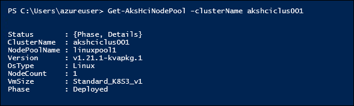

3. Next, you'll scale your Kubernetes cluster node pool using below command:, it will scale the node count to 2. 

   > **Note**: This can take upto 10 minutes to scale up the cluster

    ```powershell
    Set-AksHciNodePool -clusterName akshciclus001 -name linuxpool1 -count 2
    ```
    
    

4. Once these steps have been completed, you can verify the details by running the following command:

     ```powershell
     Get-AksHciNodePool -clusterName akshciclus001
      ```

    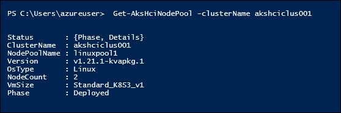

To access this **akshciclus001** cluster using **kubectl** (which was installed on your host as part of the overall installation process), you'll first need the **kubeconfig file**.

5. To retrieve the kubeconfig file for the akshciclus001 cluster, you'll need to run the following command from your **administrative PowerShell**:

    ```powershell
    Get-AksHciCredential -Name akshciclus001
     dir $env:USERPROFILE\.kube  
    ```

Next Steps
-----------
In this step, you've successfully deployed the AKS on Azure Stack HCI management cluster using Windows Admin Center, optionally integrated with Azure Arc, and subsequently, deployed and scaled a Kubernetes cluster that you can move forward with to the next stage, in which you can deploy your applications.


