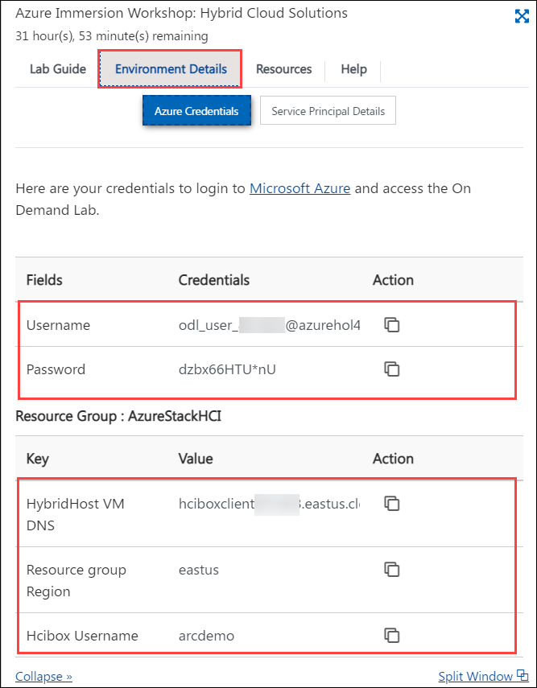
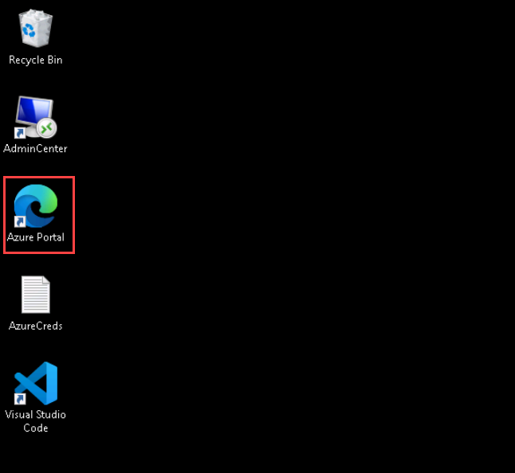
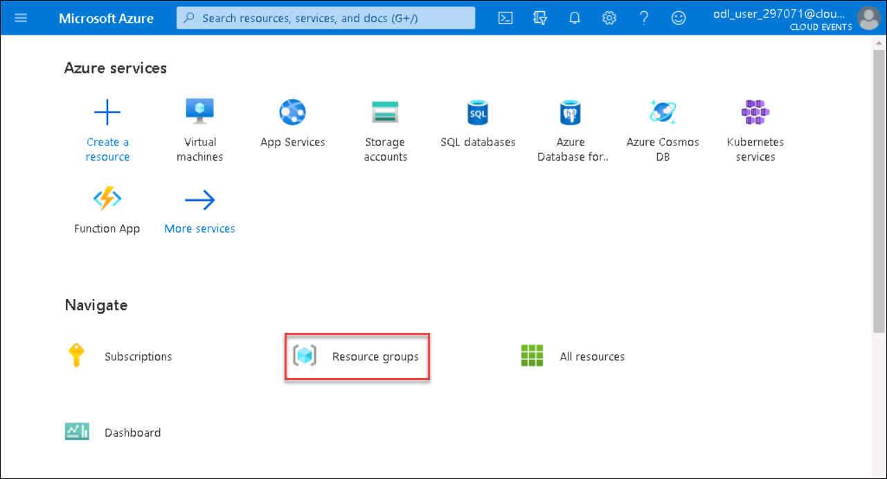
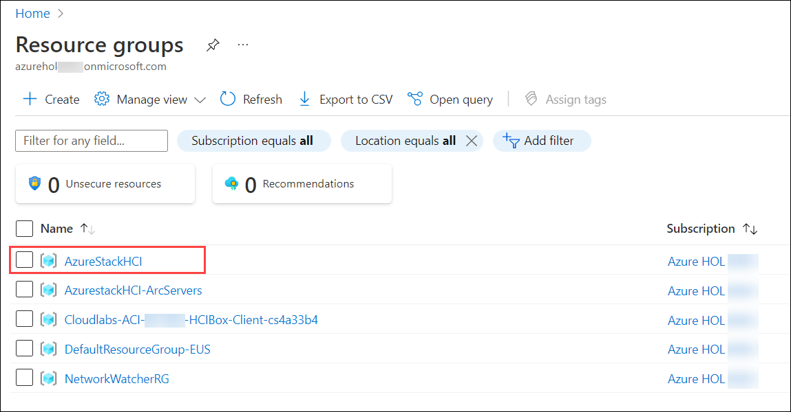
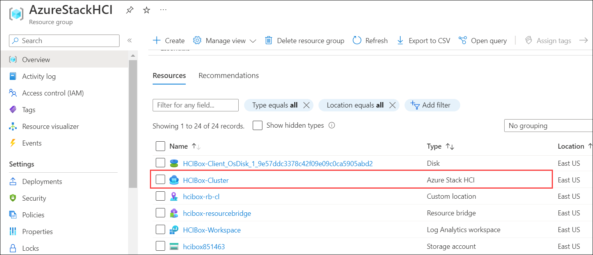
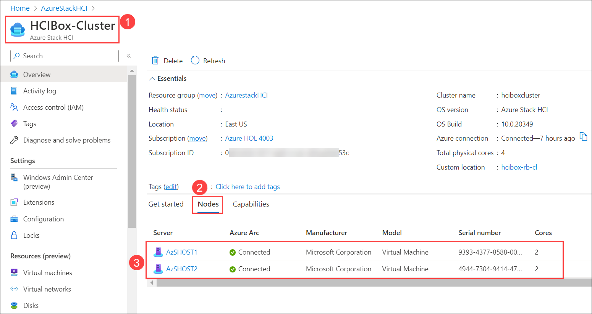
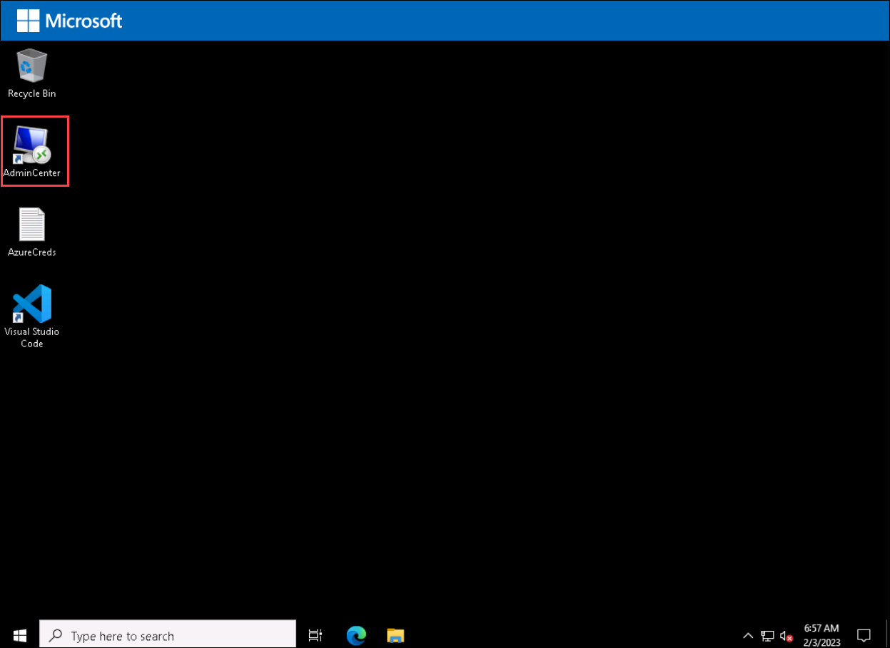
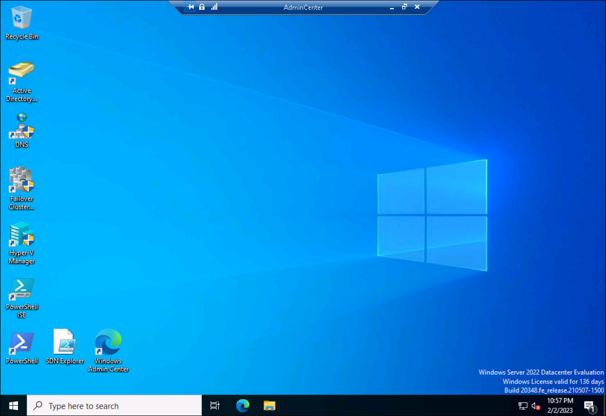

HOL-4: Getting Started With Azure Stack HCI with Azure
-------------------------
       
# Getting Started with Lab

1. Once the environment is provisioned, a virtual machine i.e, **HCIBox-Client** and lab guide will get loaded in your browser. Use this virtual machine throughout the workshop to perform the lab.

1. To get the lab environment details, select the **Environment Details** tab. The credentials will also be emailed to your registered email address. You can open the Lab Guide on a separate and full window by selecting the **Split Window** from the lower right corner. Also, you can start, stop and restart virtual machines from the **Virtual Machines** tab.

   
 

## Login to Azure Portal

1. In the **HCIBox-Client** virtual machine, double click on the Azure portal shortcut of Microsoft Edge browser which is provided on the desktop.
  
    
    
1. On the **Sign into Microsoft Azure** tab, you will see the login prompt. Enter the following **Email/Username** and then click on **Next**. 
      
      * Email/Username: <inject key="AzureAdUserEmail"></inject>
   
1. Now, enter the **Password** which you have already received for the above account.
      
      * Password: <inject key="AzureAdUserPassword"></inject>
      
1. If you see the pop-up **Stay Signed in?**, click No

1. If you see the pop-up **You have free Azure Advisor recommendations!**, close the window to continue the lab.

1. If **Welcome to Microsoft Azure** popup window appears, click **Maybe Later** to skip the tour.

1. Navigate to the Resource Group in the Azure portal navigate section.

   

1. From the Resource groups pane, click on **AzureStakHCI** resource group and verify the resources present in it.

   

1. You can see the onboarded cluster in the **AzureStackHCI** resource group, select the **HCIBox-Cluster** Azure Stack HCI resource.

   
   
1. Once you are in **Overview** page of Azure Stack HCI resource named **HCIBox-Cluster** **(1)**. Click on **Nodes** **(2)** and verify the **AzSHOST1** and **AzSHOST2** servers are connected to Azure Arc **(3)** as shown in the below screenshot.

   

## Connect to Admin Center

1. Navigate to **HCIBox-Client** virtual machince desktop and double-click on the **Admin Center** shortcut which is created on the desktop.

   
   
1. Enter the below credentials to login to **Admin Center**:

   * Username: **arcdemo@jumpstart.local**
   * Password: **ArcPassword123!!**  
   
1. Once you are connected to Admin Center, you can see the screen as shown below in the screenshot:

   
