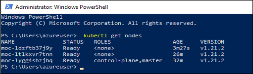
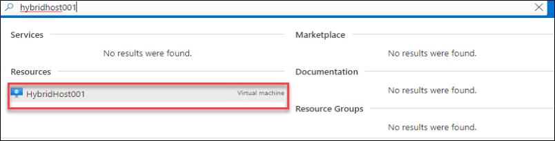
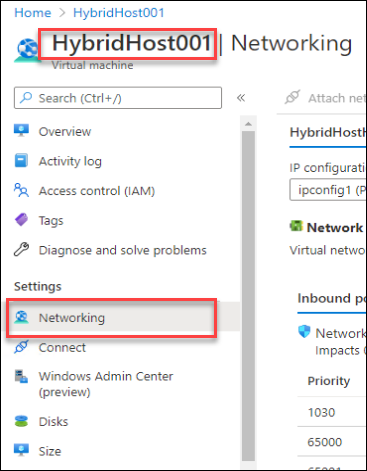
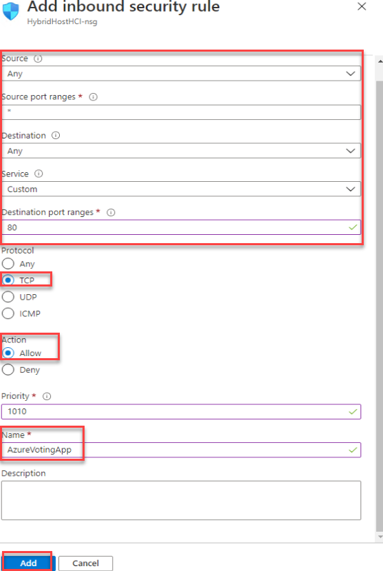
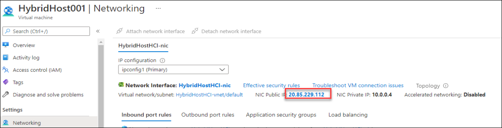
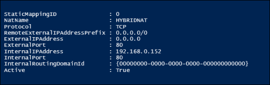
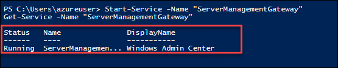

HOL-4: Exercise 3: Explore the AKS on Azure Stack HCI environment
==============
Overview
-----------
With all key components deployed, including the management cluster, along with target clusters, you can now begin to explore some of the additional capabilities within AKS on Azure Stack HCI. We'll list a few recommended activities below, to expose you to some of the key elements, but for the rest, we'll [direct you over to the official documentation](https://docs.microsoft.com/en-us/azure-stack/aks-hci/ "AKS on Azure Stack HCI documentation").

Contents
-----------
- [Overview](#overview)
- [Contents](#contents)
- [Deploying a simple Linux application](#deploying-a-simple-linux-application)
- [Expose a nested application to the internet](#expose-a-nested-application-to-the-internet)
- [Congratulations!](#congratulations)

Task 1: Deploying a simple Linux application
-----------
With your cluster up and running, to illustrate how easy it is to deploy a containerized application, The following steps will highlight key areas of deployment, testing, and scaling an application.

During the deployment of AKS on Azure Stack HCI, **kubectl** was configured on your Azure VM Host. Kubectl provides several ways to manage your Kubernetes clusters and applications.

As part of this brief tutorial, you'll deploy an [Azure vote application](https://github.com/Azure-Samples/azure-voting-app-redis "Azure vote application on GitHub"). In order to deploy the application, you'll need a Kubernetes manifest file. A Kubernetes manifest file defines the desired state for the cluster, such as what container images to run. The manifest we'll use in this tutorial includes two Kubernetes deployments - one for the sample Azure Vote Python application, and the other for a Redis instance. Two Kubernetes services are also created - an internal service for the Redis instance, and external service to access the Azure Vote application from the internet.

1. First, run the following command from an **administrative PowerShell command** to list your Kubernetes nodes, please note below commands needs to executed in Windows Powershell. Commands will not work in PowerShell ISE.

   ```powershell
    kubectl get nodes
    ```

   

2. Next, from the same **PowerShell **console**** run the following command to deploy the application directly from GitHub:

    ```powershell
    kubectl apply -f https://raw.githubusercontent.com/Azure/aks-hci/main/eval/yaml/azure-vote.yaml
    ```

    

3. Next, run the following command to monitor the progress of the deployment (using the --watch argument):

    ```powershell
    kubectl get service azure-vote-front --watch
    ```

    During deployment, you may see the **External-IP** showing as *Pending* - when this changes to an IP address, you can use **CTRL + C** to stop the watch process. The stopping process can take a few seconds to stop the script from running state.
    
    
   >Note: If the watch process take too long to terminate the operation, close the PowerShell window. Click on the windows button and look for PowerShell and right-click on it to Run as administrator to open new PowerShell window.
   
   
   

    In our case, you can see that the service has been allocated the **192.168.0.152** IP address. Copy the IP Address to use in the next step.

4. At this point, open **Microsoft Edge** and navigate to the IP address that you have copied from the previous step.

    

6. We have created a single replica of the Azure Vote front end and Redis instance. To see the number and state of pods in your cluster, use the **kubectl get command** as follows. The output should show one front end pod and one back-end pod:

    ```powershell
    kubectl get pods -n default
    ```

   

7. To change the number of pods in the azure-vote-front deployment, use the **kubectl scale command**. The following example **increases the number of front end pods to 5**

    ```powershell
    kubectl scale --replicas=5 deployment/azure-vote-front
    ```

     

8. Run **kubectl get pods** again to verify that additional pods have been created. After a minute or so, the additional pods are available in your cluster

    ```powershell
    kubectl get pods -n default
    ```

    

You should now have 5 pods for this application.

If you want to continue your learning on AKS-HCI, and are interested in deploying Windows applications in AKS on Azure Stack HCI, [you can check out these resources on the official docs page](https://docs.microsoft.com/en-us/azure-stack/aks-hci/deploy-windows-application "Deploy Windows applications in Azure Kubernetes Service on Azure Stack HCI").

Task 2: Expose a nested application to the internet
-----------
If you've followed all the steps in this guide, you'll have a running AKS-HCI infrastructure, including a target cluster that can run your containerized workloads. Additionally, if you've deployed the simple Linux application using the [tutorial above](#deploying-a-simple-linux-application), you'll now have an Azure Voting web application running in a container on your AKS-HCI infrastructure. This application will likely have been allocated an IP address from your internal NAT network, **192.168.0.0/16**, and opening your Edge browser within the Azure VM allows you to access that web application using its 192.168.0.x IP address and optionally, its port number.

However, the Azure Voting web app, and any other apps on the 192.168.0.0/16 internal network inside your Azure VM, cannot be reached from outside of the Azure VM, unless you perform some additional configuration.

**NOTE** - This is specific to the Azure VM nested configuration, and would not be required in a production deployment on-premises.

### Add an inbound rule to your NSG ###
In this example, using the [previously deployed simple Linux application](#deploying-a-simple-linux-application), I'm going to expose **port 80** through to my Azure VM internal NAT network, and then on to my Azure Voting app.

1. First, visit https://portal.azure.com/, and login with the credentials you've been using for the evaluation. 

1. Once logged in, using the search box on the dashboard, enter "HybridHost001" and once the results are returned, click on your AKSHCIHost virtual machine.

    

1. Once on the overview blade for your VM, **in the left-hand navigation**, click on **Networking** under Settings.

    

1. You'll see the existing network security group rules. On the right-hand side, click **Add inbound port rule**

1. In the **Add inbound security rule** blade add the following details and then click on Add button.

    * Source: ```Any```
    * Source port ranges: keep default as ```*```
    * Destination: ```Any```
    * Service: ```Custom```
    * Destination port ranges: ```80```
    * Protocol: Select TCP
    * Action: Select Allow
    * Priority: ```1010```
    * Name: ```AzureVotingApp```

    

     > **NOTE** - If you wish to expose multiple ports, you can create additional rules, or specify a range of ports within the same rule. You can also be more specific about the source traffic type, source port, and destination traffic type.

1. With the network security group rule created, **make a note of the NIC Public IP** on the **Networking blade**.

     

### Add a new NAT Static Mapping
With the network security group rule configured, there are some additional steps required to NAT the incoming traffic through to the containerized application.

1. Firstly, inside the Azure VM, in an **administrative PowerShell console**, you'll need to retrieve the external IP and port of your deployed application, by running the following command (in this case, the app front end name is "azure-vote-front")

    ```powershell
    kubectl get service azure-vote-front
    ```

    

2. As you can see from the image, this particular app has been assigned with IP address **192.168.0.153** and is accessible on port **80**


3. In this step we will restart the **http** service to add the external IP in next step, Copy the below commands and run in the powershell.

    ```powershell
      Stop-Service -Name "http" -Force
      Start-Service -Name "http" 
      Get-Service -Name "http"
    ```
     
    
   >Note: Make sure that the http service is in running status before running the next step.
   
4. Now open Powershell to create a new Static NAT Mapping, run the following PowerShell command:

   >Note: Please make sure to replace the **External IP** with the IP you got in Task 1:Step 3.

    ```powershell
    Add-NetNatStaticMapping -NatName "HYBRIDNAT" -Protocol TCP -ExternalIPAddress '0.0.0.0/24' -ExternalPort 80 `
    -InternalIPAddress 'External IP' -InternalPort 80
     ```
    

5. The NAT static mapping should be successfully created, and you can now test the accessibility of your application from outside of the Azure VM. You should try to access the web application using the **Azure VM Public IP** which you [noted down earlier](#add-an-inbound-rule-to-your-nsg).

    

**NOTE** - This process creates a NAT static mapping that's specific to that External IP and Port of that specific Kubernetes service you have deployed in the environment. You will need to repeat the process for additional applications. To learn more about PowerShell NetNat commands, [visit the official documentation](https://docs.microsoft.com/en-us/powershell/module/netnat "Official documentation for NetNat").

6. Now run the below command to start the Windows Admin center service as we will be working on Admin center in next exercise.

    ```powershell 
    Start-Service -Name "ServerManagementGateway"
    Get-Service -Name "ServerManagementGateway"
    ```
   

   >Note: Make sure that the ServerManagementGateway service is in running status before running the next step.
   

Congratulations!
-----------
You've reached the end of this exercise. You can now proceed with the next exercise.
