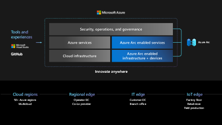

# Azure Arc Hands-on Labs
## What is Azure Arc?
Azure Arc is a bridge that extends the Azure platform so you can build applications and services with the flexibility to run across datacenters, edge, and multicloud environments. Azure Arc provides a consistent development, operations, and security model for both new and existing applications. You use the same tools, the same security and governance technologies to create and manage application and infrastructure resources. Just like in Azure datacenters, a subset of Azure services for application, data, and AI are there to use on both new and existing hardware, virtualization, and Kubernetes platforms, IoT devices, and integrated systems.
   

## Azure Arc Hands-on Labs
The following labs provide you a quick and easy way to get started with Azure Arc through virtual environments that do not require any complex set-up or installations. For the purposes of these exercises, let’s consider Contoso, a large manufacturing organization. Their IT systems run Windows, Linux, SQL Servers, and Kubernetes clusters across multiple locations, including on-premises datacenters, distribution centers and multiple public clouds. This poses operational challenges for Contoso. They’d like a consistent way to govern and operate across these disparate environments, ensure security across the entire organization, and enable innovation and developer agility (especially with their investments in cloud native practices), all while meeting regulatory and compliance requirements.

With Azure Arc, Contoso can unify inventory, governance, and compliance ensuring consistency for their entire IT landscape. They already take advantage of the core management capabilities such as tagging, update management, governance with Azure Policy, monitoring with Azure Monitor, security with Azure Defender, and more for their Azure workloads but would like to extend these same capabilities to their resources outside Azure. By onboarding their servers and Kubernetes clusters running outside Azure to Azure Arc, Contoso can take advantage of all the Azure Resource Manager (ARM) capabilities mentioned above. In addition, with Azure Arc enabled Kubernetes, Contoso can guarantee Kubernetes deployments and app consistency through GitOps-based configuration management for their Kubernetes clusters in Azure, on-premises and in other clouds.
Leveraging Azure Arc enabled data services, Contoso is interested in implementing cloud-native, evergreen versions of SQL and PostgreSQL Hyperscale to reduce the management overhead and deploy their applications and databases anywhere with elastic scale.
Let’s take the journey together with Contoso and see how easy it is to accomplish all the above with Azure Arc.

## In the next pages, you will be covering each of the scenarios below with specific instructions to perform the lab:

  * [Hands-on Lab 1](./HOL-1-azure-arc-servers): First, let's start by learning how to onboard a virtual machine and Kubernetes cluster, both running on-premises, to Azure Arc, then apply a few Azure Policies, enable monitoring, and alerts as well as Integrate Azure Security Center and Azure Sentinel to your on-premises resources. You’ll also be able to deploy an SQL Server on the VM, connect it to Arc and explore SQL Assessments for this resource.
  * [Hands-on Lab 2](./HOL-2-gitops-cluster): In this lab, you’ll learn to deploy GitOps configurations to the Kubernetes cluster that you onboarded to Arc earlier and enable Azure Policy add-on for Kubernetes to the same cluster.
  * [Hands-on Lab 3](./HOL-3-azure-arc-data-services): In this lab, you will deploy the Azure Arc data controller, Azure SQL Managed Instance & Azure PostgreSQL Hyperscale to an existing Kubernetes cluster.
  * [Hands-on Lab 4](./HOL-4-azure-stack-hci): In this workshop, we'll walk you through deploying both Azure Stack HCI, and Azure Kubernetes Service (AKS) on Azure Stack HCI in an Azure VM, and set the foundation for you to explore in your own time. You'll cover aspects such as:
    -  Deploying and configuring a Windows Server 2019 Azure VM to host the infrastructure
    -  Deployment and configuration of a 2-node Azure Stack HCI Cluster using Windows Admin Center
    -  Deployment of the AKS on Azure Stack HCI management cluster with Windows Admin Center
    -  Deployment of the AKS on Azure Stack HCI target/workload cluster with Windows Admin Center
    -  Deployment of a simple test application
    -  Integrating with Azure Arc
    -  and more...!
