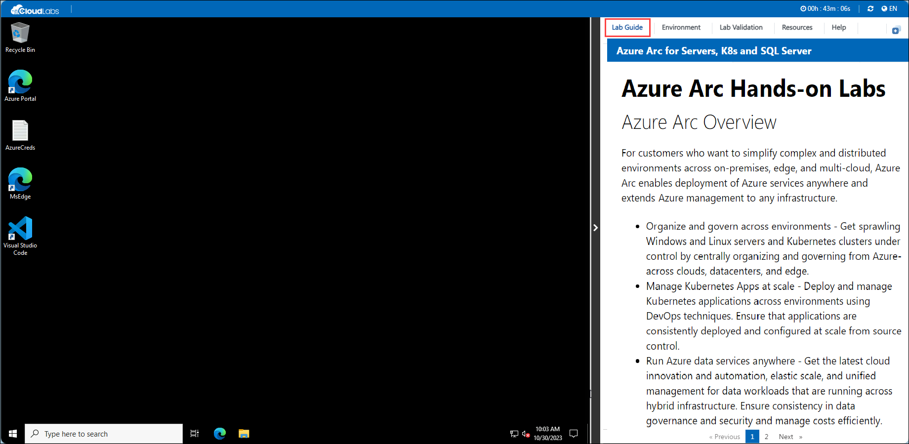
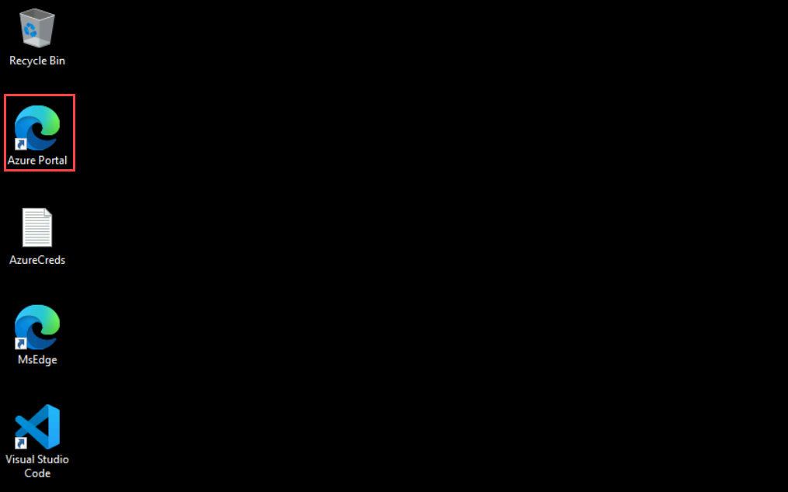
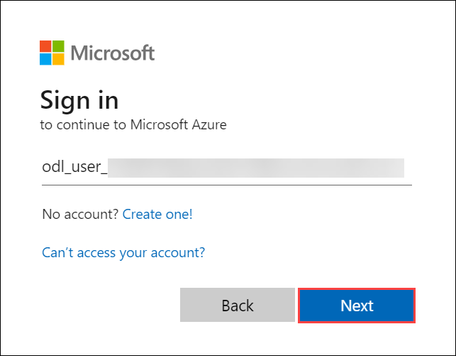
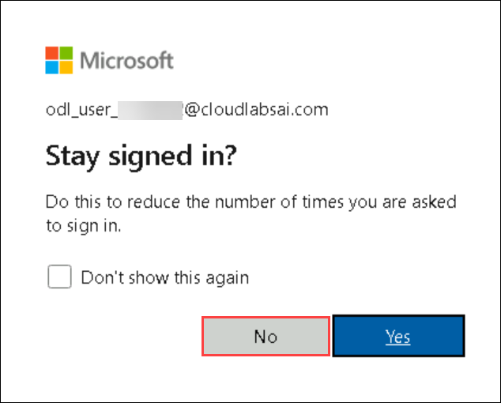
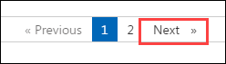

# Getting Started with Deploy GitOps configurations to the Kubernetes cluster in Azure Arc and enable Azure Policy

## **Accessing Your Lab Environment**
 
1. You can see a virtual machine desktop 💻 (LabVM/ARCHOST) is loaded on the left side of your browser. Use this virtual machine throughout the workshop to perform the lab.

    

### **Virtual Machine & Lab Guide**
 
Your virtual machine is your workhorse throughout the workshop. The lab guide is your roadmap to success.
 
## **Exploring Your Lab Resources**
 
To get a better understanding of your lab resources and credentials, navigate to the **Environment Details** tab.

   
 
## **Utilizing the Split Window Feature**
 
For convenience, you can open the lab guide in a separate window by selecting the **Split Window** button from the Top right corner.
 
   
 
## **Managing Your Virtual Machine**
 
Feel free to start, stop, or restart your virtual machine as needed from the **Resources** tab. Your experience is in your hands!
 
  

## **Let's Get Started with Azure Portal**
 
1. In the **LabVM/ARCHost VM**, double-click on the Azure portal shortcut of the Microsoft Edge browser provided on the desktop.
 
    
 
2. You'll see the **Sign into Microsoft Azure** tab. Here, enter your credentials:
 
   - **Email/Username:** <inject key="AzureAdUserEmail"></inject>
 
      
 
3. Next, provide your password:
 
   - **Password:** <inject key="AzureAdUserPassword"></inject>
 
      
 
4. If you see the pop-up **Stay Signed in?**, click **No**.

   

5. If you see the pop-up **You have free Azure Advisor recommendations!**, close the window to continue the lab.

6. If a **Welcome to Microsoft Azure** popup window appears, click **Maybe Later** to skip the tour.
   
7. Now, click on the **Next** from the lower right corner to move to the next page.

   
 
Now you're all set to explore the powerful world of technology. Feel free to reach out if you have any questions along the way. Enjoy your workshop!
   
